# Kairos: Project Overview

## Executive Summary

Kairos is an ADHD-optimized habit building and tracking system for Android and WearOS. The name derives from the Greek concept of "the opportune moment"—reflecting the app's focus on context-based triggers rather than rigid time-based scheduling.

### Core Insight

> ADHD brains operate on an **interest-based nervous system** rather than the importance-based motivation neurotypical habit advice assumes.

This means habits may never become fully automatic for ADHD users. Kairos serves as **permanent external scaffolding**, not temporary training wheels.

---

## Philosophy

### The Problem with Existing Solutions

### Kairos Differentiators

| Differentiator | Traditional Apps | Kairos Approach |
|----------------|------------------|-----------------|
| Recovery | Afterthought or absent | First-class feature |
| Completion | Binary (done/not done) | Flexible (partial counts) |
| Engagement | Streak-based motivation | Novelty injection for maintenance |
| Messaging | Achievement/failure framing | Shame-free, neutral language |
| Triggers | Time-based ("at 7 AM") | Context-based ("after brushing teeth") |
| Gamification | Points, badges, streaks | None—intrinsic motivation only |

---

## Design Principles

### Principle Details

#### 1. Executive Function Externalization
The system does cognitive work so the user doesn't have to. Reminders, decisions, and structure live in the app, not the user's head.

#### 2. Sustainable Imperfection
Expect cycling between engagement and disengagement. Design for the return, not the streak.

#### 3. Immediate Dopamine
Every interaction provides instant positive feedback. No delayed gratification requirements.

#### 4. Context Over Time
Event-based triggers ("after brushing teeth") work better than time-based ("at 7:00 AM") due to time blindness.

#### 5. Flexible Structure
Rigid routines suffocate; no structure causes chaos. The sweet spot: structured options with escape hatches.

#### 6. Shame-Free Recovery
The app never judges. Missed days are data, not failures. Coming back IS the skill being developed.

#### 7. Built-in Novelty
Combat the interest-based nervous system's boredom with variation, rotation, and refresh mechanisms.

---

## Target Users

### User Characteristics

| Characteristic | Implication for Design |
|----------------|------------------------|
| Time blindness | Context triggers over time triggers |
| Working memory deficits | Externalize all reminders |
| Rejection sensitivity | Zero shame, zero judgment |
| Interest-based motivation | Novelty injection, immediate feedback |
| Perfectionism tendency | Partial completion always valid |
| Inconsistent energy | Energy tracking, flexible scheduling |

---

## Platform Strategy

```mermaid
flowchart LR
    subgraph Devices["Supported Platforms"]
        Phone["📱 Android Phone<br/>Primary device"]
        Watch["⌚ WearOS<br/>Quick interactions"]
        Widget["🔲 Home Widget<br/>At-a-glance status"]
    end
    
    subgraph Future["Future Platforms"]
        Mirror["🪞 Smart Mirror<br/>Morning routines"]
        HA["🏠 Home Assistant<br/>Environmental triggers"]
        Desktop["💻 Desktop<br/>Work habits"]
    end
    
    Phone <--> Watch
    Phone <--> Widget
    Phone -.-> Mirror
    Phone -.-> HA
    Phone -.-> Desktop
```

### Platform Rationale

**Android + WearOS First**
- Personal devices, always available
- WearOS reduces phone dependency (phone often causes distraction)
- Widget provides passive awareness

**Future Expansion**
- Smart mirror integration for morning anchor routines
- Home Assistant webhooks for environmental automation
- Desktop companion for work-related habits

---

## Success Metrics

### What We Track

| Metric | Purpose | Display to User? |
|--------|---------|------------------|
| Completion rate | Overall engagement | Yes (weekly %) |
| Habits maintained 30+ days | Long-term success | Yes (count) |
| Recovery success rate | Return effectiveness | Yes (%) |
| Time to complete after reminder | Notification tuning | No |
| Blocker distribution | Pattern analysis | No |
| Feature usage | Product decisions | No |

### What We Explicitly Don't Track

---

## Document Index

This project documentation consists of the following documents:

| Document | Description |
|----------|-------------|
| `00-project-overview.md` | This document—philosophy and context |
| `01-prd-core.md` | Core habit tracking requirements |
| `02-prd-recovery.md` | Recovery system requirements |
| `03-prd-routines.md` | Routine runner requirements |
| `04-prd-sync.md` | Cloud synchronization requirements |
| `05-domain-model.md` | Domain entities and relationships |
| `06-invariants.md` | Business rules and constraints |
| `07-architecture.md` | System architecture and components |
| `08-erd.md` | Entity-relationship diagrams |
| `09-state-machines.md` | Lifecycle and state diagrams |
| `10-user-flows.md` | User journey and interaction flows |
| `11-notification-design.md` | Notification system design |
| `12-wearos-design.md` | WearOS integration design |
