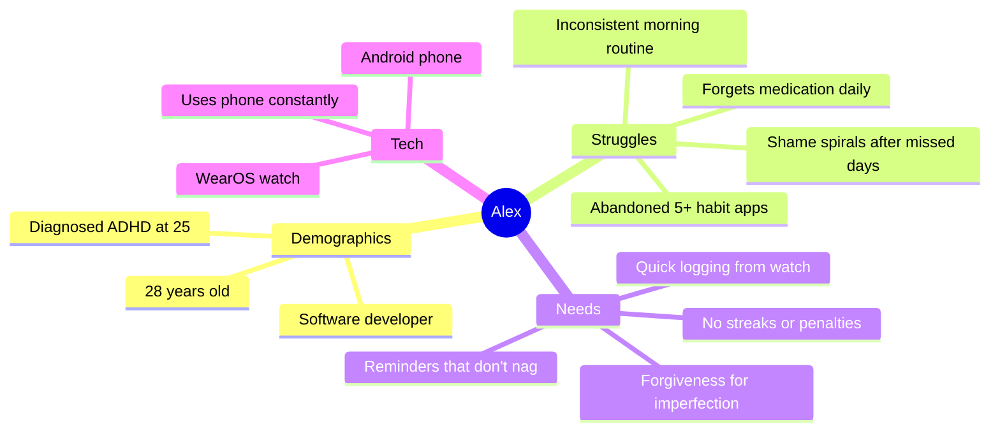
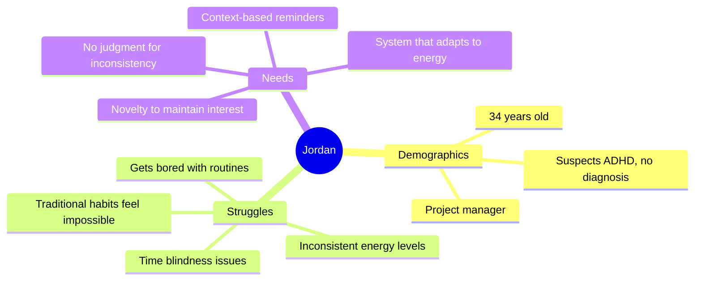
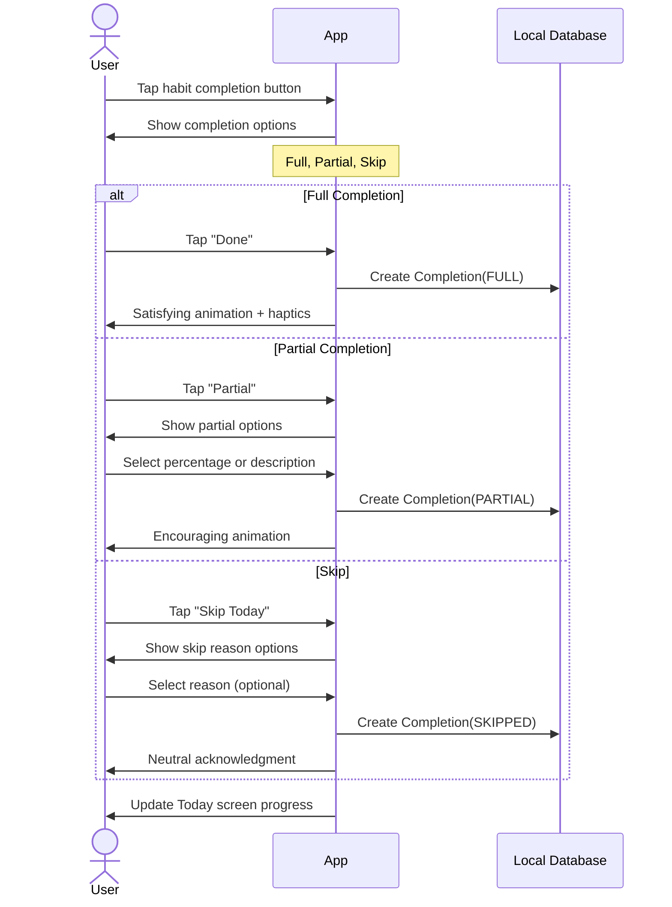
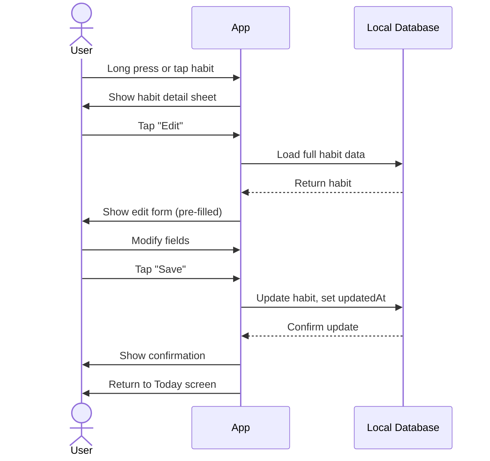
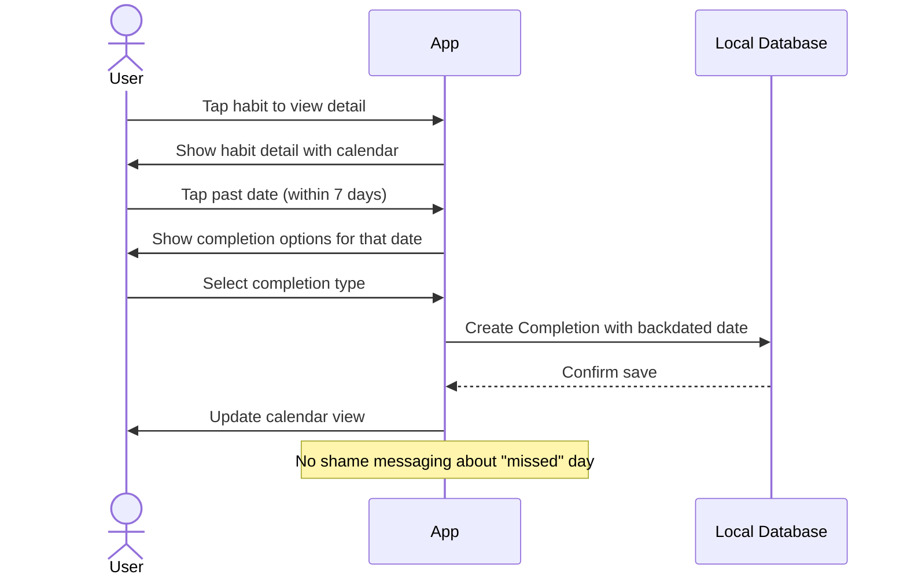
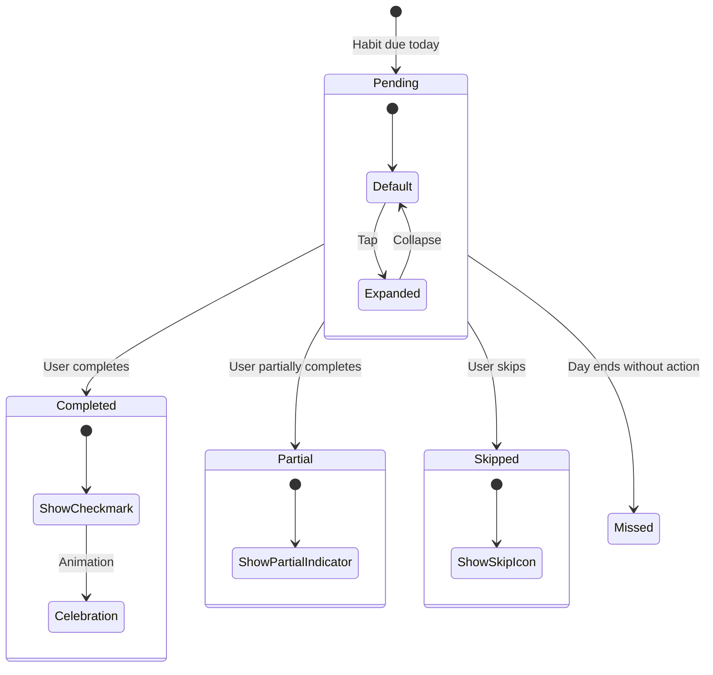
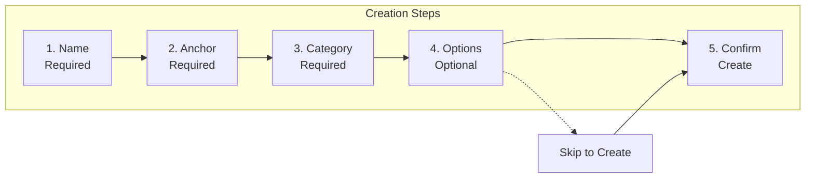

# PRD: Core Habit Tracking

## Overview

This document defines the requirements for Kairos's core habit tracking functionality—the foundation upon which all other features build.

---

## Goals

### Primary Goals (P0)

| Goal | Success Criteria |
|------|------------------|
| Enable habit creation with anchor-based triggers | 100% of habits have an anchor behavior |
| Support flexible completion tracking | Partial completion available for all habits |
| Provide immediate positive feedback | Visual feedback within 100ms of interaction |
| Maintain offline-first operation | All features work without network |

### Secondary Goals (P1)

| Goal | Success Criteria |
|------|------------------|
| Support habit categorization by time of day | Users can filter by morning/afternoon/evening |
| Enable progress visualization | Weekly completion rate visible on Today screen |
| Allow habit customization | Icon, color, and duration configurable |

### Tertiary Goals (P2)

| Goal | Success Criteria |
|------|------------------|
| Track energy levels with completions | Optional energy selector on completion |
| Support subtasks for complex habits | Habits can have ordered subtask lists |
| Enable location-based triggers | Geofence support for "at location" anchors |

---

## User Personas

### Primary: Alex (ADHD Adult)

### Secondary: Jordan (Undiagnosed)

---

## Use Cases

### UC-1: Create a New Habit

**Actor**: User  
**Precondition**: App is installed and opened  
**Trigger**: User taps "Add Habit" button

```mermaid
sequenceDiagram
    actor User
    participant App
    participant DB as Local Database
    
    User->>App: Tap "Add Habit"
    App->>User: Show habit name input
    User->>App: Enter "Take morning medication"
    App->>User: Show anchor selection
    Note over App: Required step—no skip
    User->>App: Select "After I brush my teeth"
    App->>User: Show category selection
    User->>App: Select "Morning"
    App->>User: Show optional settings
    Note over App: Duration, icon, color, reminders
    User->>App: Tap "Create Habit"
    App->>DB: Save habit with ONBOARD phase
    DB-->>App: Confirm save
    App->>User: Show success with animation
    App->>User: Navigate to Today screen
```

**Postcondition**: Habit exists in database with ONBOARD phase  
**Invariants**: Habit must have anchor behavior, habit must have category

### UC-2: Complete a Habit

**Actor**: User  
**Precondition**: Habit exists and is due today  
**Trigger**: User interacts with habit on Today screen

**Postcondition**: Completion record created  
**Invariants**: Completion type must be valid, completion date must be today (or backdated explicitly)

### UC-3: View Today's Habits

**Actor**: User  
**Precondition**: At least one active habit exists  
**Trigger**: User opens app or navigates to Today screen

```mermaid
sequenceDiagram
    actor User
    participant App
    participant DB as Local Database
    
    User->>App: Open app / Navigate to Today
    App->>DB: Query active habits for today
    DB-->>App: Return habits with status
    App->>DB: Query today's completions
    DB-->>App: Return completions
    App->>App: Calculate display state per habit
    
    loop For Each Habit
        App->>App: Determine if completed/pending/missed
        App->>App: Apply category grouping
    end
    
    App->>User: Display categorized habit list
    Note over App: Morning → Afternoon → Evening → Anytime
    App->>User: Show overall progress indicator
```

**Postcondition**: None (read-only)  
**Notes**: Habits grouped by category, completed habits visually distinct but not hidden

### UC-4: Edit an Existing Habit

**Actor**: User  
**Precondition**: Habit exists  
**Trigger**: User taps habit card and selects "Edit"

**Postcondition**: Habit updated with new values  
**Notes**: Changing anchor behavior does not reset progress

### UC-5: Backdate a Completion

**Actor**: User  
**Precondition**: Habit exists, target date has no completion  
**Trigger**: User views habit detail and selects past date

**Postcondition**: Completion record exists for past date  
**Constraints**: Cannot backdate more than 7 days, cannot backdate future

---

## Functional Requirements

### FR-1: Habit Creation

| ID | Requirement | Priority |
|----|-------------|----------|
| FR-1.1 | User must provide habit name (1-100 characters) | P0 |
| FR-1.2 | User must select anchor behavior | P0 |
| FR-1.3 | User must select anchor type (after/before/at location/at time) | P0 |
| FR-1.4 | User must select category (morning/afternoon/evening/anytime) | P0 |
| FR-1.5 | System generates unique ID for habit | P0 |
| FR-1.6 | Habit created with ONBOARD phase | P0 |
| FR-1.7 | User may provide description | P1 |
| FR-1.8 | User may select icon from predefined set | P1 |
| FR-1.9 | User may select color from predefined palette | P1 |
| FR-1.10 | User may set estimated duration | P1 |
| FR-1.11 | User may define micro-version (smallest viable) | P1 |
| FR-1.12 | User may add subtasks | P2 |
| FR-1.13 | User may set frequency (daily/weekdays/weekends/custom) | P1 |
| FR-1.14 | User may configure location trigger | P2 |

### FR-2: Habit Display

| ID | Requirement | Priority |
|----|-------------|----------|
| FR-2.1 | Today screen shows all habits due today | P0 |
| FR-2.2 | Habits grouped by category | P0 |
| FR-2.3 | Each habit shows completion status | P0 |
| FR-2.4 | Completed habits remain visible (not hidden) | P0 |
| FR-2.5 | Visual distinction between completed/pending | P0 |
| FR-2.6 | Overall progress indicator visible | P1 |
| FR-2.7 | Anchor behavior shown on habit card | P1 |
| FR-2.8 | Estimated duration shown on habit card | P2 |

### FR-3: Completion Tracking

| ID | Requirement | Priority |
|----|-------------|----------|
| FR-3.1 | User can mark habit as fully completed | P0 |
| FR-3.2 | User can mark habit as partially completed | P0 |
| FR-3.3 | User can skip habit with optional reason | P0 |
| FR-3.4 | Completion triggers immediate visual feedback | P0 |
| FR-3.5 | Completion triggers haptic feedback | P1 |
| FR-3.6 | User can undo completion within 30 seconds | P1 |
| FR-3.7 | User can backdate completion up to 7 days | P1 |
| FR-3.8 | User can optionally log energy level | P2 |
| FR-3.9 | User can optionally add note to completion | P2 |

### FR-4: Habit Management

| ID | Requirement | Priority |
|----|-------------|----------|
| FR-4.1 | User can edit any habit field | P0 |
| FR-4.2 | User can pause a habit | P0 |
| FR-4.3 | User can resume a paused habit | P0 |
| FR-4.4 | User can archive a habit | P0 |
| FR-4.5 | Archived habits hidden from Today screen | P0 |
| FR-4.6 | User can view archived habits | P1 |
| FR-4.7 | User can restore archived habit | P1 |
| FR-4.8 | User can permanently delete habit | P2 |
| FR-4.9 | Deletion requires confirmation | P2 |

---

## Non-Functional Requirements

### Performance

| ID | Requirement | Target |
|----|-------------|--------|
| NFR-P1 | Today screen load time | < 500ms |
| NFR-P2 | Completion tap to feedback | < 100ms |
| NFR-P3 | Habit creation save time | < 300ms |
| NFR-P4 | Database query time (100 habits) | < 200ms |

### Reliability

| ID | Requirement | Target |
|----|-------------|--------|
| NFR-R1 | Data persistence across app updates | 100% |
| NFR-R2 | No data loss on crash | 100% (Room transactions) |
| NFR-R3 | Offline functionality | 100% feature parity |

### Usability

| ID | Requirement | Target |
|----|-------------|--------|
| NFR-U1 | Maximum taps to complete habit | 2 |
| NFR-U2 | Maximum taps to create basic habit | 5 |
| NFR-U3 | Touch target size | ≥ 48dp |
| NFR-U4 | Color contrast ratio | ≥ 4.5:1 |

---

## UI Requirements

### Today Screen

```mermaid
flowchart TB
    subgraph TodayScreen["Today Screen Layout"]
        Header["Header<br/>Date + Progress Ring"]
        
        subgraph Categories["Habit Groups"]
            Morning["🌅 Morning<br/>Habit Cards"]
            Afternoon["☀️ Afternoon<br/>Habit Cards"]
            Evening["🌙 Evening<br/>Habit Cards"]
            Anytime["⏰ Anytime<br/>Habit Cards"]
        end
        
        FAB["+ Add Habit<br/>FAB"]
    end
    
    Header --> Categories
    Categories --> FAB
```

### Habit Card States

### Habit Card Information

| State | Visual Elements |
|-------|-----------------|
| Pending | Name, anchor, tap target, optional time estimate |
| Completed | Checkmark overlay, muted colors, name visible |
| Partial | Partial indicator (half-filled), name visible |
| Skipped | Skip icon, different background, name visible |
| Missed | Only shown in history, not on Today |

### Create Habit Flow

---

## Data Requirements

### Habit Entity

| Field | Type | Required | Notes |
|-------|------|----------|-------|
| id | UUID | Yes | System generated |
| name | String | Yes | 1-100 characters |
| description | String | No | Optional context |
| icon | String | No | Emoji or icon reference |
| color | String | No | Hex color code |
| anchorBehavior | String | Yes | The trigger context |
| anchorType | Enum | Yes | AFTER_BEHAVIOR, BEFORE_BEHAVIOR, AT_LOCATION, AT_TIME |
| timeWindow | TimeWindow | No | Optional time constraint |
| category | Enum | Yes | MORNING, AFTERNOON, EVENING, ANYTIME |
| frequency | Enum | Yes | DAILY, WEEKDAYS, WEEKENDS, CUSTOM |
| activeDays | Set<DayOfWeek> | No | For CUSTOM frequency |
| estimatedSeconds | Int | No | Default 300 (5 min) |
| microVersion | String | No | Smallest viable version |
| allowPartialCompletion | Boolean | Yes | Default true |
| subtasks | List<String> | No | Ordered task list |
| phase | Enum | Yes | ONBOARD, FORMING, MAINTAINING |
| status | Enum | Yes | ACTIVE, PAUSED, ARCHIVED |
| createdAt | Timestamp | Yes | System generated |
| updatedAt | Timestamp | Yes | System maintained |
| pausedAt | Timestamp | No | When paused |
| archivedAt | Timestamp | No | When archived |

### Completion Entity

| Field | Type | Required | Notes |
|-------|------|----------|-------|
| id | UUID | Yes | System generated |
| habitId | UUID | Yes | Foreign key |
| date | LocalDate | Yes | The habit date |
| completedAt | Timestamp | Yes | When logged |
| type | Enum | Yes | FULL, PARTIAL, SKIPPED, MISSED |
| partialPercent | Int | No | 1-99 for partial |
| skipReason | Enum | No | Predefined reasons |
| energyLevel | Int | No | 1-5 scale |
| note | String | No | Free text |

---

## Constraints

1. **Anchor Required**: Every habit must have an anchor behavior—no time-only habits without context
2. **No Streaks**: System does not calculate, store, or display streak counts
3. **No Penalties**: Missing a habit has no negative consequence in the system
4. **Partial Always Available**: Cannot disable partial completion per-habit
5. **Offline First**: All operations must work without network connectivity

---

## Dependencies

| Dependency | Type | Purpose |
|------------|------|---------|
| Room Database | Internal | Local data persistence |
| DataStore | Internal | User preferences |
| WorkManager | Internal | Background processing |
| Notification System | Internal | Reminders |

---

## Open Questions

1. Should completed habits move to bottom of category or stay in place?
2. What predefined skip reasons should be offered?
3. Should energy tracking be opt-in per habit or global setting?
4. How to handle timezone changes mid-day?
