# PRD: Recovery System

## Overview

Recovery is a **first-class feature** in Kairos, not an afterthought. This document defines the requirements for lapse detection, recovery sessions, and the relapse handling system that helps users return to habits without shame.

---

## Problem Statement

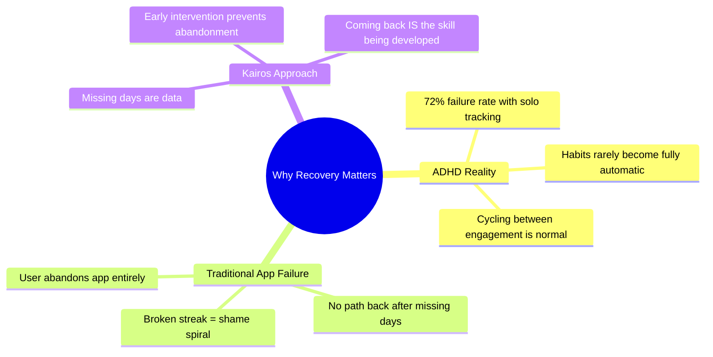

### The Shame Spiral

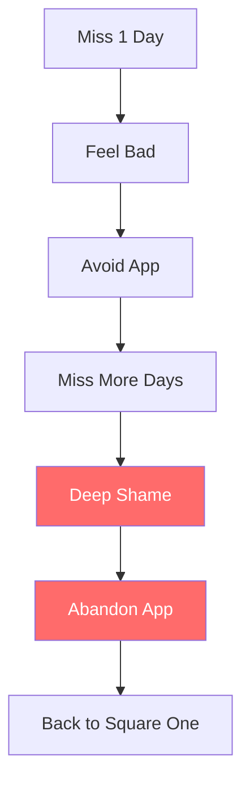

### The Recovery Loop (Kairos)

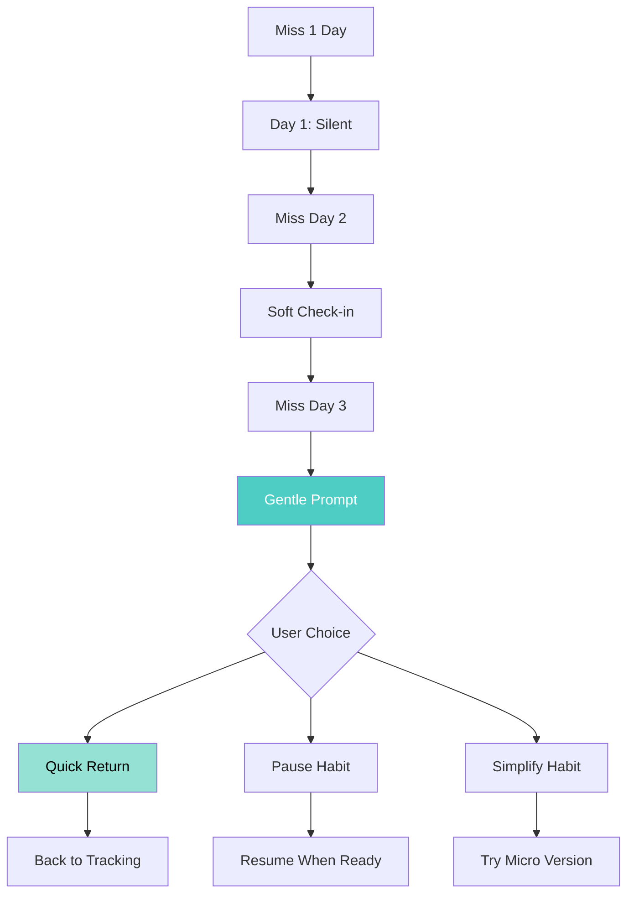

---

## Goals

### Primary Goals (P0)

| Goal | Success Criteria |
|------|------------------|
| Detect lapses early (3 days) | 100% detection within 24h of threshold |
| Provide shame-free recovery path | Zero blame language in all prompts |
| Enable quick return without friction | 1 tap to resume tracking |
| Support intentional pausing | Pause option available at all recovery points |

### Secondary Goals (P1)

| Goal | Success Criteria |
|------|------------------|
| Identify blockers for pattern analysis | Blocker selection offered at recovery |
| Suggest contextual adjustments | AI-free rule-based suggestions |
| Detect relapse (7+ days) | Deeper intervention triggered |
| Track recovery success rate | Metric available for user insight |

### Tertiary Goals (P2)

| Goal | Success Criteria |
|------|------------------|
| Fresh start alignment | Offer restart on Mondays/month starts |
| Habit simplification suggestions | Micro-version prompts when struggling |
| Energy pattern correlation | Connect low energy to lapse patterns |

---

## Key Concepts

### Lapse vs. Relapse

```mermaid
flowchart LR
    subgraph Lapse["Lapse (1-6 days)"]
        L1["Day 1: Silent"]
        L2["Day 2: Soft nudge"]
        L3["Day 3: Recovery prompt"]
        L4["Days 4-6: Continued support"]
    end
    
    subgraph Relapse["Relapse (7+ days)"]
        R1["Day 7: Deeper reflection"]
        R2["Welcome back flow"]
        R3["Adjustment options"]
    end
    
    Lapse --> |"User returns"| Resolved["✓ Resolved"]
    Lapse --> |"7 days reached"| Relapse
    Relapse --> |"User returns"| FreshStart["Fresh Start"]
    Relapse --> |"User chooses"| Paused["Paused/Archived"]
```

| Term | Definition | Threshold | Response |
|------|------------|-----------|----------|
| **Lapse** | Short break from habit | 1-6 consecutive missed days | Gentle prompts, easy return |
| **Relapse** | Extended break from habit | 7+ consecutive missed days | Deeper reflection, reset option |
| **Recovery** | Process of returning | N/A | Structured support flow |
| **Fresh Start** | Clean slate restart | After relapse | Phase resets to FORMING |

### Blockers

Predefined reasons why habits get missed—used for pattern analysis, not judgment.

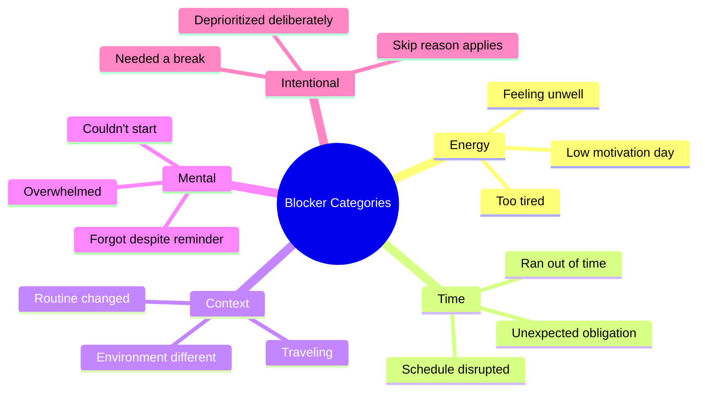

---

## Use Cases

### UC-1: Lapse Detection (Day 3)

**Actor**: System (background)  
**Precondition**: Habit has 3 consecutive missed days  
**Trigger**: Daily lapse detection worker runs

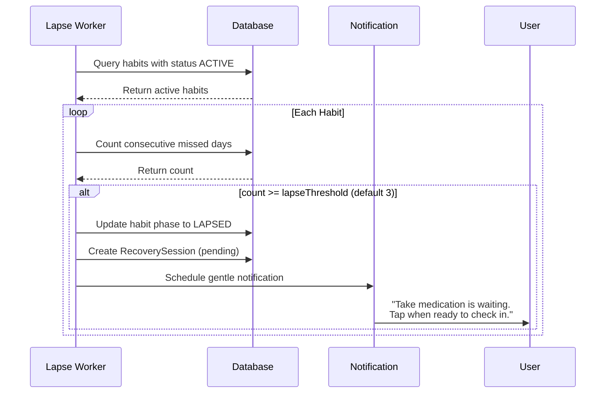

**Postcondition**: Habit phase updated, recovery session created  
**Messaging Example**:  
> "Take medication is waiting for you. No rush—tap when you're ready to check in."

### UC-2: Recovery Session (Quick Return)

**Actor**: User  
**Precondition**: Lapse detected, user taps notification or habit  
**Trigger**: User engages with lapsed habit

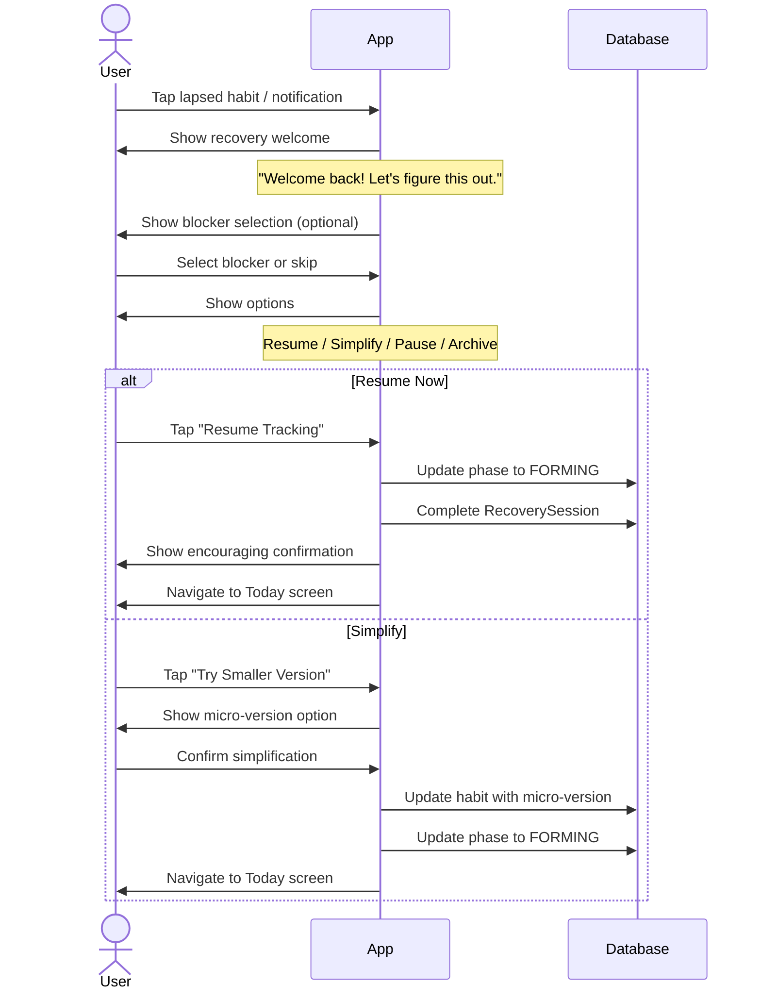

**Postcondition**: User returned to active tracking or chose alternative  
**Messaging**: 
- Welcome: "Welcome back! Let's figure this out together."
- Resume: "Great! Your habit is ready for today."
- Simplify: "Smaller is smarter. You can always expand later."

### UC-3: Relapse Detection (Day 7)

**Actor**: System (background)  
**Precondition**: Habit has 7+ consecutive missed days  
**Trigger**: Daily lapse detection worker runs

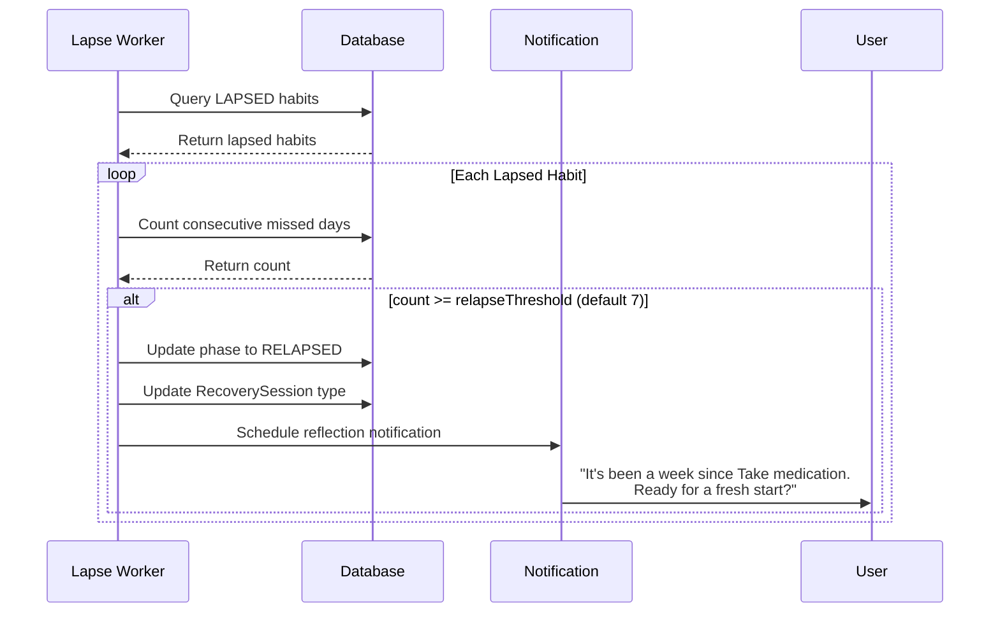

**Postcondition**: Habit phase updated to RELAPSED  
**Messaging**:
> "It's been a week since Take medication. That's okay—ready for a fresh start?"

### UC-4: Relapse Recovery Session

**Actor**: User  
**Precondition**: Habit in RELAPSED phase  
**Trigger**: User engages with relapsed habit

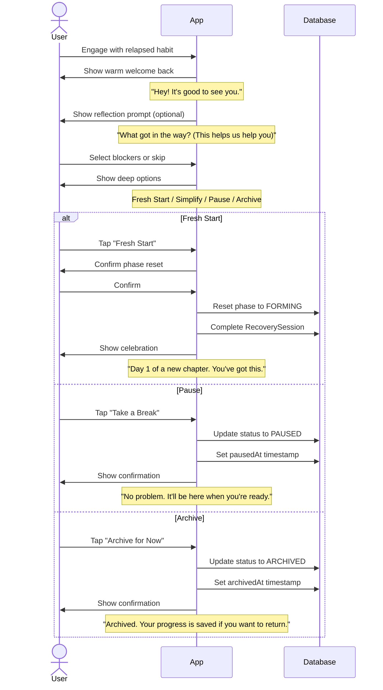

**Postcondition**: User chose recovery path  
**Key Principle**: Never delete data—user's history is preserved

### UC-5: Fresh Start Prompt (Monday/Month)

**Actor**: System  
**Precondition**: Monday morning OR first of month, user has paused/lapsed habits  
**Trigger**: Fresh start worker runs

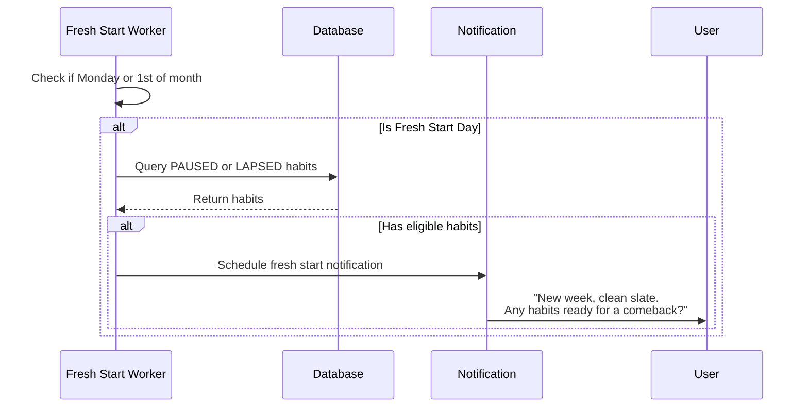

**Postcondition**: User notified of fresh start opportunity  
**Messaging**:
- Monday: "New week, clean slate. Any habits ready for a comeback?"
- Month: "New month energy! Perfect time for a fresh start."

---

## Functional Requirements

### FR-1: Lapse Detection

| ID | Requirement | Priority |
|----|-------------|----------|
| FR-1.1 | System detects consecutive missed days per habit | P0 |
| FR-1.2 | Lapse threshold configurable per habit (default 3) | P0 |
| FR-1.3 | Detection runs daily (background worker) | P0 |
| FR-1.4 | Day 1 missed: No notification (silent) | P0 |
| FR-1.5 | Day 2 missed: Soft notification (optional, no action required) | P1 |
| FR-1.6 | Day 3+ missed: Recovery prompt notification | P0 |
| FR-1.7 | Habit phase updates to LAPSED at threshold | P0 |
| FR-1.8 | RecoverySession record created at lapse | P0 |

### FR-2: Relapse Detection

| ID | Requirement | Priority |
|----|-------------|----------|
| FR-2.1 | Relapse threshold configurable per habit (default 7) | P0 |
| FR-2.2 | LAPSED habit crossing threshold becomes RELAPSED | P0 |
| FR-2.3 | Relapse notification distinct from lapse notification | P0 |
| FR-2.4 | RecoverySession type updated to RELAPSE | P0 |

### FR-3: Recovery Sessions

| ID | Requirement | Priority |
|----|-------------|----------|
| FR-3.1 | Recovery session records start time | P0 |
| FR-3.2 | User can select blocker(s) from predefined list | P1 |
| FR-3.3 | User can skip blocker selection | P0 |
| FR-3.4 | User presented with recovery options | P0 |
| FR-3.5 | Recovery options: Resume, Simplify, Pause, Archive | P0 |
| FR-3.6 | Recovery session records chosen action | P0 |
| FR-3.7 | Recovery session records completion time | P0 |
| FR-3.8 | Session can be abandoned (closed without action) | P0 |

### FR-4: Recovery Actions

| ID | Requirement | Priority |
|----|-------------|----------|
| FR-4.1 | Resume: Returns habit to FORMING phase | P0 |
| FR-4.2 | Simplify: Prompts user to try micro-version | P1 |
| FR-4.3 | Simplify: Updates habit's active version | P1 |
| FR-4.4 | Pause: Sets status to PAUSED, records timestamp | P0 |
| FR-4.5 | Archive: Sets status to ARCHIVED, records timestamp | P0 |
| FR-4.6 | Fresh Start: Resets phase to FORMING (after relapse) | P0 |
| FR-4.7 | All actions preserve historical completion data | P0 |

### FR-5: Fresh Start Prompts

| ID | Requirement | Priority |
|----|-------------|----------|
| FR-5.1 | Monday morning check for eligible habits | P1 |
| FR-5.2 | First of month check for eligible habits | P1 |
| FR-5.3 | Eligible: PAUSED or LAPSED status habits | P1 |
| FR-5.4 | Single notification for all eligible habits | P1 |
| FR-5.5 | User can dismiss without action | P1 |
| FR-5.6 | Notification links to habit list filtered for eligible | P2 |

### FR-6: Messaging Requirements

| ID | Requirement | Priority |
|----|-------------|----------|
| FR-6.1 | All recovery messaging is shame-free | P0 |
| FR-6.2 | No mention of "streak" or "broken streak" | P0 |
| FR-6.3 | No mention of "failed" or "failure" | P0 |
| FR-6.4 | Neutral or positive framing only | P0 |
| FR-6.5 | Messaging feels supportive, not judgmental | P0 |

---

## Non-Functional Requirements

### Performance

| ID | Requirement | Target |
|----|-------------|--------|
| NFR-P1 | Lapse detection worker runtime | < 5 seconds |
| NFR-P2 | Recovery session load time | < 500ms |
| NFR-P3 | Recovery action completion | < 300ms |

### Reliability

| ID | Requirement | Target |
|----|-------------|--------|
| NFR-R1 | Lapse detection runs daily | 100% (WorkManager guaranteed) |
| NFR-R2 | No false lapse detection | 100% (based on completion data) |
| NFR-R3 | Recovery data persists across app updates | 100% |

### Timing

| ID | Requirement | Target |
|----|-------------|--------|
| NFR-T1 | Lapse detection window | After midnight, before 6 AM |
| NFR-T2 | Fresh start check window | 6-8 AM on eligible days |
| NFR-T3 | Notification delivery | Within 1 hour of detection |

---

## UI Requirements

### Recovery Session Flow

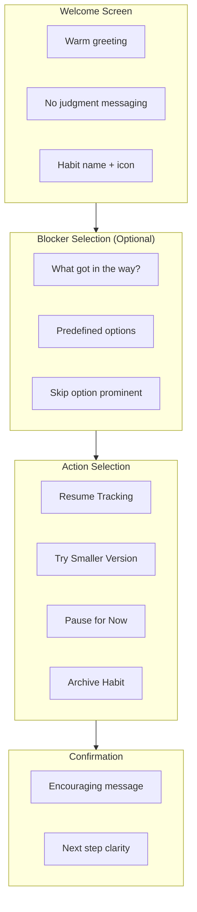

### Notification Content

| Trigger | Title | Body |
|---------|-------|------|
| Day 2 (soft) | Habit Name | "Just checking in. No pressure." |
| Day 3 (lapse) | Habit Name | "Ready when you are. Tap to check in." |
| Day 7 (relapse) | "Fresh Start?" | "It's been a week. Ready for a new chapter?" |
| Monday | "New Week" | "Clean slate. Any habits ready for a comeback?" |
| Month Start | "New Month" | "Perfect time for a fresh start." |

### Blocker Selection UI

```mermaid
flowchart TB
    subgraph BlockerUI["Blocker Selection"]
        Q["What got in the way?<br/>(Optional - helps us help you)"]
        
        subgraph Options["Tap all that apply"]
            E1["😴 Too tired"]
            E2["🤒 Felt unwell"]
            T1["⏰ No time"]
            T2["📅 Schedule changed"]
            C1["✈️ Traveling"]
            C2["🏠 Environment changed"]
            M1["😰 Overwhelmed"]
            M2["🧠 Just forgot"]
            I1["🎯 Needed a break"]
        end
        
        Skip["Skip →"]
    end
    
    Q --> Options
    Options --> Skip
```

---

## Data Requirements

### RecoverySession Entity

| Field | Type | Required | Notes |
|-------|------|----------|-------|
| id | UUID | Yes | System generated |
| habitId | UUID | Yes | Foreign key |
| type | Enum | Yes | LAPSE, RELAPSE |
| status | Enum | Yes | PENDING, COMPLETED, ABANDONED |
| triggeredAt | Timestamp | Yes | When detected |
| completedAt | Timestamp | No | When user completed session |
| blockers | List<Blocker> | No | Selected blockers |
| action | Enum | No | RESUME, SIMPLIFY, PAUSE, ARCHIVE, FRESH_START |
| notes | String | No | Optional user notes |

### Blocker Enum

| Value | Display Text | Category |
|-------|--------------|----------|
| TOO_TIRED | Too tired | Energy |
| FELT_UNWELL | Felt unwell | Energy |
| LOW_MOTIVATION | Low motivation day | Energy |
| NO_TIME | Ran out of time | Time |
| SCHEDULE_CHANGED | Schedule changed | Time |
| UNEXPECTED_OBLIGATION | Unexpected obligation | Time |
| TRAVELING | Traveling | Context |
| ENVIRONMENT_CHANGED | Environment different | Context |
| OVERWHELMED | Felt overwhelmed | Mental |
| FORGOT | Forgot despite reminder | Mental |
| COULDNT_START | Couldn't get started | Mental |
| NEEDED_BREAK | Needed a break | Intentional |
| DEPRIORITIZED | Chose to skip | Intentional |

### Recovery Action Enum

| Value | Effect |
|-------|--------|
| RESUME | Phase → FORMING, status unchanged |
| SIMPLIFY | Activates micro-version, phase → FORMING |
| PAUSE | Status → PAUSED, pausedAt set |
| ARCHIVE | Status → ARCHIVED, archivedAt set |
| FRESH_START | Phase → FORMING (resets progress tracking) |

---

## Invariants

1. **No Data Deletion**: Recovery actions never delete completion history
2. **Phase Consistency**: LAPSED/RELAPSED phases only exist during active recovery
3. **Threshold Order**: relapseThreshold > lapseThreshold always
4. **Session Completeness**: Completed sessions must have an action
5. **Messaging Compliance**: All user-facing text passes shame-free review

---

## State Machine

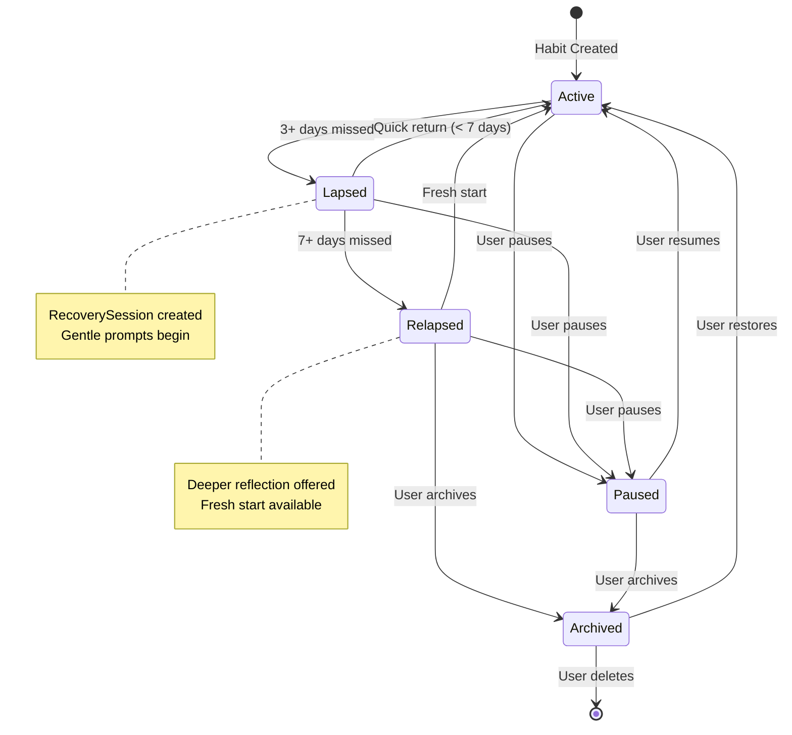

---

## Success Metrics

| Metric | Definition | Target |
|--------|------------|--------|
| Recovery Rate | % of lapsed habits that return to active | > 60% |
| Time to Recovery | Days from lapse detection to return | < 3 days median |
| Relapse Prevention | % of lapses that don't become relapses | > 70% |
| Fresh Start Uptake | % of fresh start prompts that lead to action | > 30% |
| Blocker Completion | % of recovery sessions with blocker selected | > 50% |

---

## Messaging Reference

### Do Say

| Situation | Example |
|-----------|---------|
| Lapse notification | "Take medication is waiting. Tap when ready." |
| Recovery welcome | "Welcome back! Let's figure this out." |
| Resume confirmation | "Great! Your habit is ready for today." |
| Pause confirmation | "No problem. It'll be here when you're ready." |
| Fresh start | "Day 1 of a new chapter. You've got this." |

### Never Say

| Forbidden | Why |
|-----------|-----|
| "You broke your streak" | Shame trigger |
| "You failed to..." | Blame language |
| "You missed X days" | Emphasizes failure |
| "Try harder" | Dismissive of real challenges |
| "Don't give up" | Implies they're giving up |
| "You should have..." | Judgmental |

---

## Dependencies

| Dependency | Purpose |
|------------|---------|
| WorkManager | Background lapse/relapse detection |
| Notification System | Recovery prompts |
| Room Database | RecoverySession persistence |
| Habit System | Phase and status updates |

---

## Open Questions

1. Should Day 2 soft notification be opt-in or opt-out?
2. Should fresh start prompts respect Do Not Disturb?
3. What happens if user has 10+ lapsed habits—batch notification?
4. Should archived habits show in a separate view or just filtered out?
