# PRD: Routines System

## Overview

Routines are **ordered sequences of habits** designed for grouped execution—particularly valuable for morning, evening, or work startup flows. The routine runner provides timer-led guidance through each habit, reducing the executive function load of deciding "what's next."

---

## Problem Statement

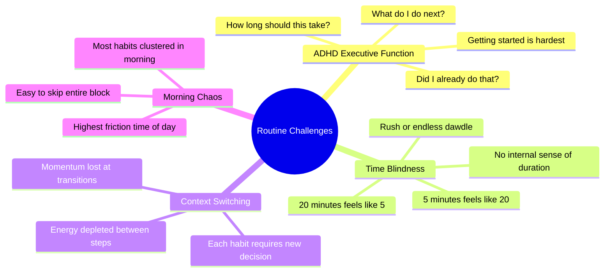

### Solution: Routine Runner

```mermaid
flowchart LR
    subgraph Before["Without Routine Runner"]
        B1["Check app"]
        B2["Decide what's first"]
        B3["Do habit"]
        B4["Return to app"]
        B5["Decide what's next"]
        B6["Repeat..."]
    end
    
    subgraph After["With Routine Runner"]
        A1["Press Play"]
        A2["Follow timer"]
        A3["Tap Done"]
        A4["Auto-advance"]
        A5["Routine complete"]
    end
    
    Before --> |"High cognitive load"| Exhausting["😩"]
    After --> |"Guided flow"| Smooth["😌"]
```

---

## Goals

### Primary Goals (P0)

| Goal | Success Criteria |
|------|------------------|
| Group habits into named routines | User can create routine with 2+ habits |
| Provide timer-led execution | Each habit shows countdown timer |
| Auto-advance between habits | No decision needed at transitions |
| Track routine completion | Routine-level completion recorded |

### Secondary Goals (P1)

| Goal | Success Criteria |
|------|------------------|
| Support routine variants | Multiple versions of same routine |
| Allow habit reordering | Drag-and-drop sequence editing |
| Skip individual habits during run | Continue routine without abandoning |
| Pause and resume routine | Timer state preserved |

### Tertiary Goals (P2)

| Goal | Success Criteria |
|------|------------------|
| Voice guidance option | Audio cues for transitions |
| Background timer mode | Run while phone locked |
| Routine scheduling | Auto-start prompts at set times |
| WearOS routine control | Start/advance from watch |

---

## Key Concepts

### Routine Structure

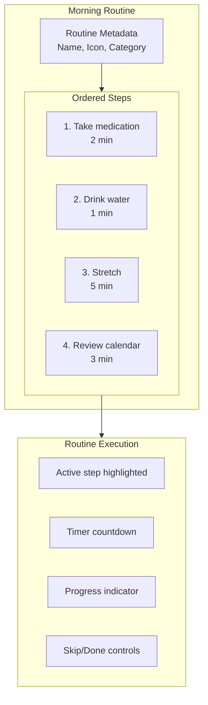

### Routine vs Individual Habits

| Aspect | Individual Habit | Routine |
|--------|------------------|---------|
| Completion | One-tap done | Multi-step flow |
| Timer | Optional estimate | Active countdown |
| Order | User decides | Predefined sequence |
| Cognitive load | Per-habit decision | Single "start" decision |
| Best for | Standalone actions | Grouped sequences |

### Routine Variants

Variants combat maintenance boredom by offering rotation within structure.

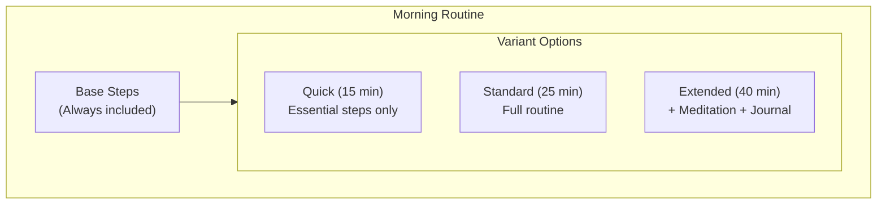

---

## Use Cases

### UC-1: Create a Routine

**Actor**: User  
**Precondition**: At least 2 habits exist  
**Trigger**: User taps "Create Routine" or groups selected habits

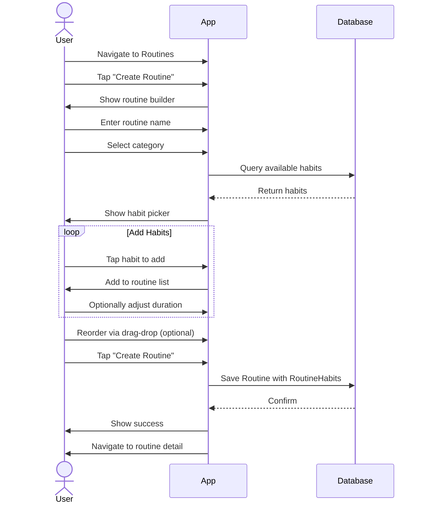

**Postcondition**: Routine exists with linked habits in order  
**Constraint**: Routine must have at least 2 habits

### UC-2: Run a Routine

**Actor**: User  
**Precondition**: Routine exists with habits  
**Trigger**: User taps "Start Routine" or play button

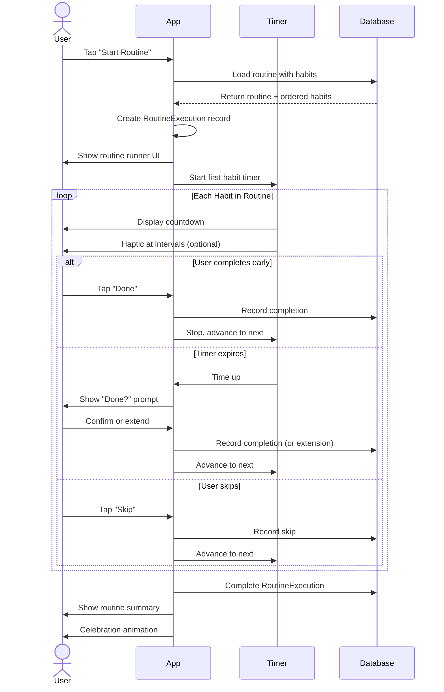

**Postcondition**: RoutineExecution completed, all habits marked  
**Notes**: Each habit gets individual completion record

### UC-3: Pause and Resume Routine

**Actor**: User  
**Precondition**: Routine currently running  
**Trigger**: User taps pause or leaves app

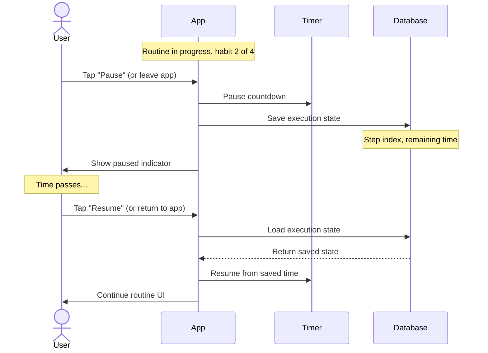

**Postcondition**: Routine continues from pause point  
**Constraint**: Paused state persists across app restart

### UC-4: Select Routine Variant

**Actor**: User  
**Precondition**: Routine has multiple variants  
**Trigger**: User starts routine with variants

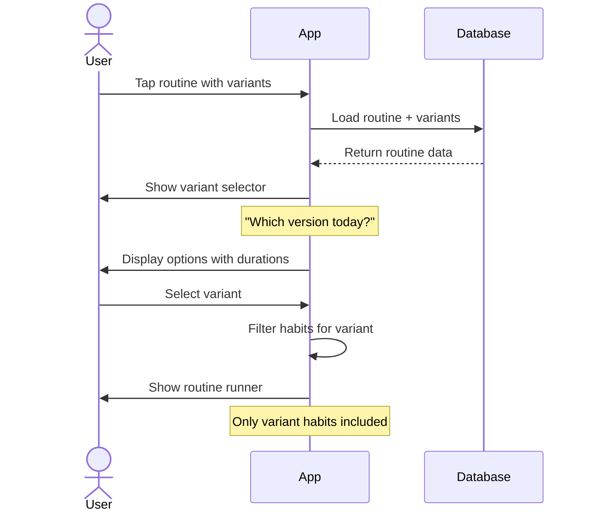

**Postcondition**: Routine starts with selected variant's habits

### UC-5: Edit Routine Order

**Actor**: User  
**Precondition**: Routine exists  
**Trigger**: User opens routine settings

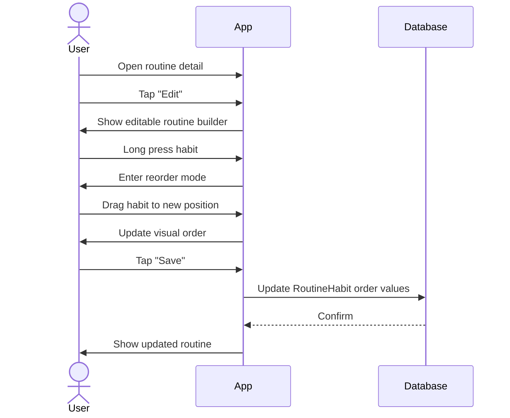

**Postcondition**: Habit sequence updated

---

## Functional Requirements

### FR-1: Routine Creation

| ID | Requirement | Priority |
|----|-------------|----------|
| FR-1.1 | User can create routine with name | P0 |
| FR-1.2 | User can add habits to routine | P0 |
| FR-1.3 | Routine requires minimum 2 habits | P0 |
| FR-1.4 | User can set habit order | P0 |
| FR-1.5 | User can assign routine to category | P0 |
| FR-1.6 | User can set icon for routine | P1 |
| FR-1.7 | User can set color for routine | P1 |
| FR-1.8 | User can override habit duration in routine | P1 |
| FR-1.9 | User can create variants for routine | P2 |

### FR-2: Routine Execution

| ID | Requirement | Priority |
|----|-------------|----------|
| FR-2.1 | User can start routine with one tap | P0 |
| FR-2.2 | Active habit shows countdown timer | P0 |
| FR-2.3 | Timer auto-advances on completion | P0 |
| FR-2.4 | User can mark current habit done | P0 |
| FR-2.5 | User can skip current habit | P0 |
| FR-2.6 | User can pause routine | P1 |
| FR-2.7 | User can resume paused routine | P1 |
| FR-2.8 | Paused state persists across app restart | P1 |
| FR-2.9 | User can abandon routine mid-execution | P0 |
| FR-2.10 | Abandoned routines record partial completion | P1 |

### FR-3: Timer Behavior

| ID | Requirement | Priority |
|----|-------------|----------|
| FR-3.1 | Timer displays remaining time prominently | P0 |
| FR-3.2 | Timer shows progress bar or ring | P0 |
| FR-3.3 | Timer can be extended mid-habit | P1 |
| FR-3.4 | Timer provides haptic at configurable intervals | P2 |
| FR-3.5 | Timer continues in background (notification) | P1 |
| FR-3.6 | Timer respects screen-off/lock | P1 |

### FR-4: Completion Tracking

| ID | Requirement | Priority |
|----|-------------|----------|
| FR-4.1 | Each habit in routine gets individual completion | P0 |
| FR-4.2 | Routine execution recorded separately | P0 |
| FR-4.3 | Partial routine completion tracked | P1 |
| FR-4.4 | Time spent per habit recorded | P2 |
| FR-4.5 | Routine completion shows summary | P1 |

### FR-5: Routine Management

| ID | Requirement | Priority |
|----|-------------|----------|
| FR-5.1 | User can edit routine | P0 |
| FR-5.2 | User can delete routine | P0 |
| FR-5.3 | User can add/remove habits from routine | P0 |
| FR-5.4 | User can reorder habits via drag-drop | P1 |
| FR-5.5 | User can duplicate routine | P2 |
| FR-5.6 | User can pause routine (not archive) | P1 |

### FR-6: Variants

| ID | Requirement | Priority |
|----|-------------|----------|
| FR-6.1 | Routine can have multiple variants | P2 |
| FR-6.2 | Variant includes subset of routine habits | P2 |
| FR-6.3 | Each variant has name and estimated duration | P2 |
| FR-6.4 | User selects variant at start time | P2 |
| FR-6.5 | Default variant can be configured | P2 |

---

## Non-Functional Requirements

### Performance

| ID | Requirement | Target |
|----|-------------|--------|
| NFR-P1 | Routine start to first habit display | < 500ms |
| NFR-P2 | Timer accuracy | ± 1 second |
| NFR-P3 | Habit transition time | < 200ms |
| NFR-P4 | State persistence on pause | < 100ms |

### Reliability

| ID | Requirement | Target |
|----|-------------|--------|
| NFR-R1 | Timer survives app backgrounding | 100% |
| NFR-R2 | Paused state survives app termination | 100% |
| NFR-R3 | No habit completions lost on crash | 100% |

### Battery

| ID | Requirement | Target |
|----|-------------|--------|
| NFR-B1 | Background timer battery impact | < 1% per routine |
| NFR-B2 | Screen-on timer optimization | Use efficient animations |

---

## UI Requirements

### Routine Runner Screen

```mermaid
flowchart TB
    subgraph Runner["Routine Runner Layout"]
        Header["Header<br/>Routine Name + Progress (2/4)"]
        
        subgraph Current["Current Habit"]
            Name["Habit Name + Icon"]
            Timer["Large Timer Display<br/>3:42"]
            Progress["Timer Progress Ring"]
        end
        
        subgraph Controls["Controls"]
            Skip["Skip →"]
            Done["✓ Done"]
            Pause["⏸ Pause"]
        end
        
        Queue["Up Next Preview<br/>Next 1-2 habits"]
    end
    
    Header --> Current --> Controls --> Queue
```

### Timer States

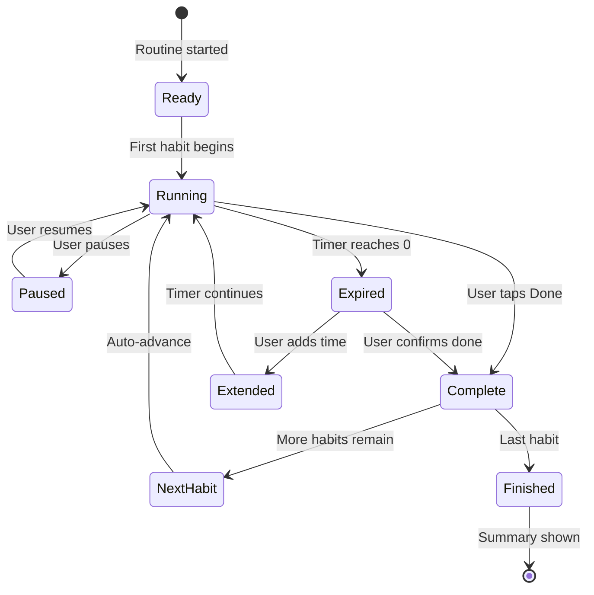

### Progress Indication

| Element | Purpose |
|---------|---------|
| Step counter | "2 of 4 habits" |
| Progress bar | Visual completion percentage |
| Time remaining | Total routine time left |
| Current habit timer | Countdown for active step |
| Up next preview | Reduces uncertainty about what's coming |

### Routine Summary Screen

```mermaid
flowchart TB
    subgraph Summary["Routine Complete"]
        Celebrate["🎉 Celebration Animation"]
        Stats["Routine Summary<br/>Total Time: 12 min<br/>Habits: 4/4 complete"]
        
        subgraph Breakdown["Habit Breakdown"]
            H1["✓ Take medication (2:00)"]
            H2["✓ Drink water (0:45)"]
            H3["✓ Stretch (5:30)"]
            H4["✓ Calendar (3:45)"]
        end
        
        Actions["Done / Start Again"]
    end
```

---

## Data Requirements

### Routine Entity

| Field | Type | Required | Notes |
|-------|------|----------|-------|
| id | UUID | Yes | System generated |
| name | String | Yes | 1-50 characters |
| description | String | No | Optional context |
| icon | String | No | Emoji or icon reference |
| color | String | No | Hex color code |
| category | Enum | Yes | MORNING, AFTERNOON, EVENING, ANYTIME |
| status | Enum | Yes | ACTIVE, PAUSED, ARCHIVED |
| createdAt | Timestamp | Yes | System generated |
| updatedAt | Timestamp | Yes | System maintained |

### RoutineHabit Entity (Join Table)

| Field | Type | Required | Notes |
|-------|------|----------|-------|
| id | UUID | Yes | System generated |
| routineId | UUID | Yes | Foreign key |
| habitId | UUID | Yes | Foreign key |
| orderIndex | Int | Yes | Position in routine (0-based) |
| overrideDurationSeconds | Int | No | Custom duration for this routine |
| variantIds | List<UUID> | No | Which variants include this habit |

### RoutineVariant Entity

| Field | Type | Required | Notes |
|-------|------|----------|-------|
| id | UUID | Yes | System generated |
| routineId | UUID | Yes | Foreign key |
| name | String | Yes | "Quick", "Standard", "Extended" |
| estimatedMinutes | Int | Yes | Total variant duration |
| isDefault | Boolean | Yes | Default false |

### RoutineExecution Entity

| Field | Type | Required | Notes |
|-------|------|----------|-------|
| id | UUID | Yes | System generated |
| routineId | UUID | Yes | Foreign key |
| variantId | UUID | No | If variant selected |
| startedAt | Timestamp | Yes | When routine started |
| completedAt | Timestamp | No | When routine finished |
| status | Enum | Yes | IN_PROGRESS, COMPLETED, ABANDONED, PAUSED |
| currentStepIndex | Int | Yes | For pause/resume |
| currentStepRemainingSeconds | Int | No | For pause/resume |
| totalPausedSeconds | Int | Yes | Cumulative pause time |

---

## State Machine: Routine Execution

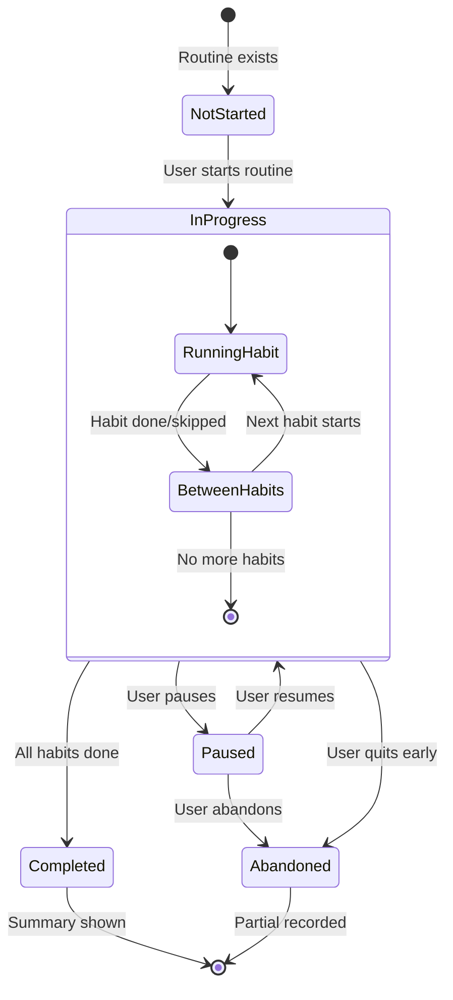

---

## Integration Points

### With Habits

- Routine completion creates individual habit completions
- Habit deletion removes from routines (with warning)
- Habit pause/archive affects routine (warning or remove)

### With Recovery

- Routine-level lapse detection? (Future consideration)
- Individual habit lapses still tracked

### With Notifications

- Routine start reminders (optional)
- In-progress notification (timer visible)
- Completion notification (if backgrounded)

### With WearOS

- Start routine from watch
- Current step display on watch
- Done/Skip controls on watch

---

## Invariants

1. **Minimum Habits**: Routine must have ≥ 2 habits
2. **Order Integrity**: orderIndex values must be sequential without gaps
3. **Duration Positivity**: All durations must be > 0 seconds
4. **Execution State**: Paused execution must preserve step + remaining time
5. **Completion Linkage**: RoutineExecution completions must create Habit Completions

---

## Success Metrics

| Metric | Definition | Target |
|--------|------------|--------|
| Routine Completion Rate | % of started routines completed | > 80% |
| Habit Skip Rate | % of habits skipped within routines | < 20% |
| Routine Adoption | % of users with ≥ 1 routine | > 40% |
| Morning Routine Usage | % of routines in MORNING category | Tracking only |
| Average Routine Length | Mean habits per routine | 3-5 (optimal) |

---

## Open Questions

1. Should routines support habits not yet created (create during routine setup)?
2. How to handle habit modifications (duration, removal) mid-routine-execution?
3. Should variants be shown as tabs or selection dialog?
4. Support for non-sequential routines (any order)?
5. Integration with calendar for automatic routine suggestions?
