# Domain Model

## Overview

This document defines the conceptual model for Kairos, including bounded contexts, entities, value objects, aggregates, and their relationships.

---

## Bounded Contexts

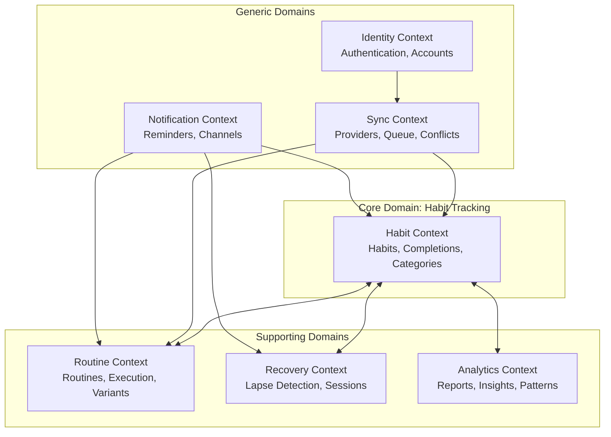
```mermaid
flowchart TB
    subgraph CoreDomain["Core Domain: Habit Tracking"]
        HabitCtx["Habit Context<br/>Habits, Completions, Categories"]
    end
    
    subgraph SupportingDomains["Supporting Domains"]
        RoutineCtx["Routine Context<br/>Routines, Execution, Variants"]
        RecoveryCtx["Recovery Context<br/>Lapse Detection, Sessions"]
        AnalyticsCtx["Analytics Context<br/>Reports, Insights, Patterns"]
    end
    
    subgraph GenericDomains["Generic Domains"]
        IdentityCtx["Identity Context<br/>Authentication, Accounts"]
        SyncCtx["Sync Context<br/>Providers, Queue, Conflicts"]
        NotificationCtx["Notification Context<br/>Reminders, Channels"]
    end
    
    HabitCtx <--> RoutineCtx
    HabitCtx <--> RecoveryCtx
    HabitCtx <--> AnalyticsCtx
    
    IdentityCtx --> SyncCtx
    SyncCtx --> HabitCtx
    SyncCtx --> RoutineCtx
    
    NotificationCtx --> HabitCtx
    NotificationCtx --> RecoveryCtx
    NotificationCtx --> RoutineCtx
```

### Context Definitions

| Context | Type | Responsibility |
|---------|------|----------------|
| Habit Tracking | Core | Define and track habit completions |
| Routine | Supporting | Group habits for sequential execution |
| Recovery | Supporting | Detect lapses and guide return |
| Analytics | Supporting | Generate insights from completion data |
| Identity | Generic | User authentication and accounts |
| Sync | Generic | Multi-device data synchronization |
| Notification | Generic | Reminder scheduling and delivery |

---

## Entity Hierarchy

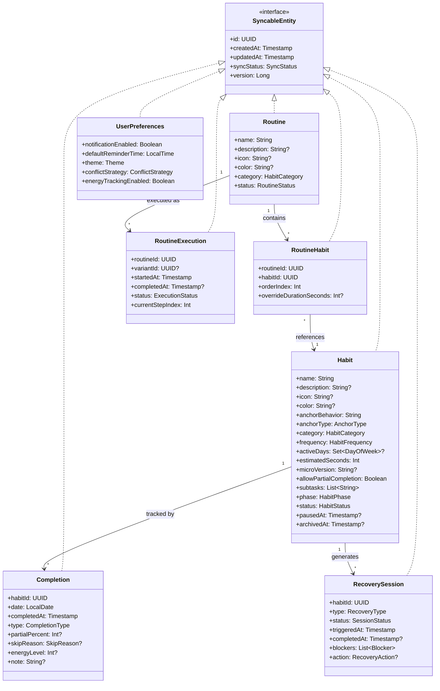
```mermaid
classDiagram
    class SyncableEntity {
        <<interface>>
        +id: UUID
        +createdAt: Timestamp
        +updatedAt: Timestamp
        +syncStatus: SyncStatus
        +version: Long
    }
    
    class Habit {
        +name: String
        +description: String?
        +icon: String?
        +color: String?
        +anchorBehavior: String
        +anchorType: AnchorType
        +category: HabitCategory
        +frequency: HabitFrequency
        +activeDays: Set~DayOfWeek~?
        +estimatedSeconds: Int
        +microVersion: String?
        +allowPartialCompletion: Boolean
        +subtasks: List~String~
        +phase: HabitPhase
        +status: HabitStatus
        +pausedAt: Timestamp?
        +archivedAt: Timestamp?
    }
    
    class Completion {
        +habitId: UUID
        +date: LocalDate
        +completedAt: Timestamp
        +type: CompletionType
        +partialPercent: Int?
        +skipReason: SkipReason?
        +energyLevel: Int?
        +note: String?
    }
    
    class Routine {
        +name: String
        +description: String?
        +icon: String?
        +color: String?
        +category: HabitCategory
        +status: RoutineStatus
    }
    
    class RoutineHabit {
        +routineId: UUID
        +habitId: UUID
        +orderIndex: Int
        +overrideDurationSeconds: Int?
    }
    
    class RoutineExecution {
        +routineId: UUID
        +variantId: UUID?
        +startedAt: Timestamp
        +completedAt: Timestamp?
        +status: ExecutionStatus
        +currentStepIndex: Int
    }
    
    class RecoverySession {
        +habitId: UUID
        +type: RecoveryType
        +status: SessionStatus
        +triggeredAt: Timestamp
        +completedAt: Timestamp?
        +blockers: List~Blocker~
        +action: RecoveryAction?
    }
    
    class UserPreferences {
        +notificationEnabled: Boolean
        +defaultReminderTime: LocalTime
        +theme: Theme
        +conflictStrategy: ConflictStrategy
        +energyTrackingEnabled: Boolean
    }
    
    SyncableEntity <|.. Habit
    SyncableEntity <|.. Completion
    SyncableEntity <|.. Routine
    SyncableEntity <|.. RoutineHabit
    SyncableEntity <|.. RoutineExecution
    SyncableEntity <|.. RecoverySession
    SyncableEntity <|.. UserPreferences
    
    Habit "1" --> "*" Completion : tracked by
    Habit "1" --> "*" RecoverySession : generates
    Routine "1" --> "*" RoutineHabit : contains
    RoutineHabit "*" --> "1" Habit : references
    Routine "1" --> "*" RoutineExecution : executed as
```

---

## Aggregate Roots

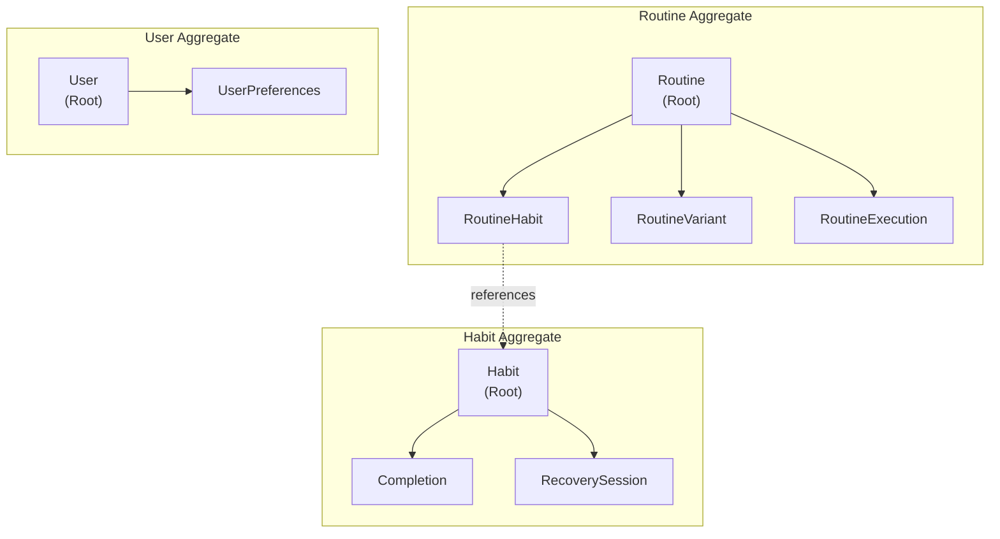
```mermaid
flowchart TB
    subgraph HabitAggregate["Habit Aggregate"]
        Habit["Habit<br/>(Root)"]
        Completion["Completion"]
        RecoverySession["RecoverySession"]
        
        Habit --> Completion
        Habit --> RecoverySession
    end
    
    subgraph RoutineAggregate["Routine Aggregate"]
        Routine["Routine<br/>(Root)"]
        RoutineHabit["RoutineHabit"]
        RoutineVariant["RoutineVariant"]
        RoutineExecution["RoutineExecution"]
        
        Routine --> RoutineHabit
        Routine --> RoutineVariant
        Routine --> RoutineExecution
    end
    
    subgraph UserAggregate["User Aggregate"]
        User["User<br/>(Root)"]
        UserPreferences["UserPreferences"]
        
        User --> UserPreferences
    end
    
    RoutineHabit -.-> |"references"| Habit
```

### Aggregate Rules

| Aggregate | Root | Owned Entities | Notes |
|-----------|------|----------------|-------|
| Habit | Habit | Completion, RecoverySession | Completions accessed through habit |
| Routine | Routine | RoutineHabit, RoutineVariant, RoutineExecution | RoutineHabit references (not owns) Habit |
| User | User | UserPreferences | Single preferences document |

---

## Core Entities

### Habit

The fundamental unit of behavior change.

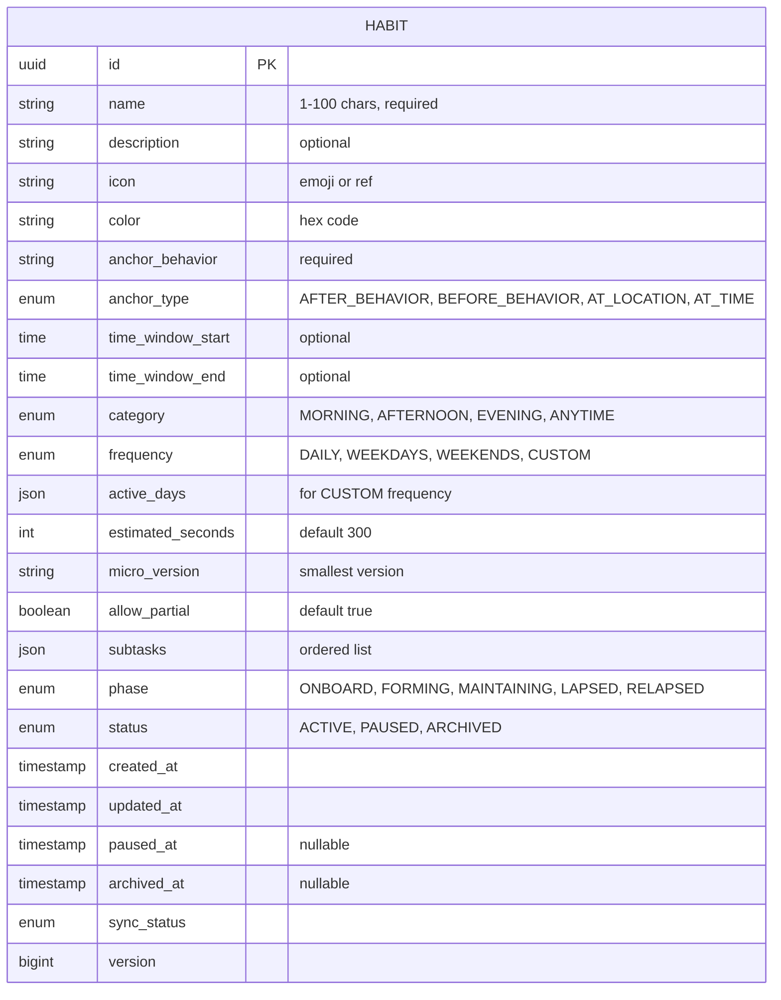
```mermaid
erDiagram
    HABIT {
        uuid id PK
        string name "1-100 chars, required"
        string description "optional"
        string icon "emoji or ref"
        string color "hex code"
        string anchor_behavior "required"
        enum anchor_type "AFTER_BEHAVIOR, BEFORE_BEHAVIOR, AT_LOCATION, AT_TIME"
        time time_window_start "optional"
        time time_window_end "optional"
        enum category "MORNING, AFTERNOON, EVENING, ANYTIME"
        enum frequency "DAILY, WEEKDAYS, WEEKENDS, CUSTOM"
        json active_days "for CUSTOM frequency"
        int estimated_seconds "default 300"
        string micro_version "smallest version"
        boolean allow_partial "default true"
        json subtasks "ordered list"
        enum phase "ONBOARD, FORMING, MAINTAINING, LAPSED, RELAPSED"
        enum status "ACTIVE, PAUSED, ARCHIVED"
        timestamp created_at
        timestamp updated_at
        timestamp paused_at "nullable"
        timestamp archived_at "nullable"
        enum sync_status
        bigint version
    }
```

#### Habit Lifecycle

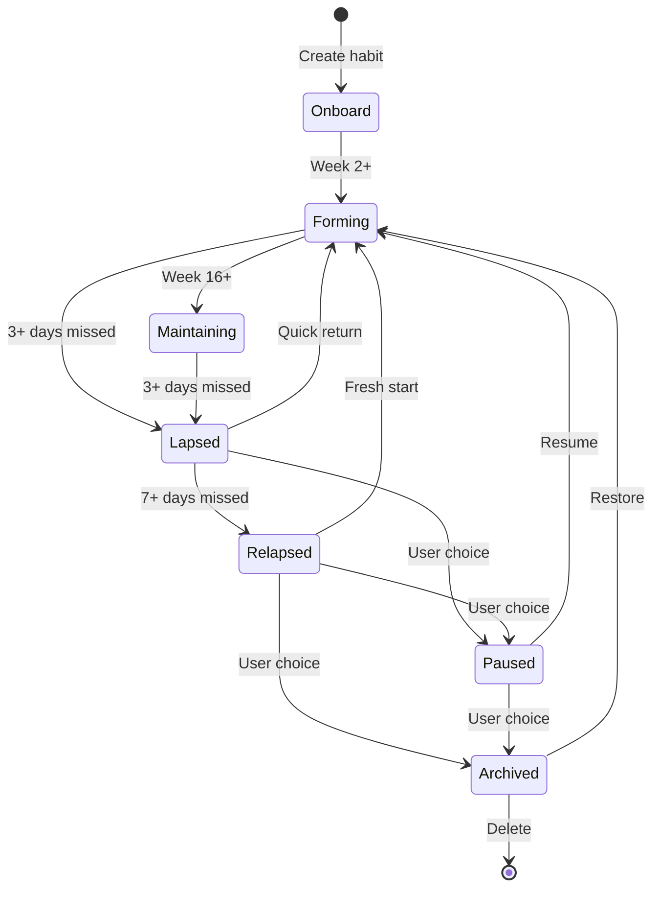
```mermaid
stateDiagram-v2
    [*] --> Onboard: Create habit
    
    Onboard --> Forming: Week 2+
    Forming --> Maintaining: Week 16+
    
    Forming --> Lapsed: 3+ days missed
    Maintaining --> Lapsed: 3+ days missed
    
    Lapsed --> Forming: Quick return
    Lapsed --> Relapsed: 7+ days missed
    Lapsed --> Paused: User choice
    
    Relapsed --> Forming: Fresh start
    Relapsed --> Paused: User choice
    Relapsed --> Archived: User choice
    
    Paused --> Forming: Resume
    Paused --> Archived: User choice
    
    Archived --> Forming: Restore
    Archived --> [*]: Delete
```

### Completion

A record of habit execution for a specific day.

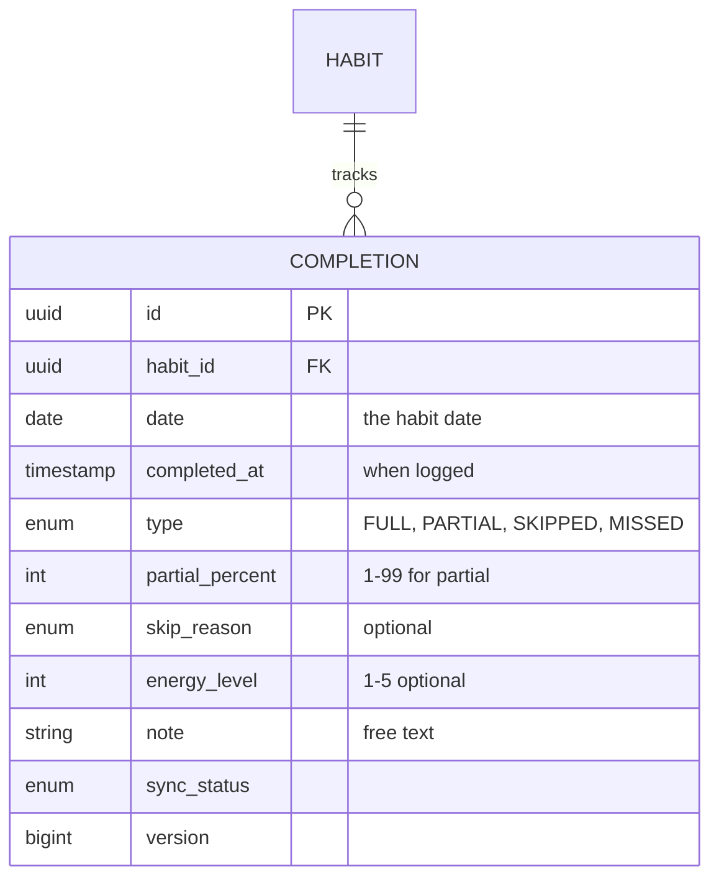
```mermaid
erDiagram
    COMPLETION {
        uuid id PK
        uuid habit_id FK
        date date "the habit date"
        timestamp completed_at "when logged"
        enum type "FULL, PARTIAL, SKIPPED, MISSED"
        int partial_percent "1-99 for partial"
        enum skip_reason "optional"
        int energy_level "1-5 optional"
        string note "free text"
        enum sync_status
        bigint version
    }
    
    HABIT ||--o{ COMPLETION : "tracks"
```

#### Completion Types

| Type | Meaning | User Action | Visual |
|------|---------|-------------|--------|
| FULL | Habit completed fully | Tap "Done" | ✓ Checkmark |
| PARTIAL | Habit partially done | Tap "Partial" | Half-filled circle |
| SKIPPED | Intentionally skipped | Tap "Skip" | Skip icon |
| MISSED | Day ended without action | System-assigned | No visual (history only) |

### Routine

An ordered sequence of habits for grouped execution.

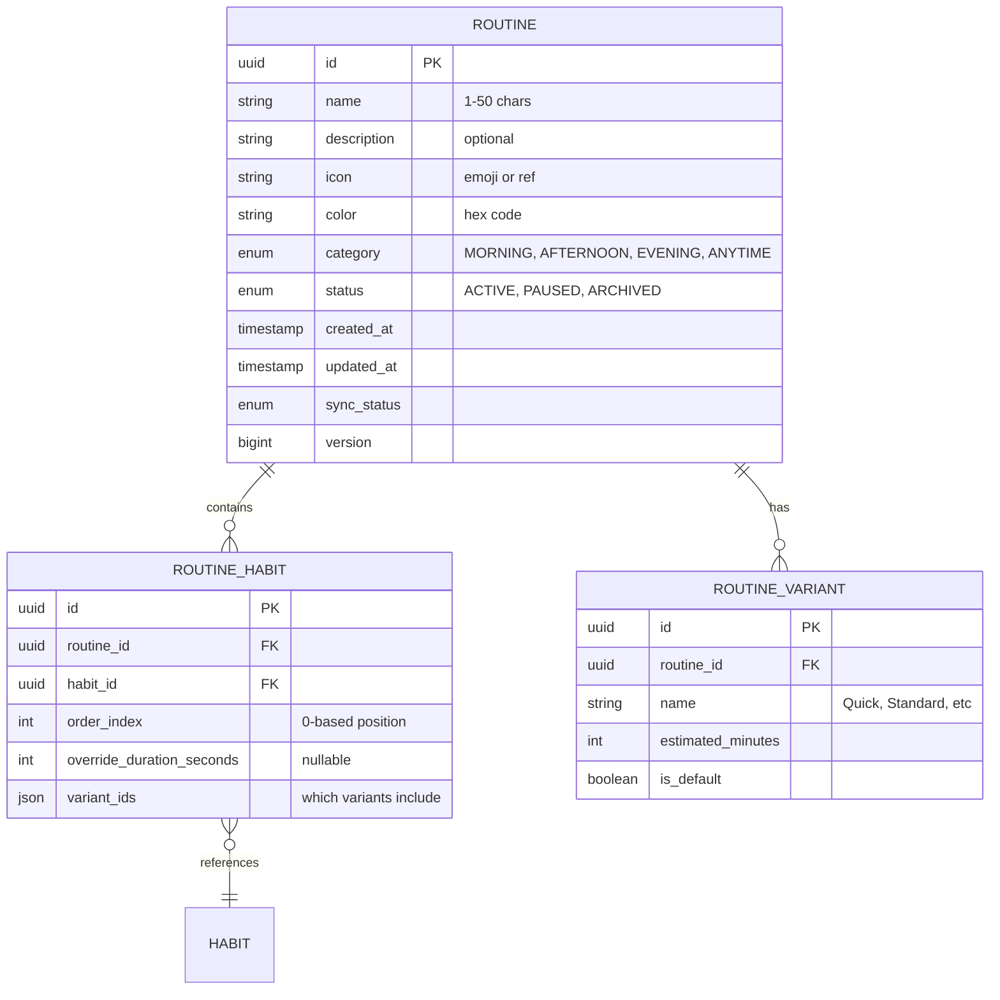
```mermaid
erDiagram
    ROUTINE {
        uuid id PK
        string name "1-50 chars"
        string description "optional"
        string icon "emoji or ref"
        string color "hex code"
        enum category "MORNING, AFTERNOON, EVENING, ANYTIME"
        enum status "ACTIVE, PAUSED, ARCHIVED"
        timestamp created_at
        timestamp updated_at
        enum sync_status
        bigint version
    }
    
    ROUTINE_HABIT {
        uuid id PK
        uuid routine_id FK
        uuid habit_id FK
        int order_index "0-based position"
        int override_duration_seconds "nullable"
        json variant_ids "which variants include"
    }
    
    ROUTINE_VARIANT {
        uuid id PK
        uuid routine_id FK
        string name "Quick, Standard, etc"
        int estimated_minutes
        boolean is_default
    }
    
    ROUTINE ||--o{ ROUTINE_HABIT : "contains"
    ROUTINE ||--o{ ROUTINE_VARIANT : "has"
    ROUTINE_HABIT }o--|| HABIT : "references"
```

### RoutineExecution

A single run of a routine.

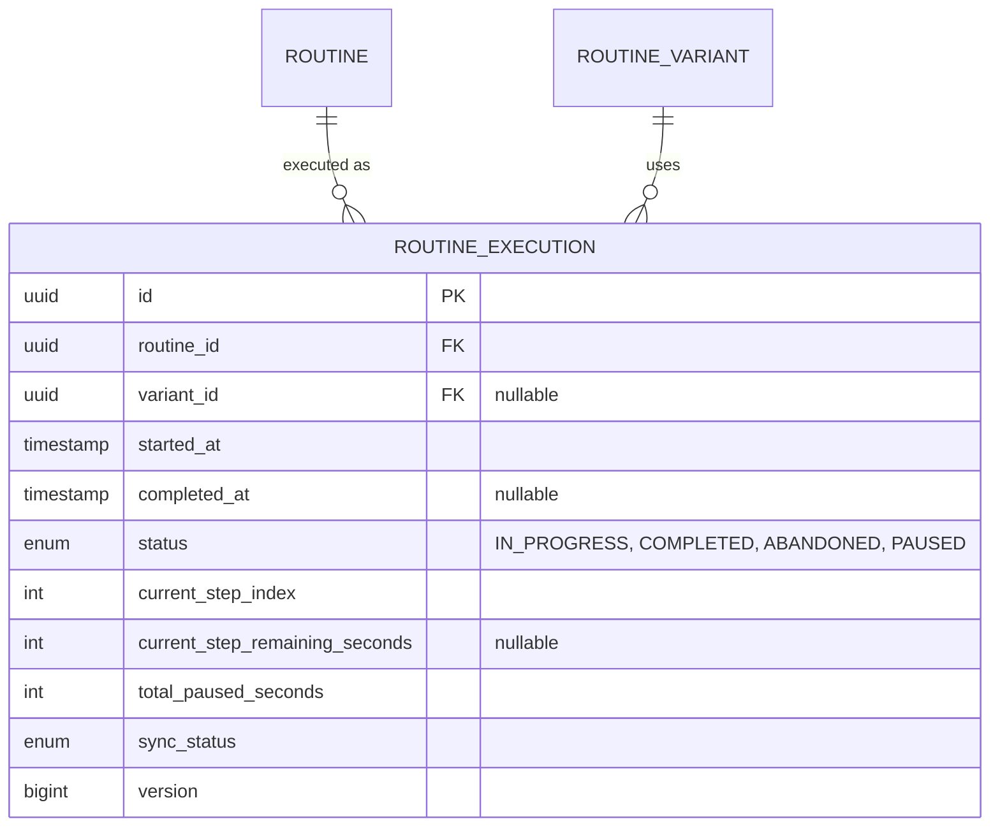
```mermaid
erDiagram
    ROUTINE_EXECUTION {
        uuid id PK
        uuid routine_id FK
        uuid variant_id FK "nullable"
        timestamp started_at
        timestamp completed_at "nullable"
        enum status "IN_PROGRESS, COMPLETED, ABANDONED, PAUSED"
        int current_step_index
        int current_step_remaining_seconds "nullable"
        int total_paused_seconds
        enum sync_status
        bigint version
    }
    
    ROUTINE ||--o{ ROUTINE_EXECUTION : "executed as"
    ROUTINE_VARIANT ||--o{ ROUTINE_EXECUTION : "uses"
```

### RecoverySession

A structured return from lapse or relapse.

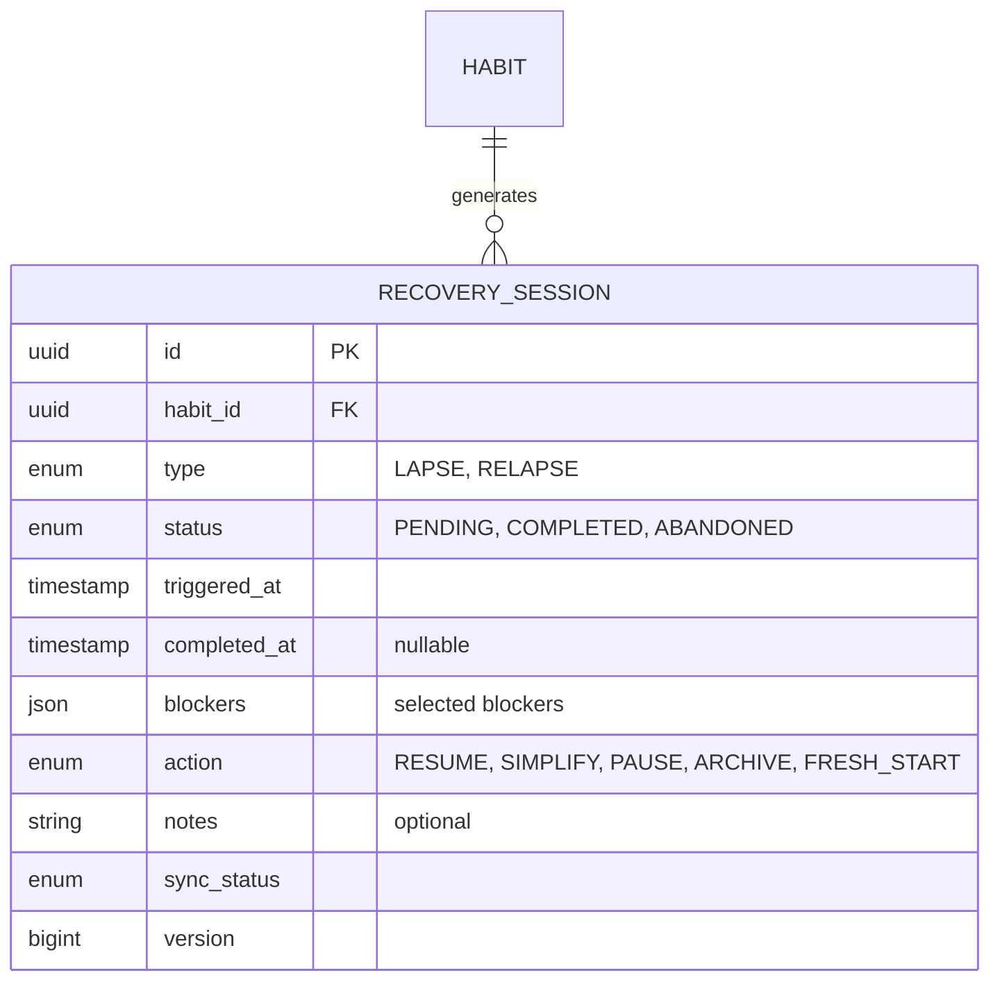
```mermaid
erDiagram
    RECOVERY_SESSION {
        uuid id PK
        uuid habit_id FK
        enum type "LAPSE, RELAPSE"
        enum status "PENDING, COMPLETED, ABANDONED"
        timestamp triggered_at
        timestamp completed_at "nullable"
        json blockers "selected blockers"
        enum action "RESUME, SIMPLIFY, PAUSE, ARCHIVE, FRESH_START"
        string notes "optional"
        enum sync_status
        bigint version
    }
    
    HABIT ||--o{ RECOVERY_SESSION : "generates"
```

### UserPreferences

Global user settings.

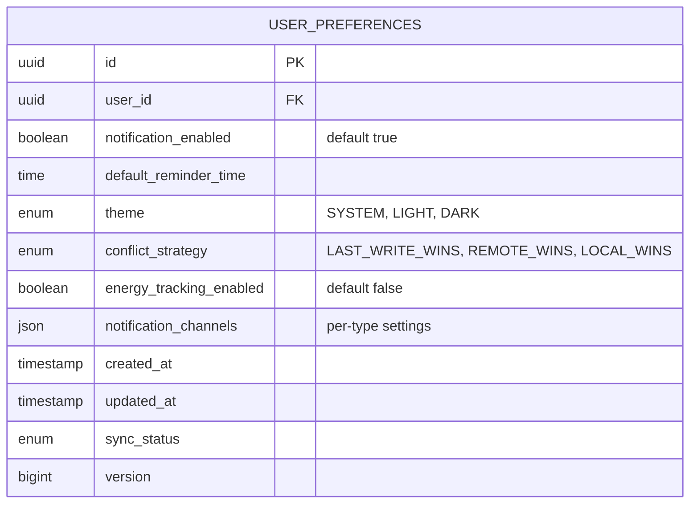
```mermaid
erDiagram
    USER_PREFERENCES {
        uuid id PK
        uuid user_id FK
        boolean notification_enabled "default true"
        time default_reminder_time
        enum theme "SYSTEM, LIGHT, DARK"
        enum conflict_strategy "LAST_WRITE_WINS, REMOTE_WINS, LOCAL_WINS"
        boolean energy_tracking_enabled "default false"
        json notification_channels "per-type settings"
        timestamp created_at
        timestamp updated_at
        enum sync_status
        bigint version
    }
```

---

## Value Objects

Value objects are immutable and compared by value, not identity.

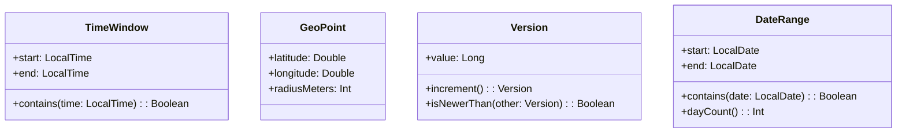
```mermaid
classDiagram
    class TimeWindow {
        +start: LocalTime
        +end: LocalTime
        +contains(time: LocalTime): Boolean
    }
    
    class GeoPoint {
        +latitude: Double
        +longitude: Double
        +radiusMeters: Int
    }
    
    class Version {
        +value: Long
        +increment(): Version
        +isNewerThan(other: Version): Boolean
    }
    
    class DateRange {
        +start: LocalDate
        +end: LocalDate
        +contains(date: LocalDate): Boolean
        +dayCount(): Int
    }
```

### Value Object Definitions

| Value Object | Fields | Purpose |
|--------------|--------|---------|
| TimeWindow | start, end | Define optional time constraints |
| GeoPoint | lat, lon, radius | Location-based triggers |
| Version | value (Long) | Conflict detection for sync |
| DateRange | start, end | Report date ranges |

---

## Enumerations

### Habit Enums

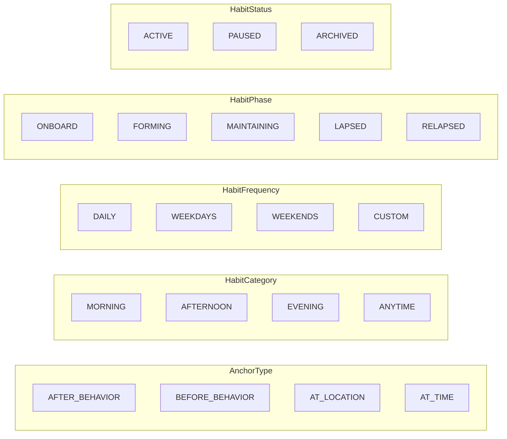
```mermaid
flowchart LR
    subgraph AnchorType
        AT1["AFTER_BEHAVIOR"]
        AT2["BEFORE_BEHAVIOR"]
        AT3["AT_LOCATION"]
        AT4["AT_TIME"]
    end
    
    subgraph HabitCategory
        HC1["MORNING"]
        HC2["AFTERNOON"]
        HC3["EVENING"]
        HC4["ANYTIME"]
    end
    
    subgraph HabitFrequency
        HF1["DAILY"]
        HF2["WEEKDAYS"]
        HF3["WEEKENDS"]
        HF4["CUSTOM"]
    end
    
    subgraph HabitPhase
        HP1["ONBOARD"]
        HP2["FORMING"]
        HP3["MAINTAINING"]
        HP4["LAPSED"]
        HP5["RELAPSED"]
    end
    
    subgraph HabitStatus
        HS1["ACTIVE"]
        HS2["PAUSED"]
        HS3["ARCHIVED"]
    end
```

### Completion Enums

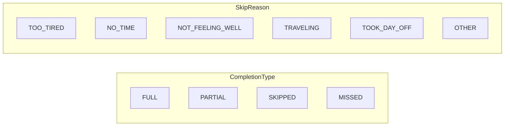
```mermaid
flowchart LR
    subgraph CompletionType
        CT1["FULL"]
        CT2["PARTIAL"]
        CT3["SKIPPED"]
        CT4["MISSED"]
    end
    
    subgraph SkipReason
        SR1["TOO_TIRED"]
        SR2["NO_TIME"]
        SR3["NOT_FEELING_WELL"]
        SR4["TRAVELING"]
        SR5["TOOK_DAY_OFF"]
        SR6["OTHER"]
    end
```

### Recovery Enums

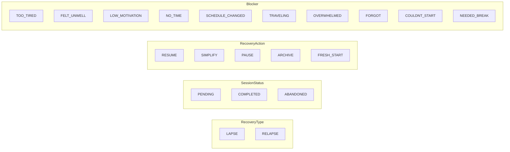
```mermaid
flowchart LR
    subgraph RecoveryType
        RT1["LAPSE"]
        RT2["RELAPSE"]
    end
    
    subgraph SessionStatus
        SS1["PENDING"]
        SS2["COMPLETED"]
        SS3["ABANDONED"]
    end
    
    subgraph RecoveryAction
        RA1["RESUME"]
        RA2["SIMPLIFY"]
        RA3["PAUSE"]
        RA4["ARCHIVE"]
        RA5["FRESH_START"]
    end
    
    subgraph Blocker
        B1["TOO_TIRED"]
        B2["FELT_UNWELL"]
        B3["LOW_MOTIVATION"]
        B4["NO_TIME"]
        B5["SCHEDULE_CHANGED"]
        B6["TRAVELING"]
        B7["OVERWHELMED"]
        B8["FORGOT"]
        B9["COULDNT_START"]
        B10["NEEDED_BREAK"]
    end
```

### Sync Enums

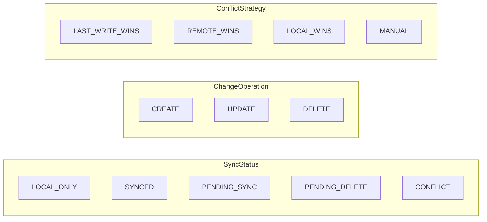
```mermaid
flowchart LR
    subgraph SyncStatus
        SS1["LOCAL_ONLY"]
        SS2["SYNCED"]
        SS3["PENDING_SYNC"]
        SS4["PENDING_DELETE"]
        SS5["CONFLICT"]
    end
    
    subgraph ChangeOperation
        CO1["CREATE"]
        CO2["UPDATE"]
        CO3["DELETE"]
    end
    
    subgraph ConflictStrategy
        CS1["LAST_WRITE_WINS"]
        CS2["REMOTE_WINS"]
        CS3["LOCAL_WINS"]
        CS4["MANUAL"]
    end
```

---

## Domain Events

Events that represent significant occurrences in the domain.

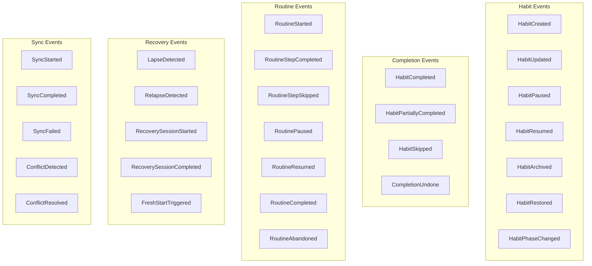
```mermaid
flowchart TB
    subgraph HabitEvents["Habit Events"]
        HE1["HabitCreated"]
        HE2["HabitUpdated"]
        HE3["HabitPaused"]
        HE4["HabitResumed"]
        HE5["HabitArchived"]
        HE6["HabitRestored"]
        HE7["HabitPhaseChanged"]
    end
    
    subgraph CompletionEvents["Completion Events"]
        CE1["HabitCompleted"]
        CE2["HabitPartiallyCompleted"]
        CE3["HabitSkipped"]
        CE4["CompletionUndone"]
    end
    
    subgraph RoutineEvents["Routine Events"]
        RE1["RoutineStarted"]
        RE2["RoutineStepCompleted"]
        RE3["RoutineStepSkipped"]
        RE4["RoutinePaused"]
        RE5["RoutineResumed"]
        RE6["RoutineCompleted"]
        RE7["RoutineAbandoned"]
    end
    
    subgraph RecoveryEvents["Recovery Events"]
        RCE1["LapseDetected"]
        RCE2["RelapseDetected"]
        RCE3["RecoverySessionStarted"]
        RCE4["RecoverySessionCompleted"]
        RCE5["FreshStartTriggered"]
    end
    
    subgraph SyncEvents["Sync Events"]
        SE1["SyncStarted"]
        SE2["SyncCompleted"]
        SE3["SyncFailed"]
        SE4["ConflictDetected"]
        SE5["ConflictResolved"]
    end
```

### Event Details

| Event | Payload | Triggers |
|-------|---------|----------|
| HabitCreated | Habit | Analytics, initial notification setup |
| HabitCompleted | Completion, Habit | Update Today screen, analytics |
| LapseDetected | Habit, daysMissed | Create RecoverySession, notification |
| RoutineCompleted | Execution | Create Completions for all habits |
| ConflictDetected | local, remote, entity type | Conflict resolution flow |

---

## Relationships Summary

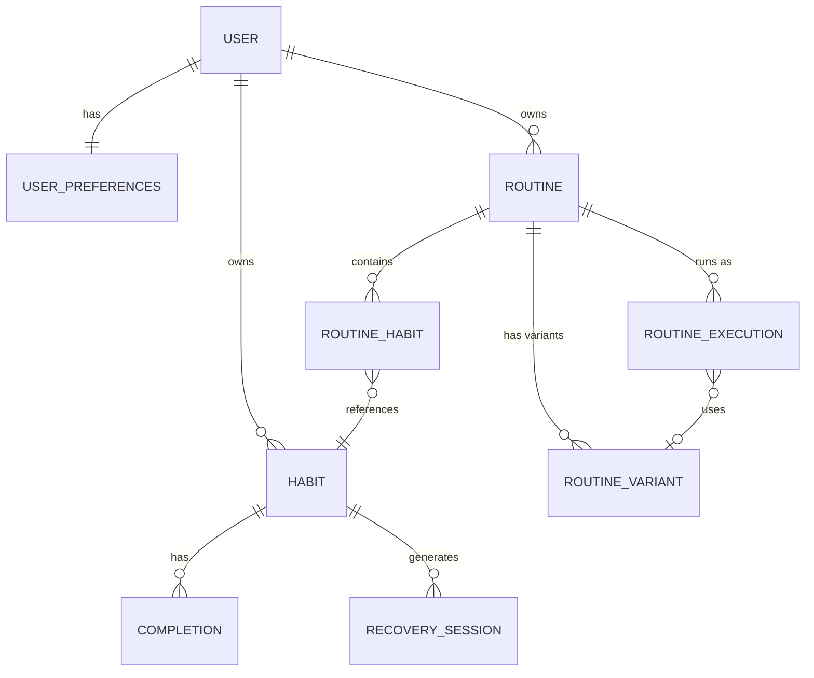
```mermaid
erDiagram
    HABIT ||--o{ COMPLETION : "has"
    HABIT ||--o{ RECOVERY_SESSION : "generates"
    
    ROUTINE ||--o{ ROUTINE_HABIT : "contains"
    ROUTINE ||--o{ ROUTINE_VARIANT : "has variants"
    ROUTINE ||--o{ ROUTINE_EXECUTION : "runs as"
    
    ROUTINE_HABIT }o--|| HABIT : "references"
    ROUTINE_EXECUTION }o--o| ROUTINE_VARIANT : "uses"
    
    USER ||--|| USER_PREFERENCES : "has"
    USER ||--o{ HABIT : "owns"
    USER ||--o{ ROUTINE : "owns"
```

---

## Consistency Rules

### Within Aggregates

| Aggregate | Rule | Enforcement |
|-----------|------|-------------|
| Habit | Completion.habitId must exist | Foreign key |
| Habit | RecoverySession.habitId must exist | Foreign key |
| Routine | RoutineHabit.orderIndex unique per routine | Unique constraint |
| Routine | RoutineExecution.routineId must exist | Foreign key |

### Across Aggregates

| Rule | Source | Target | Handling |
|------|--------|--------|----------|
| RoutineHabit → Habit | RoutineHabit.habitId | Habit.id | Soft reference, warn on delete |
| Variant → RoutineHabit | RoutineHabit.variantIds | RoutineVariant.id | JSON validation |

---

## Query Patterns

### Common Queries

| Query | Entities | Frequency |
|-------|----------|-----------|
| Habits due today | Habit, Completion | Very High |
| Today's completions | Completion | Very High |
| Week completion rate | Completion (7 days) | High |
| Active routines | Routine | Medium |
| Lapsed habits | Habit (by phase) | Low (daily worker) |
| Recovery history | RecoverySession | Low |

### Query Optimization Notes

- Index on `Completion(habitId, date)`
- Index on `Habit(status, category)`
- Index on `Habit(phase)` for lapse detection
- Composite index on `RoutineHabit(routineId, orderIndex)`
