# Business Invariants

## Overview

This document defines the business rules and invariants that must always hold true in the Kairos system. Invariants are constraints that cannot be violated regardless of the operation being performed.

---

## Invariant Categories

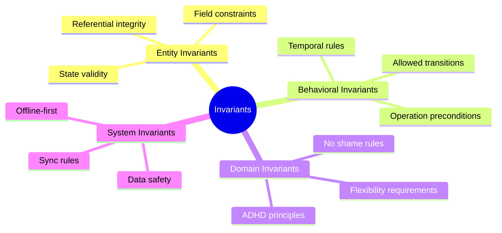

---

## Habit Invariants

### H-1: Anchor Requirement

**Every habit must have an anchor behavior.**

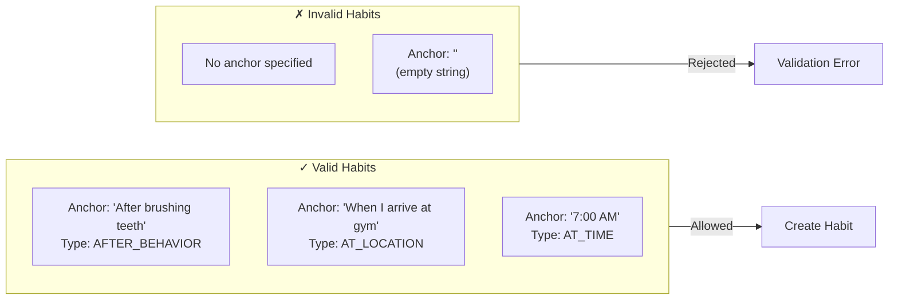

**Rule**: `habit.anchorBehavior != null && habit.anchorBehavior.isNotBlank()`

**Rationale**: Context-based triggers are fundamental to ADHD-friendly habit design. Time-based triggers are allowed but must be explicitly chosen.

---

### H-2: Category Assignment

**Every habit must belong to exactly one category.**

| Category | Time Association | Examples |
|----------|------------------|----------|
| MORNING | Before noon | Medication, exercise, breakfast routine |
| AFTERNOON | Noon to 6 PM | Work habits, lunch routine |
| EVENING | After 6 PM | Wind-down, preparation for next day |
| ANYTIME | No time constraint | Hydration, posture check |

**Rule**: `habit.category in [MORNING, AFTERNOON, EVENING, ANYTIME]`

---

### H-3: Phase Validity

**Habit phase must be valid for current status.**

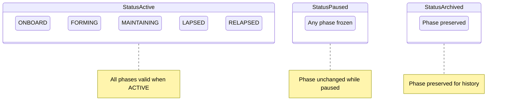

**Rules**:
- If `status == ACTIVE`, phase can be any value
- If `status == PAUSED`, phase is frozen (not updated)
- If `status == ARCHIVED`, phase is preserved (not updated)

---

### H-4: Partial Completion Always Allowed

**Partial completion cannot be disabled.**

**Rule**: `habit.allowPartialCompletion == true` (always)

**Rationale**: ADHD users struggle with perfectionism. Removing partial completion would reintroduce all-or-nothing thinking that causes abandonment.

**Note**: This field exists for potential future flexibility but currently must always be true.

---

### H-5: Threshold Ordering

**Relapse threshold must exceed lapse threshold.**

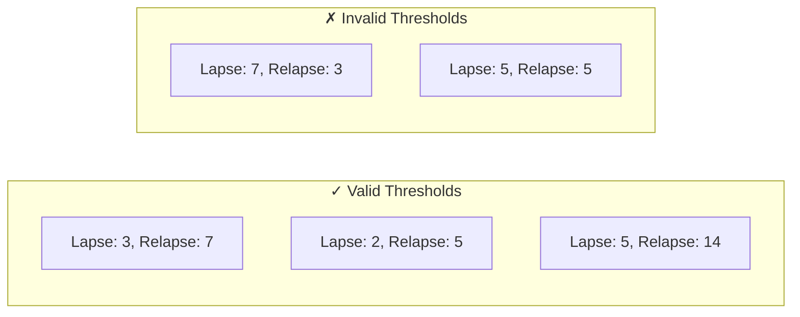

**Rule**: `habit.relapseThresholdDays > habit.lapseThresholdDays`

**Rationale**: Lapse detection must occur before relapse to allow early intervention.

---

### H-6: Timestamp Consistency

**Lifecycle timestamps must be logically ordered.**

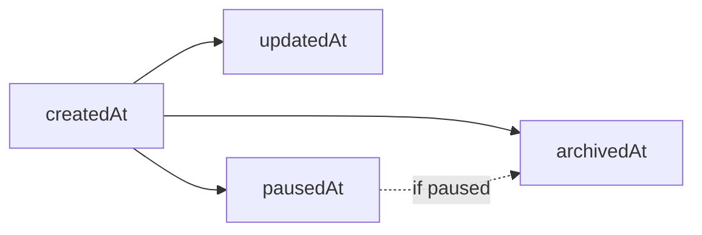

**Rules**:
- `habit.createdAt <= habit.updatedAt`
- `habit.pausedAt == null || habit.pausedAt >= habit.createdAt`
- `habit.archivedAt == null || habit.archivedAt >= habit.createdAt`
- If both set: `habit.pausedAt <= habit.archivedAt` (paused before archived)

---

## Completion Invariants

### C-1: Valid Completion Type

**Completion type must match the action taken.**

| Type | User Action | System Action |
|------|-------------|---------------|
| FULL | User taps "Done" | Never |
| PARTIAL | User taps "Partial" | Never |
| SKIPPED | User taps "Skip" | Never |
| MISSED | Never | System marks at day end |

**Rule**: MISSED completions can only be created by the lapse detection worker, never by direct user action.

---

### C-2: Partial Percentage Range

**Partial percentage must be between 1 and 99.**

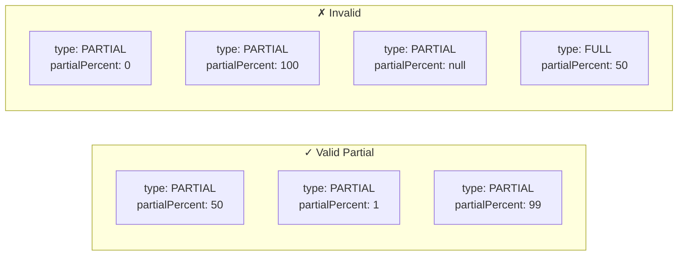

**Rules**:
- If `type == PARTIAL`: `1 <= partialPercent <= 99`
- If `type != PARTIAL`: `partialPercent == null`

---

### C-3: One Completion Per Habit Per Day

**A habit cannot have multiple completions for the same day.**

**Rule**: Unique constraint on `(habitId, date)`

**Exception**: Undo and redo operations replace the existing completion, they don't create a second one.

---

### C-4: No Future Completions

**Completions cannot be created for future dates.**

**Rule**: `completion.date <= today()`

---

### C-5: Limited Backdating

**Completions can only be backdated within 7 days.**

**Rule**: `completion.date >= today() - 7 days`

**Rationale**: Allows correcting recent oversights without enabling extensive history manipulation.

---

### C-6: Habit Must Exist

**Completion must reference an existing habit.**

**Rule**: `completion.habitId` references valid `Habit.id`

**Note**: Completions are preserved even if habit is archived—archive doesn't delete.

---

## Routine Invariants

### R-1: Minimum Habit Count

**A routine must contain at least 2 habits.**

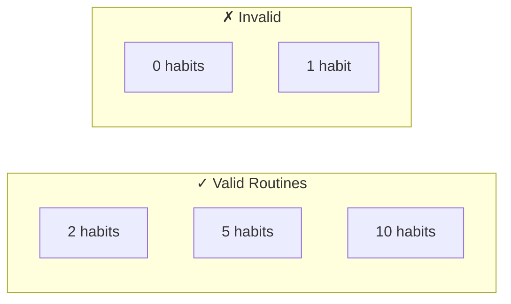

**Rule**: `routine.habits.count >= 2`

**Rationale**: A single habit doesn't need a routine—routines exist for sequencing multiple actions.

---

### R-2: Order Index Integrity

**Order indices must be sequential without gaps.**

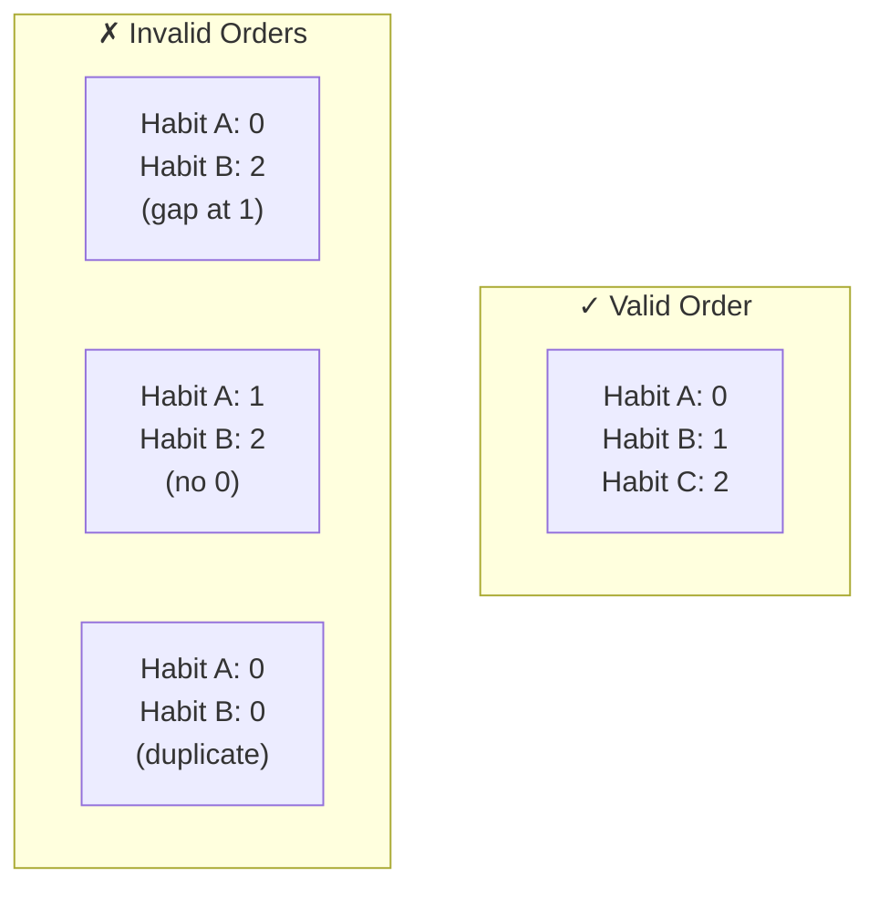

**Rules**:
- `orderIndex` starts at 0
- No gaps in sequence
- No duplicate indices within a routine

---

### R-3: Habit Reference Validity

**RoutineHabit must reference an existing, active habit.**

**Rule**: `routineHabit.habitId` references `Habit` where `status != ARCHIVED`

**Handling**: When a habit is archived, warn user that it will be removed from routines, or prevent archive if habit is in routines.

---

### R-4: Positive Duration

**All durations must be positive.**

**Rule**: 
- `routineHabit.overrideDurationSeconds > 0` (if set)
- Referenced habit's `estimatedSeconds > 0`

---

### R-5: Variant Habit Subset

**Variant can only include habits that are in the parent routine.**

**Rule**: `routineHabit.variantIds` must all exist in `RoutineVariant` for the same routine.

---

## Execution Invariants

### E-1: Active Execution Uniqueness

**Only one routine execution can be IN_PROGRESS at a time.**

**Rule**: At most one `RoutineExecution` with `status == IN_PROGRESS` per user.

**Rationale**: User can only run one routine at a time.

---

### E-2: Step Index Bounds

**Current step index must be within routine bounds.**

**Rule**: `0 <= execution.currentStepIndex < routine.habits.count`

---

### E-3: Completion Creates Habit Completions

**When a routine completes, all non-skipped steps create habit completions.**

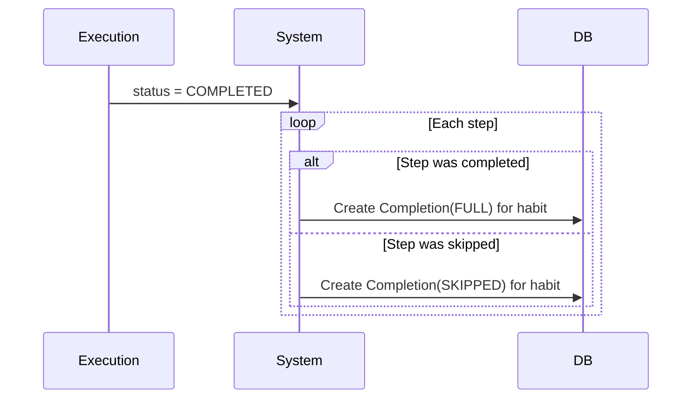

**Rule**: Routine completion atomically creates completions for all habits in the routine.

---

## Recovery Invariants

### REC-1: Session Triggers at Threshold

**Recovery session created exactly when lapse threshold is reached.**

**Rule**: `RecoverySession` created when `consecutiveMissedDays == habit.lapseThresholdDays`

**Not before, not after**—exactly at threshold.

---

### REC-2: One Pending Session Per Habit

**A habit can have at most one PENDING recovery session.**

**Rule**: `RecoverySession.count(habitId, status=PENDING) <= 1`

---

### REC-3: Session Completion Requirements

**Completed session must have an action.**

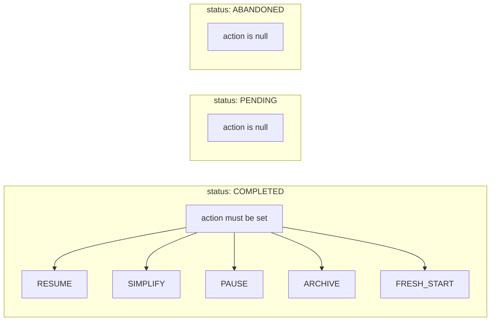

**Rules**:
- If `status == COMPLETED`: `action != null`
- If `status == PENDING`: `action == null`
- If `status == ABANDONED`: `action == null`

---

### REC-4: Type Escalation

**Lapse can become relapse, but not vice versa.**

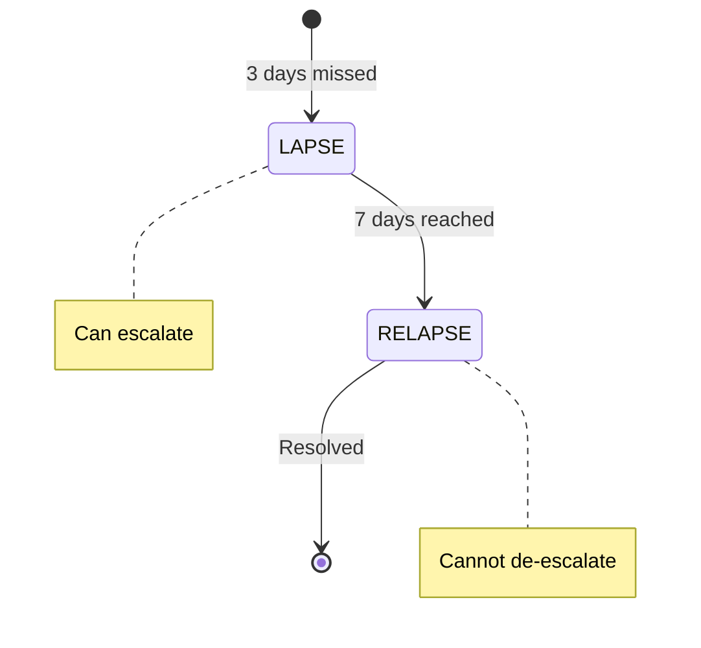

**Rule**: If `type == RELAPSE`, it cannot change back to `LAPSE`.

---

## Sync Invariants

### S-1: Local Source of Truth

**Room database is the authoritative source; cloud is backup.**

**Rules**:
- All operations succeed locally before sync
- Sync failure never blocks local operations
- No local data deleted without sync confirmation

---

### S-2: Offline Queue Persistence

**Pending changes survive app termination.**

**Rule**: `PendingChange` records persisted to Room, not just memory.

---

### S-3: Version Monotonicity

**Entity version only increases, never decreases.**

**Rule**: `newVersion > oldVersion` for all updates

---

### S-4: No Orphaned Deletes

**Delete operations only queued for entities that exist locally.**

**Rule**: Cannot create `PendingChange(DELETE)` for entity not in local DB.

---

### S-5: Authentication Required

**All sync operations require valid authentication.**

**Rule**: Sync disabled if `authToken == null || authToken.isExpired`

---

## Domain Invariants (ADHD Principles)

### D-1: No Streak Display

**System never calculates, stores, or displays streak counts.**

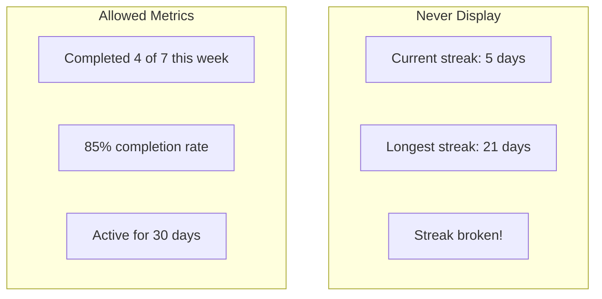

**Rule**: No streak-related fields or calculations anywhere in the system.

---

### D-2: No Punitive Messaging

**All user-facing text must be shame-free.**

| Forbidden Phrases | Allowed Alternatives |
|-------------------|---------------------|
| "You failed" | "Let's figure this out" |
| "Streak broken" | (Never mention) |
| "You missed X days" | "Ready when you are" |
| "Try harder" | "What would help?" |
| "Don't give up" | "Welcome back" |

**Rule**: All strings pass shame-free review (see Messaging Guidelines).

---

### D-3: No Gamification

**System has no points, badges, levels, or leaderboards.**

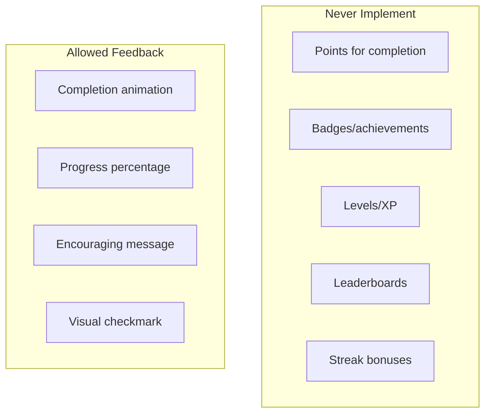

**Rule**: Feedback is immediate and intrinsic, not gamified.

---

### D-4: Flexibility Over Rigidity

**Users can always skip, pause, or simplify without penalty.**

**Rules**:
- Skip option always available
- Pause option always available
- No penalty for any of these actions
- Recovery always offered, never forced

---

## Summary Table

| ID | Category | Invariant | Enforcement |
|----|----------|-----------|-------------|
| H-1 | Habit | Anchor required | Validation |
| H-2 | Habit | Category required | Enum constraint |
| H-3 | Habit | Phase valid for status | State machine |
| H-4 | Habit | Partial always allowed | Hardcoded true |
| H-5 | Habit | Threshold ordering | Validation |
| H-6 | Habit | Timestamp consistency | Validation |
| C-1 | Completion | Valid type | Enum + workflow |
| C-2 | Completion | Partial percentage range | Validation |
| C-3 | Completion | One per habit per day | Unique constraint |
| C-4 | Completion | No future dates | Validation |
| C-5 | Completion | Limited backdating | Validation |
| C-6 | Completion | Habit exists | Foreign key |
| R-1 | Routine | Minimum 2 habits | Validation |
| R-2 | Routine | Order index integrity | Validation |
| R-3 | Routine | Habit reference valid | Foreign key + check |
| R-4 | Routine | Positive duration | Validation |
| R-5 | Routine | Variant subset | Validation |
| E-1 | Execution | Single active | Unique constraint |
| E-2 | Execution | Step bounds | Validation |
| E-3 | Execution | Creates completions | Transaction |
| REC-1 | Recovery | Threshold trigger | Worker logic |
| REC-2 | Recovery | One pending per habit | Unique constraint |
| REC-3 | Recovery | Completion has action | Validation |
| REC-4 | Recovery | Type escalation | State machine |
| S-1 | Sync | Local source of truth | Architecture |
| S-2 | Sync | Queue persistence | Room storage |
| S-3 | Sync | Version monotonicity | Validation |
| S-4 | Sync | No orphaned deletes | Validation |
| S-5 | Sync | Auth required | Guard |
| D-1 | Domain | No streaks | Policy |
| D-2 | Domain | No punitive messaging | Review |
| D-3 | Domain | No gamification | Policy |
| D-4 | Domain | Flexibility over rigidity | Design |
