# System Architecture

## Overview

Kairos follows a **Clean Architecture** pattern with clear separation between layers. The system is designed for offline-first operation with optional cloud synchronization.

---

## High-Level Architecture

```mermaid
flowchart TB
    subgraph Clients["Client Applications"]
        Android["📱 Android App<br/>Jetpack Compose"]
        WearOS["⌚ WearOS App<br/>Tiles + Compose"]
        Widget["🔲 Home Widget<br/>Glance"]
    end
    
    subgraph AppLayers["Application Layers"]
        subgraph Presentation["Presentation Layer"]
            Screens["Screens"]
            ViewModels["ViewModels"]
            Components["UI Components"]
        end
        
        subgraph Domain["Domain Layer"]
            UseCases["Use Cases"]
            Models["Domain Models"]
            Interfaces["Repository Interfaces"]
        end
        
        subgraph Data["Data Layer"]
            Repos["Repository Implementations"]
            LocalDS["Local Data Sources"]
            RemoteDS["Remote Data Sources"]
        end
    end
    
    subgraph Infrastructure["Infrastructure"]
        Room["Room Database"]
        DataStore["DataStore Preferences"]
        WorkMgr["WorkManager"]
        Notifications["Notification Service"]
    end
    
    subgraph External["Self-Hosted Server (Docker)"]
        PocketBase["PocketBase<br/>Auth + Admin"]
        Postgres["Postgres<br/>Data Storage"]
        PowerSync["PowerSync<br/>Offline-First Sync"]
        Mosquitto["Mosquitto<br/>MQTT for ESP32"]
    end
    
    Android --> Presentation
    WearOS --> Presentation
    Widget --> ViewModels
    
    Screens --> ViewModels
    ViewModels --> UseCases
    UseCases --> Models
    UseCases --> Interfaces
    
    Interfaces --> Repos
    Repos --> LocalDS
    Repos --> RemoteDS
    
    LocalDS --> Room
    LocalDS --> DataStore
    RemoteDS --> PowerSync
    RemoteDS --> PocketBase
    
    PowerSync --> Postgres
    
    WorkMgr --> Repos
    Notifications --> Android
    Notifications --> WearOS
```



---

## Layer Responsibilities

### Presentation Layer


| Component | Responsibility |
|-----------|----------------|
| Screens | Compose UI, observes ViewModel state |
| ViewModels | Manages UI state, invokes use cases |
| UI State | Immutable state objects, one-way data flow |
| UI Events | One-time events (navigation, toasts) |

### Domain Layer


| Component | Responsibility |
|-----------|----------------|
| Use Cases | Single business operation, orchestrates repositories |
| Domain Models | Pure business entities, no framework dependencies |
| Repository Interfaces | Contracts for data access |

### Data Layer

```mermaid
flowchart TB
    subgraph Data["Data Layer"]
        subgraph RepoImpl["Repository Implementations"]
            HabitRepoImpl["HabitRepositoryImpl"]
            CompletionRepoImpl["CompletionRepositoryImpl"]
            RoutineRepoImpl["RoutineRepositoryImpl"]
            SyncRepoImpl["SyncRepositoryImpl"]
        end
        
        subgraph LocalSources["Local Data Sources"]
            HabitDao["HabitDao"]
            CompletionDao["CompletionDao"]
            RoutineDao["RoutineDao"]
            PendingChangeDao["PendingChangeDao"]
            PrefsStore["PreferencesDataStore"]
        end
        
        subgraph RemoteSources["Remote Data Sources"]
            SyncProvider["SyncProvider Interface"]
            FirebaseImpl["FirebaseProvider"]
            PocketBaseImpl["PocketBaseProvider"]
        end
        
        subgraph Mappers["Mappers"]
            EntityMapper["Entity ↔ Domain"]
            DtoMapper["DTO ↔ Entity"]
        end
    end
    
    RepoImpl --> LocalSources
    RepoImpl --> RemoteSources
    RepoImpl --> Mappers
```



| Component | Responsibility |
|-----------|----------------|
| Repositories | Coordinate local and remote data sources |
| DAOs | Room database access objects |
| Providers | Backend-specific sync implementations |
| Mappers | Transform between layer-specific models |

---

## Module Structure


### Module Descriptions

| Module | Contents | Dependencies |
|--------|----------|--------------|
| `app` | Android app, DI setup, navigation | core, ui |
| `wear` | WearOS app, tiles, complications | core, ui |
| `core` | Use cases, ViewModels | data, domain |
| `data` | Repositories, DAOs, entities | domain, sync |
| `domain` | Domain models, interfaces | None (pure) |
| `sync` | SyncProvider, queue, conflict resolution | domain |
| `ui` | Shared Compose components, theme | None |

---

## Data Flow

### Habit Completion Flow


### Routine Execution Flow


### Sync Data Flow

```mermaid
sequenceDiagram
    participant App as Application
    participant SM as SyncManager
    participant Queue as PendingChangeQueue
    participant Provider as SyncProvider
    participant Remote as Remote Backend
    participant Local as Local Database
    
    Note over App,Local: Push Flow (Local → Remote)
    
    App->>Local: Modify entity
    Local->>Queue: Enqueue change
    
    SM->>Queue: Poll pending changes
    Queue-->>SM: Return changes
    
    loop Each change
        SM->>Provider: pushChange(change)
        Provider->>Remote: Write data
        Remote-->>Provider: Success/Conflict
        
        alt Success
            Provider-->>SM: PushResult.Success
            SM->>Local: Mark SYNCED
            SM->>Queue: Remove from queue
        else Conflict
            Provider-->>SM: PushResult.Conflict
            SM->>SM: Resolve conflict
            SM->>Provider: pushChange(resolved)
        end
    end
    
    Note over App,Local: Pull Flow (Remote → Local)
    
    SM->>Provider: pullChanges(since)
    Provider->>Remote: Query changes
    Remote-->>Provider: Return changes
    Provider-->>SM: PullResult
    
    loop Each remote change
        SM->>Local: Check for pending local changes
        
        alt No pending changes
            SM->>Local: Apply remote change
        else Has pending changes
            SM->>SM: Skip (local wins during push)
        end
    end
```



---

## Background Processing


### Worker Schedule

| Worker | Schedule | Constraints |
|--------|----------|-------------|
| LapseDetectionWorker | Daily, 00:00-06:00 | Battery not low |
| FreshStartWorker | Monday 06:00, 1st of month 06:00 | None |
| SyncWorker | Every 15 minutes | Network connected |
| ReminderWorker | Per-habit schedule | None |

---

## Notification Architecture


### Notification Actions

| Notification Type | Actions |
|-------------------|---------|
| Habit Reminder | Complete, Snooze, Skip |
| Recovery Prompt | Open Recovery, Dismiss |
| Fresh Start | View Habits, Dismiss |
| Routine Timer | Done, Skip, Pause |

---

## WearOS Architecture

```mermaid
flowchart TB
    subgraph Phone["Phone App"]
        PhoneDB["Room Database"]
        PhoneSync["Sync Manager"]
    end
    
    subgraph Watch["WearOS App"]
        subgraph WearUI["UI"]
            TileService["HabitTileService"]
            Complication["HabitComplication"]
            WearScreens["Wear Compose Screens"]
        end
        
        subgraph WearData["Data"]
            WearDB["Room Database<br/>(Mirror)"]
            DataLayer["Data Layer API"]
        end
    end
    
    subgraph Cloud["Cloud"]
        Backend["Firebase/Custom"]
    end
    
    PhoneDB <--> DataLayer
    DataLayer <--> WearDB
    
    PhoneSync <--> Backend
    
    WearDB --> TileService
    WearDB --> Complication
    WearDB --> WearScreens
    
    Note over DataLayer: Wear Data Layer API<br/>syncs subset of data<br/>between phone and watch
```

### Phone-Watch Sync Strategy

| Data Type | Sync Strategy |
|-----------|---------------|
| Today's Habits | Full sync via Data Layer |
| Completions (today) | Full sync via Data Layer |
| Historical Data | Not synced to watch |
| Routines | Active routine only |
| Settings | Subset (notification prefs) |

---

## Dependency Injection


---

## Error Handling Strategy


### Result Type Pattern


---

## Security Architecture


### Security Rules

| Rule | Implementation |
|------|----------------|
| Token storage | Android Keystore (hardware-backed) |
| Network | TLS required, no cleartext |
| Data isolation | Firestore rules enforce user-only access |
| PII in logs | Prohibited, enforced by lint |
| Session management | Refresh tokens, automatic expiry |

---

## Performance Considerations

### Database Optimization

| Optimization | Purpose |
|--------------|---------|
| Indices on query columns | Fast habit/completion lookup |
| Paging for history | Memory efficiency |
| Precomputed views | Today screen performance |
| Batch operations | Sync efficiency |

### UI Optimization

| Optimization | Purpose |
|--------------|---------|
| Lazy composition | Only render visible items |
| Stable keys | Minimize recomposition |
| Async image loading | Smooth scrolling |
| Remember/derivedStateOf | Avoid redundant computation |

### Sync Optimization

| Optimization | Purpose |
|--------------|---------|
| Incremental sync | Minimize data transfer |
| Change coalescing | Reduce operations |
| Batch writes | Fewer round trips |
| Offline queue | Never block UI |

---

## Deployment Architecture


### Build Variants

| Variant | Backend | Logging | Debuggable |
|---------|---------|---------|------------|
| debug | Local server (configurable) | Verbose | Yes |
| staging | Staging server | Info | Yes |
| release | User-configured server | Error only | No |
