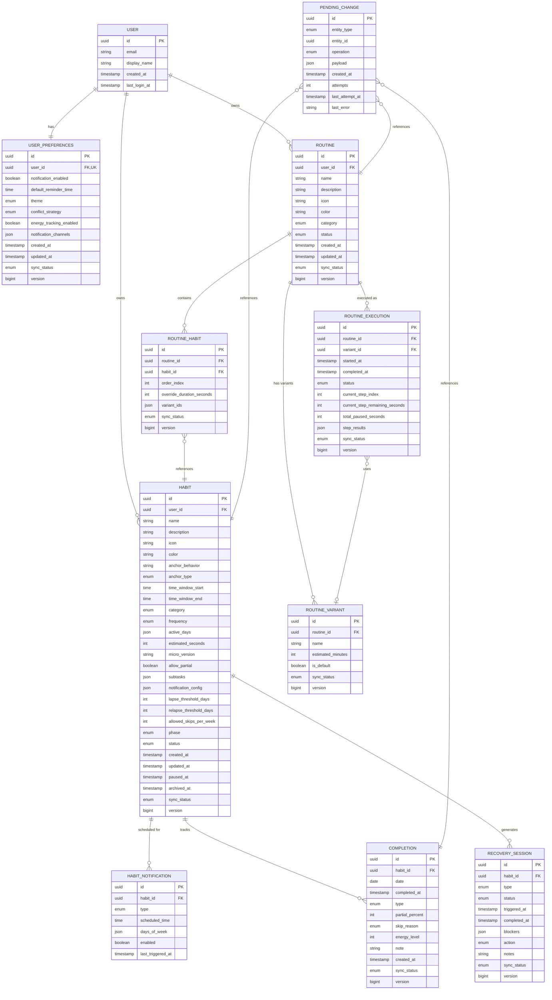
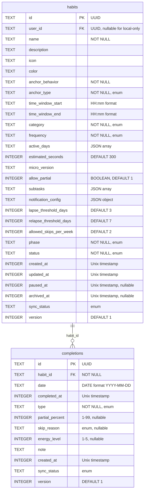
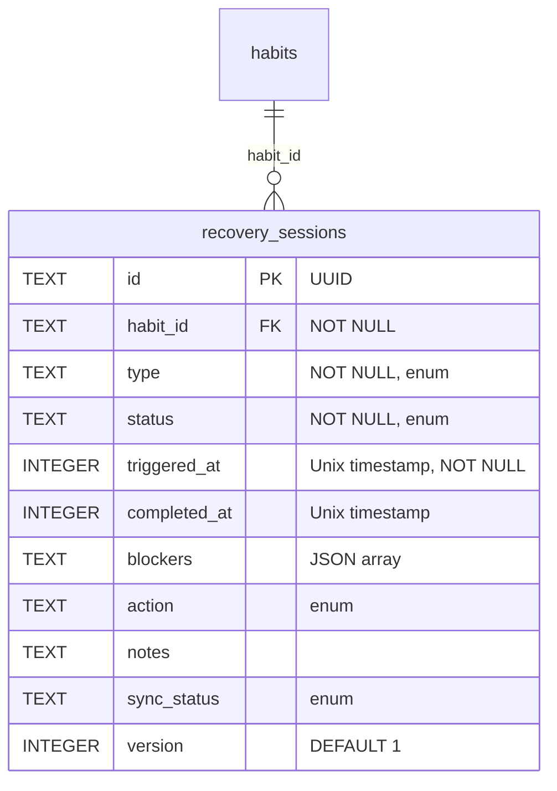
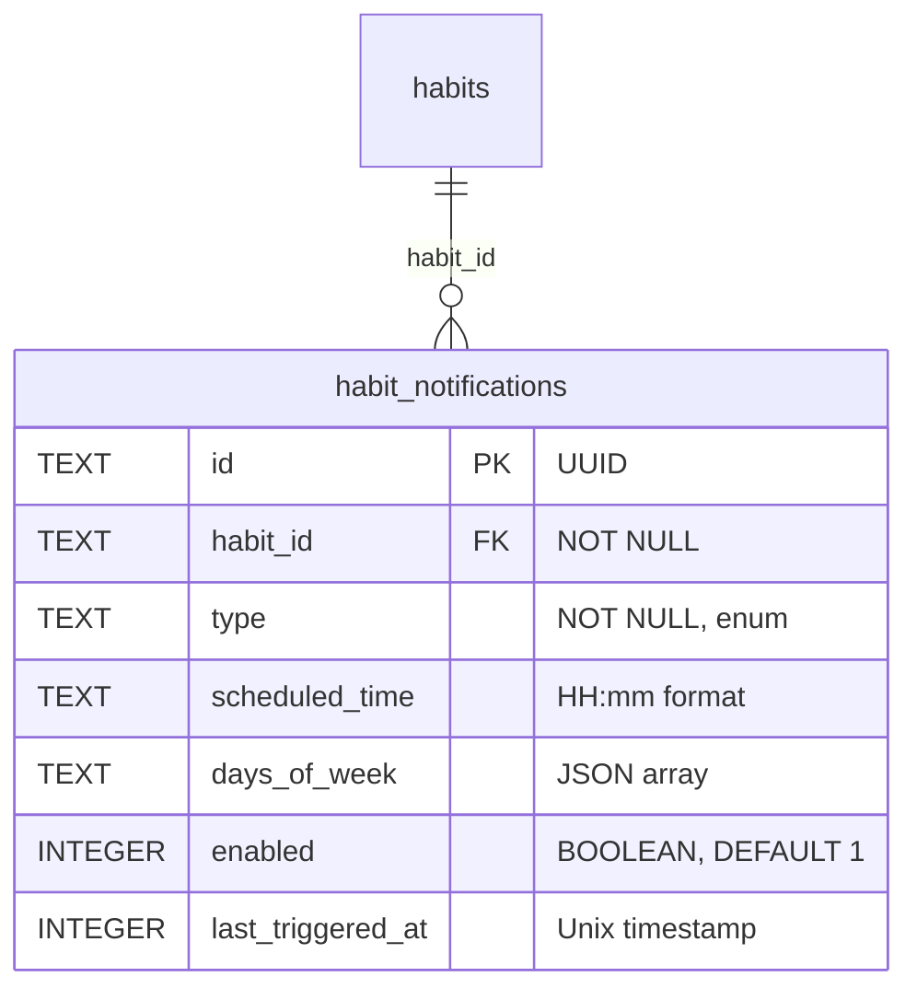
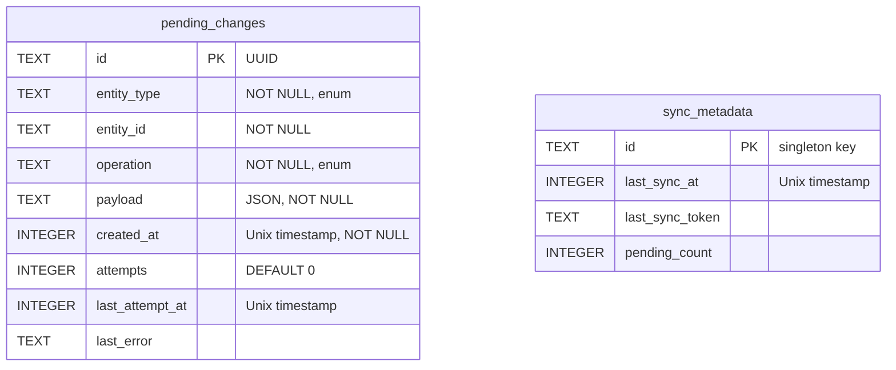
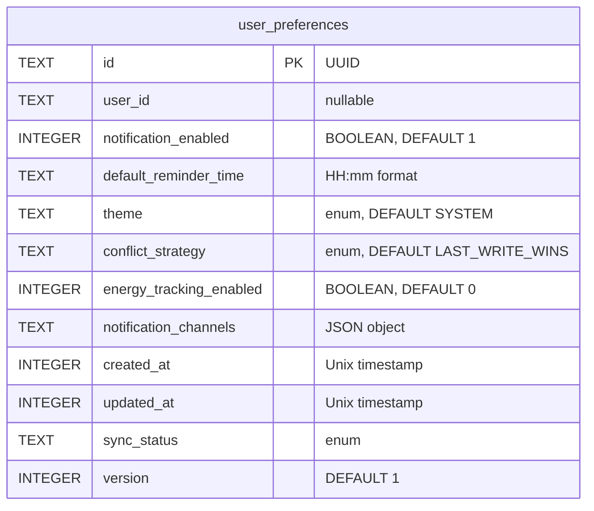
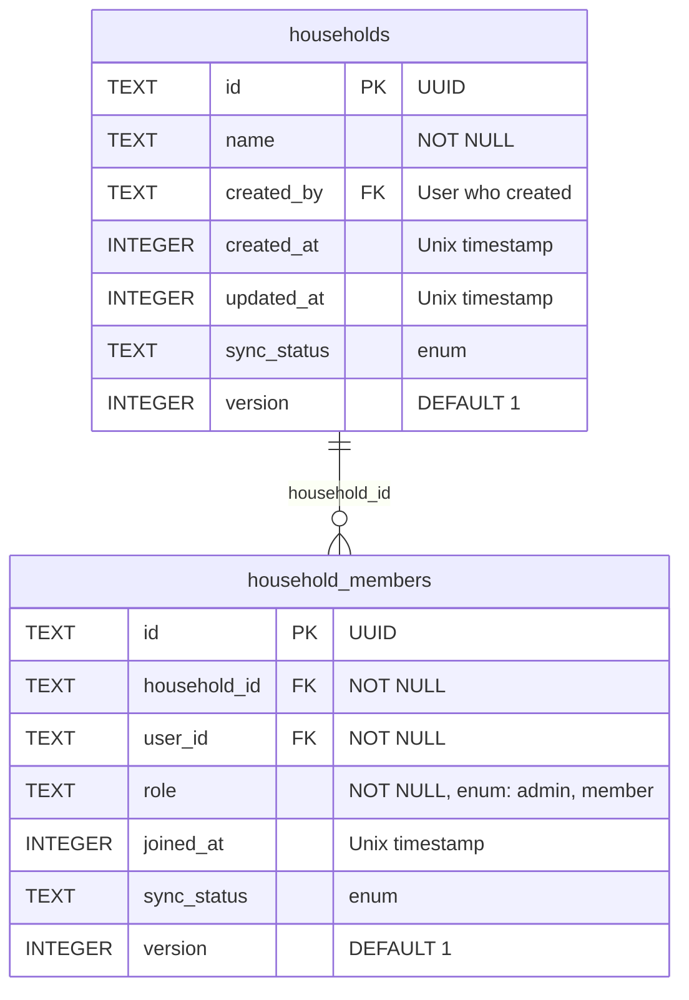
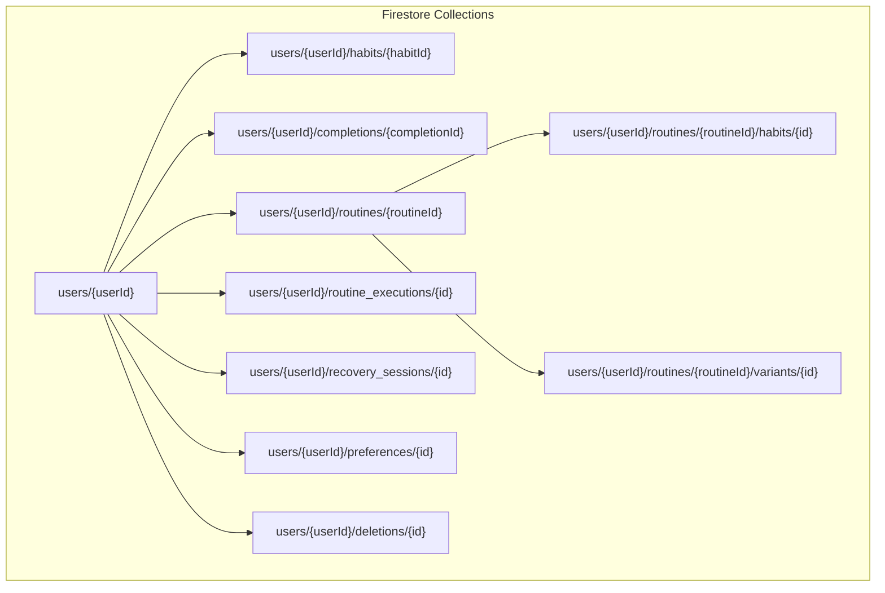

# Entity-Relationship Diagrams

## Overview

This document provides comprehensive entity-relationship diagrams for both the local Room database and remote cloud schema.

---

## Complete ERD



---

## Local Database Schema (Room)

### Core Tables



### Routine Tables

```mermaid
erDiagram
    routines {
        TEXT id PK "UUID"
        TEXT user_id FK "UUID, nullable"
        TEXT name "NOT NULL"
        TEXT description
        TEXT icon
        TEXT color
        TEXT category "NOT NULL, enum"
        TEXT status "NOT NULL, enum"
        INTEGER created_at "Unix timestamp"
        INTEGER updated_at "Unix timestamp"
        TEXT sync_status "enum"
        INTEGER version "DEFAULT 1"
    }
    
    routine_habits {
        TEXT id PK "UUID"
        TEXT routine_id FK "NOT NULL"
        TEXT habit_id FK "NOT NULL"
        INTEGER order_index "NOT NULL"
        INTEGER override_duration_seconds
        TEXT variant_ids "JSON array"
        TEXT sync_status "enum"
        INTEGER version "DEFAULT 1"
    }
    
    routine_variants {
        TEXT id PK "UUID"
        TEXT routine_id FK "NOT NULL"
        TEXT name "NOT NULL"
        INTEGER estimated_minutes "NOT NULL"
        INTEGER is_default "BOOLEAN, DEFAULT 0"
        TEXT sync_status "enum"
        INTEGER version "DEFAULT 1"
    }
    
    routine_executions {
        TEXT id PK "UUID"
        TEXT routine_id FK "NOT NULL"
        TEXT variant_id FK
        INTEGER started_at "Unix timestamp, NOT NULL"
        INTEGER completed_at "Unix timestamp"
        TEXT status "NOT NULL, enum"
        INTEGER current_step_index "DEFAULT 0"
        INTEGER current_step_remaining_seconds
        INTEGER total_paused_seconds "DEFAULT 0"
        TEXT step_results "JSON array"
        TEXT sync_status "enum"
        INTEGER version "DEFAULT 1"
    }
    
    routines ||--o{ routine_habits : "routine_id"
    routines ||--o{ routine_variants : "routine_id"
    routines ||--o{ routine_executions : "routine_id"
    routine_habits }o--|| habits : "habit_id"
    routine_executions }o--o| routine_variants : "variant_id"
```



### Recovery Tables



### Notification Tables



### Sync Tables



### Preferences Table



### Household Tables (v1.1)

> **Note**: These tables are created in v1.0 but unused until v1.1 when shared habits are implemented.



#### Household Completion Mode (v1.1)

When shared habits are implemented, habits will support these completion modes:

| Mode | Description | Example |
|------|-------------|---------|
| `ANYONE_ONCE` | First person to complete, done for all | Feed the dog |
| `EVERYONE` | Each member must complete individually | Take vitamins |
| `ASSIGNED` | Specific member(s) responsible | Kid's medication |
| `ROTATING` | Auto-assigns, rotates through members | Take out trash |

#### Extended Habit Schema (v1.1)

```sql
-- These columns exist but are NULL in v1.0
ALTER TABLE habits ADD COLUMN household_id TEXT REFERENCES households(id);
ALTER TABLE habits ADD COLUMN completion_mode TEXT;

-- Constraint: habit belongs to user OR household, not both
-- CHECK (user_id IS NOT NULL OR household_id IS NOT NULL)
-- CHECK (NOT (user_id IS NOT NULL AND household_id IS NOT NULL))
```

#### Shared Completion Tracking (v1.1)

For shared habits, completions need to track who completed:

```sql
-- completions table already has this, just used differently for shared habits
-- For personal habits: user who owns the habit (implicit)
-- For shared habits: user who performed the completion (explicit)
-- The completed_by field will be populated for shared habit completions
```

---

## Indices

### Habit Indices

```sql
-- Primary queries: Today's habits
CREATE INDEX idx_habits_status_category 
    ON habits(status, category);

-- Lapse detection query
CREATE INDEX idx_habits_phase 
    ON habits(phase);

-- User lookup (for sync)
CREATE INDEX idx_habits_user_id 
    ON habits(user_id);

-- Sync status query
CREATE INDEX idx_habits_sync_status 
    ON habits(sync_status);
```

### Completion Indices

```sql
-- Primary query: Completions for a habit on a date range
CREATE INDEX idx_completions_habit_date 
    ON completions(habit_id, date);

-- Today's completions
CREATE INDEX idx_completions_date 
    ON completions(date);

-- Sync status query
CREATE INDEX idx_completions_sync_status 
    ON completions(sync_status);

-- Unique constraint: One completion per habit per day
CREATE UNIQUE INDEX idx_completions_habit_date_unique 
    ON completions(habit_id, date);
```

### Routine Indices

```sql
-- Routine habit ordering
CREATE UNIQUE INDEX idx_routine_habits_order 
    ON routine_habits(routine_id, order_index);

-- Active executions
CREATE INDEX idx_routine_executions_status 
    ON routine_executions(status);
```

### Pending Change Indices

```sql
-- Queue processing order
CREATE INDEX idx_pending_changes_created 
    ON pending_changes(created_at ASC);

-- Retry lookup
CREATE INDEX idx_pending_changes_attempts 
    ON pending_changes(attempts, last_attempt_at);
```

---

## Remote Schema (Firestore)

### Collection Structure



### Document Schemas

#### User Document

```typescript
// users/{userId}
interface UserDocument {
  email: string;
  displayName: string | null;
  createdAt: Timestamp;
  lastLoginAt: Timestamp;
  deviceIds: string[];  // For multi-device tracking
}
```

#### Habit Document

```typescript
// users/{userId}/habits/{habitId}
interface HabitDocument {
  id: string;
  name: string;
  description: string | null;
  icon: string | null;
  color: string | null;
  anchorBehavior: string;
  anchorType: 'AFTER_BEHAVIOR' | 'BEFORE_BEHAVIOR' | 'AT_LOCATION' | 'AT_TIME';
  timeWindow: {
    start: string;  // HH:mm
    end: string;
  } | null;
  category: 'MORNING' | 'AFTERNOON' | 'EVENING' | 'ANYTIME';
  frequency: 'DAILY' | 'WEEKDAYS' | 'WEEKENDS' | 'CUSTOM';
  activeDays: string[] | null;  // ['MONDAY', 'WEDNESDAY', ...]
  estimatedSeconds: number;
  microVersion: string | null;
  allowPartial: boolean;
  subtasks: string[];
  notificationConfig: object | null;
  lapseThresholdDays: number;
  relapseThresholdDays: number;
  allowedSkipsPerWeek: number;
  phase: 'ONBOARD' | 'FORMING' | 'MAINTAINING' | 'LAPSED' | 'RELAPSED';
  status: 'ACTIVE' | 'PAUSED' | 'ARCHIVED';
  createdAt: Timestamp;
  updatedAt: Timestamp;
  pausedAt: Timestamp | null;
  archivedAt: Timestamp | null;
  version: number;
}
```

#### Completion Document

```typescript
// users/{userId}/completions/{completionId}
interface CompletionDocument {
  id: string;
  habitId: string;
  date: string;  // YYYY-MM-DD
  completedAt: Timestamp;
  type: 'FULL' | 'PARTIAL' | 'SKIPPED' | 'MISSED';
  partialPercent: number | null;
  skipReason: string | null;
  energyLevel: number | null;
  note: string | null;
  createdAt: Timestamp;
  version: number;
}
```

#### Deletion Log Document

```typescript
// users/{userId}/deletions/{deletionId}
interface DeletionDocument {
  id: string;
  entityType: 'HABIT' | 'COMPLETION' | 'ROUTINE' | 'ROUTINE_HABIT' | 'RECOVERY_SESSION';
  entityId: string;
  deletedAt: Timestamp;
}
```

### Firestore Security Rules

```javascript
rules_version = '2';
service cloud.firestore {
  match /databases/{database}/documents {
    // User can only access their own data
    match /users/{userId} {
      allow read, write: if request.auth != null && request.auth.uid == userId;
      
      // All subcollections inherit user access
      match /{document=**} {
        allow read, write: if request.auth != null && request.auth.uid == userId;
      }
    }
  }
}
```

---

## Data Type Mappings

### Local to Remote Type Mapping

| Local (Room/SQLite) | Remote (Firestore) | Notes |
|---------------------|-------------------|-------|
| TEXT (UUID) | string | Same format |
| INTEGER (timestamp) | Timestamp | Convert Unix → Firestore |
| TEXT (date) | string | Keep YYYY-MM-DD format |
| TEXT (time) | string | Keep HH:mm format |
| TEXT (enum) | string | Uppercase enum name |
| TEXT (JSON array) | array | Parse/stringify |
| TEXT (JSON object) | map | Parse/stringify |
| INTEGER (boolean) | boolean | 0/1 → false/true |

### Sync Status Mapping

| Local Status | Cloud Behavior |
|--------------|----------------|
| LOCAL_ONLY | Not synced |
| SYNCED | Matches remote |
| PENDING_SYNC | Queued for push |
| PENDING_DELETE | Queued for deletion |
| CONFLICT | Requires resolution |

---

## Migration Strategy

### Version Tracking

```kotlin
@Database(
    entities = [
        HabitEntity::class,
        CompletionEntity::class,
        RoutineEntity::class,
        RoutineHabitEntity::class,
        RoutineVariantEntity::class,
        RoutineExecutionEntity::class,
        RecoverySessionEntity::class,
        HabitNotificationEntity::class,
        PendingChangeEntity::class,
        SyncMetadataEntity::class,
        UserPreferencesEntity::class
    ],
    version = 1,
    exportSchema = true
)
abstract class KairosDatabase : RoomDatabase() {
    // DAOs...
}
```

### Migration Example

```kotlin
val MIGRATION_1_2 = object : Migration(1, 2) {
    override fun migrate(database: SupportSQLiteDatabase) {
        // Add new column
        database.execSQL(
            "ALTER TABLE habits ADD COLUMN new_field TEXT DEFAULT NULL"
        )
        
        // Create new index
        database.execSQL(
            "CREATE INDEX idx_habits_new_field ON habits(new_field)"
        )
    }
}
```

---

## Query Examples

### Get Today's Habits with Status

```sql
SELECT 
    h.*,
    c.id as completion_id,
    c.type as completion_type,
    c.partial_percent
FROM habits h
LEFT JOIN completions c ON h.id = c.habit_id AND c.date = :today
WHERE h.status = 'ACTIVE'
    AND (
        h.frequency = 'DAILY'
        OR (h.frequency = 'WEEKDAYS' AND :dayOfWeek NOT IN ('SATURDAY', 'SUNDAY'))
        OR (h.frequency = 'WEEKENDS' AND :dayOfWeek IN ('SATURDAY', 'SUNDAY'))
        OR (h.frequency = 'CUSTOM' AND h.active_days LIKE '%' || :dayOfWeek || '%')
    )
ORDER BY 
    CASE h.category 
        WHEN 'MORNING' THEN 1 
        WHEN 'AFTERNOON' THEN 2 
        WHEN 'EVENING' THEN 3 
        ELSE 4 
    END,
    h.created_at ASC
```

### Get Completion Rate for Week

```sql
SELECT 
    h.id,
    h.name,
    COUNT(CASE WHEN c.type IN ('FULL', 'PARTIAL') THEN 1 END) as completed_count,
    COUNT(CASE WHEN c.type = 'SKIPPED' THEN 1 END) as skipped_count,
    7 as total_days
FROM habits h
LEFT JOIN completions c ON h.id = c.habit_id 
    AND c.date BETWEEN :weekStart AND :weekEnd
WHERE h.status = 'ACTIVE'
GROUP BY h.id
```

### Detect Lapsed Habits

```sql
SELECT h.*
FROM habits h
WHERE h.status = 'ACTIVE'
    AND h.phase NOT IN ('LAPSED', 'RELAPSED')
    AND NOT EXISTS (
        SELECT 1 FROM completions c 
        WHERE c.habit_id = h.id 
            AND c.type IN ('FULL', 'PARTIAL', 'SKIPPED')
            AND c.date >= date(:today, '-' || h.lapse_threshold_days || ' days')
    )
```

### Get Pending Sync Changes

```sql
SELECT * FROM pending_changes
WHERE attempts < 10
ORDER BY created_at ASC
LIMIT 50
```
