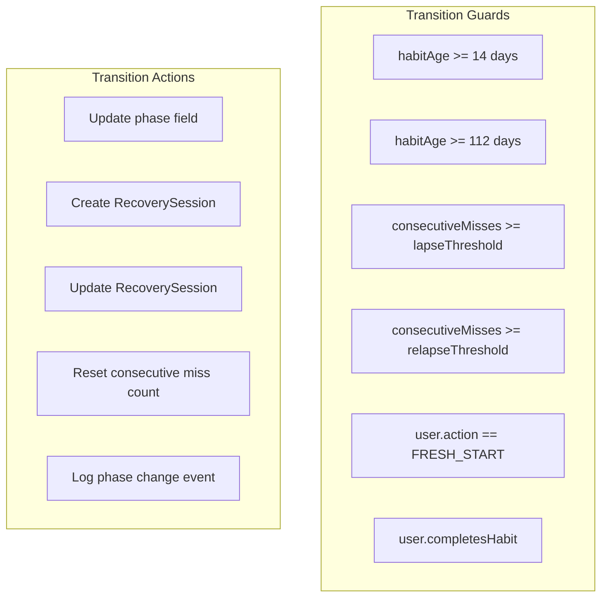
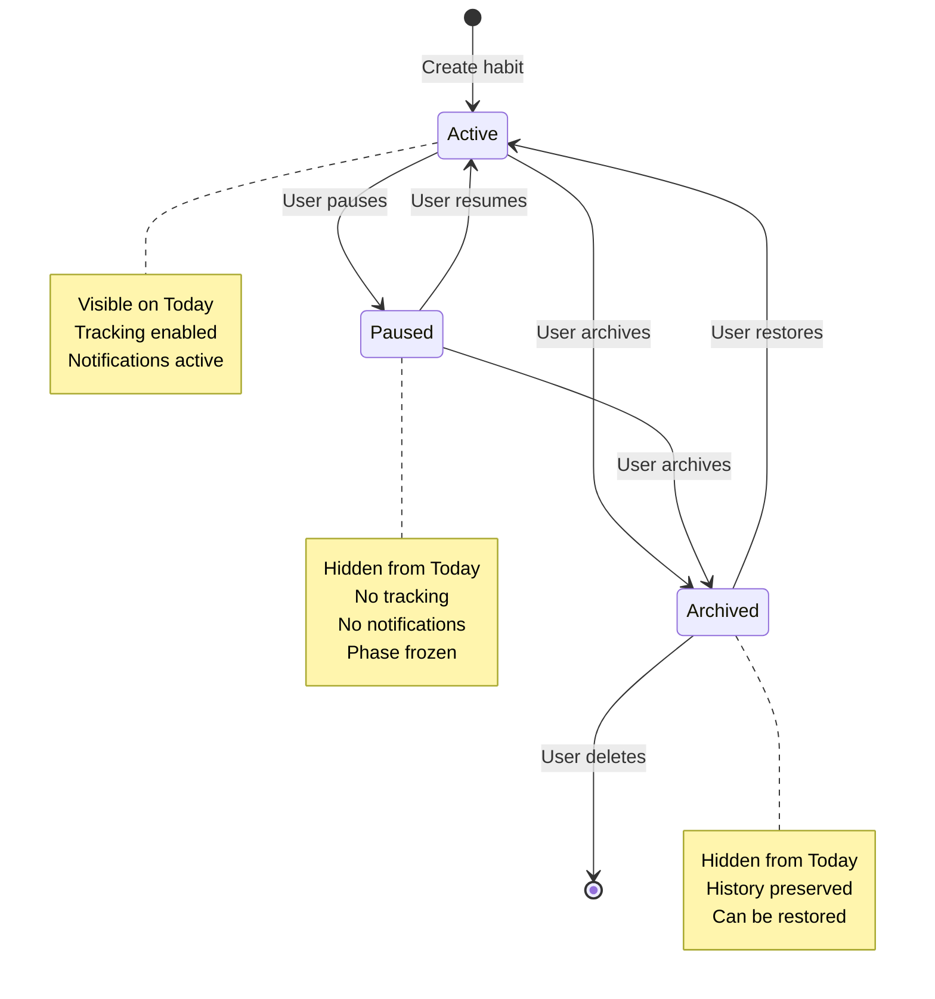
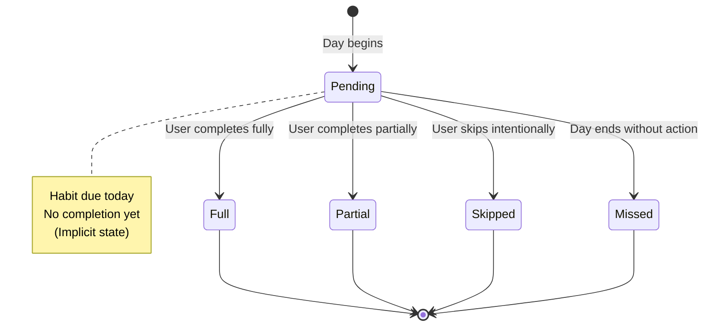
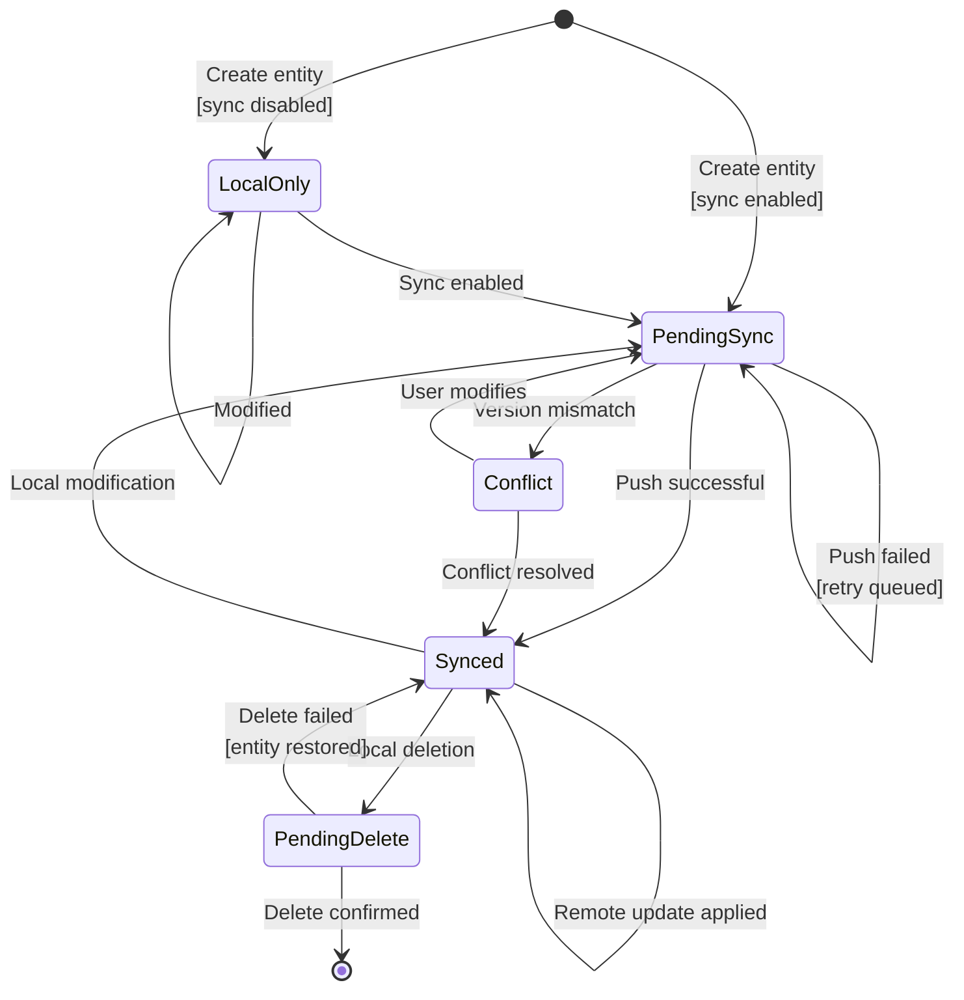
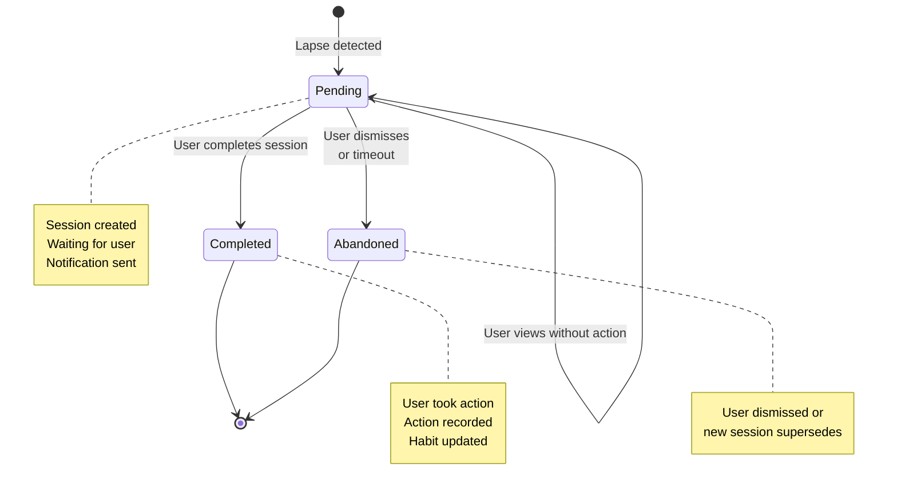
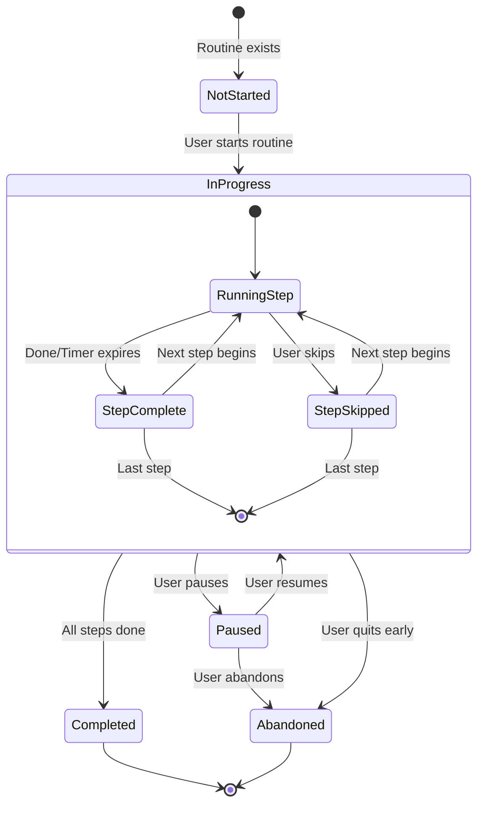
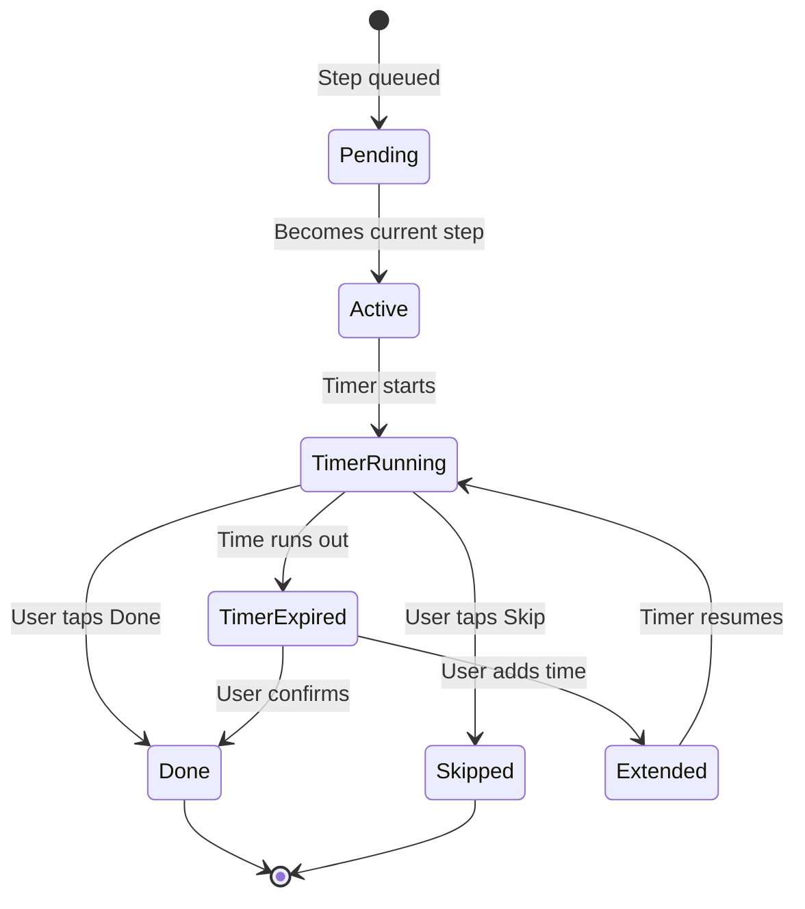
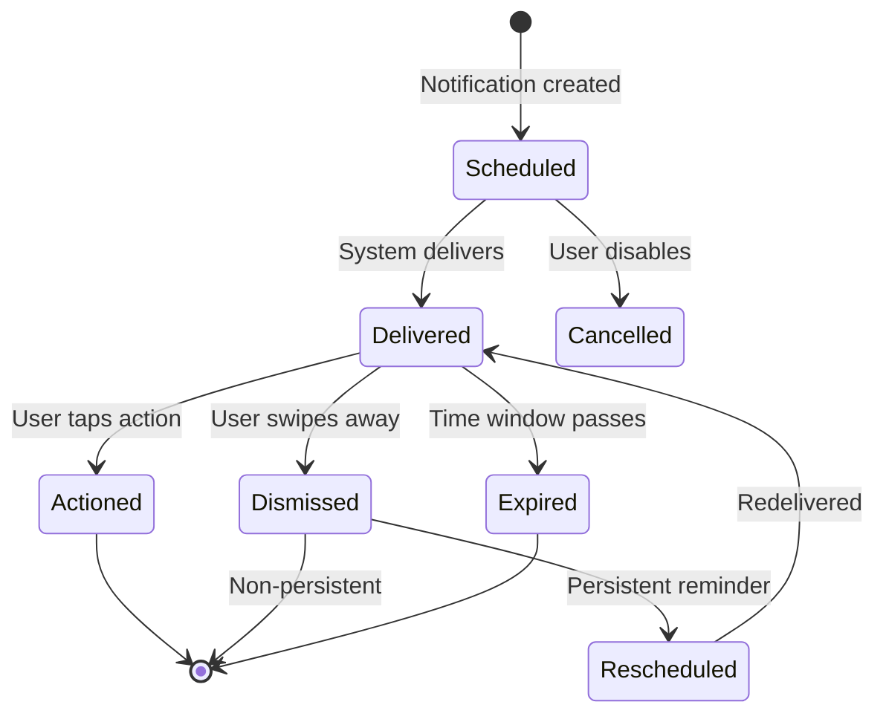
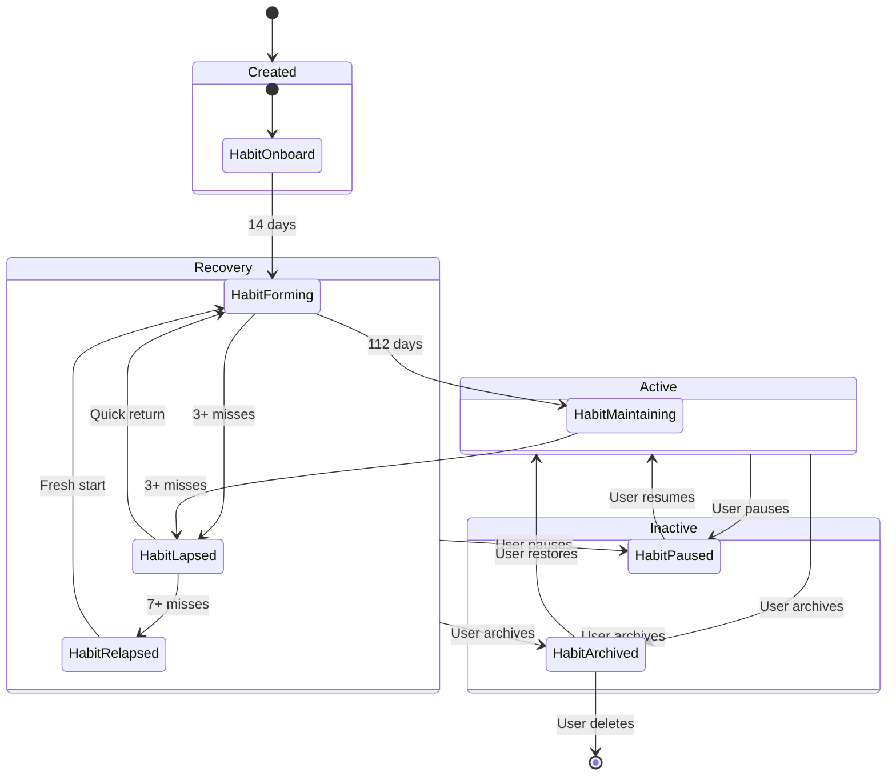

# State Machines

## Overview

This document defines all state machines in the Kairos system, including valid states, transitions, guards, and actions.

---

## Habit Lifecycle State Machine

The habit lifecycle is the core state machine governing how habits progress through phases.

```mermaid
stateDiagram-v2
    [*] --> Onboard: Create Habit
    
    state "🌱 Onboard" as Onboard
    state "📈 Forming" as Forming
    state "✨ Maintaining" as Maintaining
    state "⚠️ Lapsed" as Lapsed
    state "🔄 Relapsed" as Relapsed
    
    Onboard --> Forming: Week 2+<br/>[habit age >= 14 days]
    
    Forming --> Maintaining: Week 16+<br/>[habit age >= 112 days]
    
    Forming --> Lapsed: Missed threshold<br/>[consecutive misses >= lapseThreshold]
    Maintaining --> Lapsed: Missed threshold<br/>[consecutive misses >= lapseThreshold]
    
    Lapsed --> Forming: Quick return<br/>[user completes habit]
    Lapsed --> Relapsed: Extended absence<br/>[consecutive misses >= relapseThreshold]
    
    Relapsed --> Forming: Fresh start<br/>[user chooses FRESH_START]
    
    note right of Onboard
        First 2 weeks
        System observes
        No judgment
    end note
    
    note right of Forming
        Weeks 3-16
        Building automaticity
        Weekly reflections
    end note
    
    note right of Maintaining
        Week 16+
        Reduced friction
        Novelty injection
    end note
    
    note right of Lapsed
        Early intervention
        Gentle prompts
        Recovery options
    end note
    
    note right of Relapsed
        Deeper reflection
        Fresh start option
        No shame
    end note
```



### Phase Definitions

| Phase | Duration | Characteristics | Transitions Out |
|-------|----------|-----------------|-----------------|
| ONBOARD | Weeks 1-2 | Setup complete, observation period | → FORMING (time) |
| FORMING | Weeks 3-16 | Active tracking, building consistency | → MAINTAINING (time), → LAPSED (misses) |
| MAINTAINING | Week 16+ | Low friction, novelty injection | → LAPSED (misses) |
| LAPSED | Variable | 3-6 consecutive misses | → FORMING (return), → RELAPSED (extended) |
| RELAPSED | Variable | 7+ consecutive misses | → FORMING (fresh start) |

### Phase Transition Rules



---

## Habit Status State Machine

Separate from phase, status controls visibility and activity.



### Status Transition Table

| From | Event | Guard | To | Actions |
|------|-------|-------|-----|---------|
| ACTIVE | UserPauses | - | PAUSED | Set pausedAt, disable notifications |
| ACTIVE | UserArchives | - | ARCHIVED | Set archivedAt, disable notifications |
| PAUSED | UserResumes | - | ACTIVE | Clear pausedAt, restore notifications |
| PAUSED | UserArchives | - | ARCHIVED | Set archivedAt |
| ARCHIVED | UserRestores | - | ACTIVE | Clear archivedAt |
| ARCHIVED | UserDeletes | Confirm dialog | (deleted) | Remove entity |

---

## Completion Type State Machine

Completions are final—no state changes after creation.



### Completion Type Details

| Type | Trigger | User Action | System Action |
|------|---------|-------------|---------------|
| FULL | User taps Done | Required | Never |
| PARTIAL | User taps Partial | Required | Never |
| SKIPPED | User taps Skip | Required | Never |
| MISSED | End of day | Never | LapseDetectionWorker |

---

## Sync Status State Machine

Tracks synchronization state of each entity.



### Sync Status Transitions

| From | Event | To | Actions |
|------|-------|-----|---------|
| LOCAL_ONLY | SyncEnabled | PENDING_SYNC | Enqueue for push |
| PENDING_SYNC | PushSuccess | SYNCED | Update serverUpdatedAt |
| PENDING_SYNC | VersionConflict | CONFLICT | Store both versions |
| SYNCED | LocalModified | PENDING_SYNC | Increment version, enqueue |
| SYNCED | RemoteUpdate | SYNCED | Apply remote changes |
| CONFLICT | Resolved | SYNCED | Apply resolution |
| SYNCED | LocalDeleted | PENDING_DELETE | Enqueue delete |
| PENDING_DELETE | DeleteConfirmed | (removed) | Remove from local DB |

---

## Recovery Session State Machine

Manages the lifecycle of recovery interventions.



### Session Completion Actions

| Action | Effect on Habit | Session Result |
|--------|-----------------|----------------|
| RESUME | Phase → FORMING | Completed |
| SIMPLIFY | Activate micro-version, Phase → FORMING | Completed |
| PAUSE | Status → PAUSED | Completed |
| ARCHIVE | Status → ARCHIVED | Completed |
| FRESH_START | Phase → FORMING, reset tracking | Completed |
| (dismiss) | No change | Abandoned |

---

## Routine Execution State Machine

Tracks the progress of a routine run.



### Execution State Details

| State | Timer | UI | Persistence |
|-------|-------|-----|-------------|
| NOT_STARTED | - | Start button visible | - |
| IN_PROGRESS | Active | Current step highlighted | Step index saved |
| PAUSED | Frozen | Resume button visible | State preserved |
| COMPLETED | - | Summary shown | Completions created |
| ABANDONED | - | Partial recorded | Partial completions |

### Step State Machine (Within Execution)



---

## Notification State Machine

Tracks notification delivery and user response.



### Notification Actions by Type

| Notification Type | Available Actions |
|-------------------|-------------------|
| Habit Reminder | Complete, Snooze 15m, Skip |
| Recovery Prompt | Open Recovery, Dismiss |
| Fresh Start | View Habits, Dismiss |
| Routine Timer | Done, Skip, Pause |
| Sync Error | Retry, Open Settings |

---

## Combined State Diagram: Habit Complete Lifecycle



---

## State Machine Implementation Patterns

### Sealed Class Pattern (Kotlin)

```kotlin
sealed class HabitPhase {
    object Onboard : HabitPhase()
    object Forming : HabitPhase()
    object Maintaining : HabitPhase()
    object Lapsed : HabitPhase()
    object Relapsed : HabitPhase()
    
    fun canTransitionTo(target: HabitPhase): Boolean = when (this) {
        is Onboard -> target is Forming
        is Forming -> target in listOf(Maintaining, Lapsed)
        is Maintaining -> target is Lapsed
        is Lapsed -> target in listOf(Forming, Relapsed)
        is Relapsed -> target is Forming
    }
}
```

### State Machine Engine Pattern

```kotlin
class HabitStateMachine(
    private val habit: Habit,
    private val repository: HabitRepository
) {
    fun transition(event: HabitEvent): Result<Habit> {
        val currentPhase = habit.phase
        val newPhase = when (event) {
            is HabitEvent.TimeElapsed -> evaluateTimeTransition(habit)
            is HabitEvent.MissedDays -> evaluateMissTransition(habit, event.count)
            is HabitEvent.UserCompleted -> evaluateCompletionTransition(habit)
            is HabitEvent.FreshStart -> HabitPhase.Forming
        }
        
        return if (currentPhase.canTransitionTo(newPhase)) {
            val updated = habit.copy(phase = newPhase, updatedAt = Instant.now())
            repository.update(updated)
            Result.success(updated)
        } else {
            Result.failure(IllegalStateTransition(currentPhase, newPhase))
        }
    }
}
```

---

## Transition Summary Table

### Habit Phase Transitions

| Current | Event | Guard | Next | Action |
|---------|-------|-------|------|--------|
| ONBOARD | TimeElapsed | age >= 14d | FORMING | Log transition |
| FORMING | TimeElapsed | age >= 112d | MAINTAINING | Log transition |
| FORMING | MissedDays | count >= lapse | LAPSED | Create RecoverySession |
| MAINTAINING | MissedDays | count >= lapse | LAPSED | Create RecoverySession |
| LAPSED | UserCompleted | - | FORMING | Complete RecoverySession |
| LAPSED | MissedDays | count >= relapse | RELAPSED | Update RecoverySession |
| RELAPSED | FreshStart | - | FORMING | Complete RecoverySession |

### Habit Status Transitions

| Current | Event | Guard | Next | Action |
|---------|-------|-------|------|--------|
| ACTIVE | UserPauses | - | PAUSED | Set pausedAt |
| ACTIVE | UserArchives | - | ARCHIVED | Set archivedAt |
| PAUSED | UserResumes | - | ACTIVE | Clear pausedAt |
| PAUSED | UserArchives | - | ARCHIVED | Set archivedAt |
| ARCHIVED | UserRestores | - | ACTIVE | Clear archivedAt |
| ARCHIVED | UserDeletes | Confirm | (deleted) | Delete entity |

### Sync Status Transitions

| Current | Event | Guard | Next | Action |
|---------|-------|-------|------|--------|
| LOCAL_ONLY | SyncEnabled | - | PENDING_SYNC | Enqueue push |
| PENDING_SYNC | PushSuccess | - | SYNCED | Update timestamps |
| PENDING_SYNC | VersionMismatch | - | CONFLICT | Store conflict |
| SYNCED | LocalModified | - | PENDING_SYNC | Increment version |
| SYNCED | RemoteUpdate | no pending local | SYNCED | Apply update |
| CONFLICT | Resolved | - | SYNCED | Clear conflict |
| SYNCED | LocalDeleted | - | PENDING_DELETE | Enqueue delete |
| PENDING_DELETE | DeleteConfirmed | - | (removed) | Remove from DB |
