# User Flows & Experience Design

## Overview

This document maps the key user journeys through Kairos, detailing screens, interactions, and decision points.

---

## Flow Index

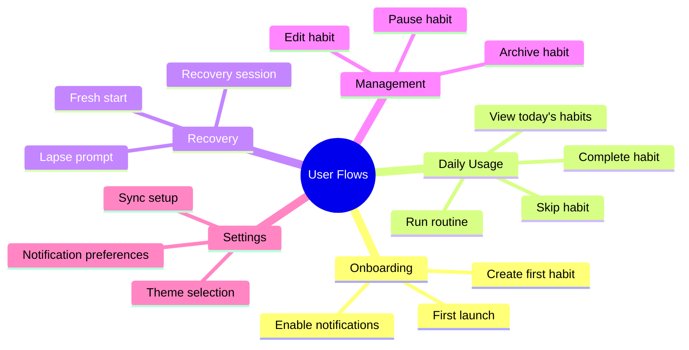

---

## Flow 1: First Launch & Onboarding

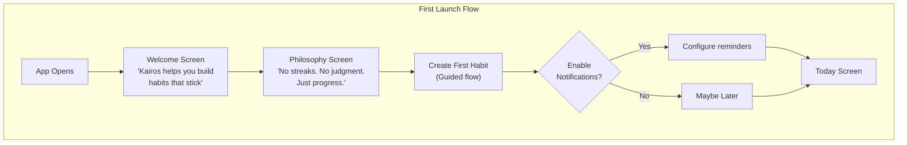

### Welcome Screen

| Element | Content |
|---------|---------|
| Illustration | Calm, non-gamified visual |
| Headline | "Kairos" |
| Subhead | "Habit building designed for how your brain actually works" |
| CTA | "Get Started" |
| Skip | Not available (must see philosophy) |

### Philosophy Screen

| Element | Content |
|---------|---------|
| Headline | "Three things we do differently" |
| Point 1 | "No streaks to break" with icon |
| Point 2 | "Partial completion counts" with icon |
| Point 3 | "Recovery is built in" with icon |
| CTA | "Create Your First Habit" |

---

## Flow 2: Create Habit

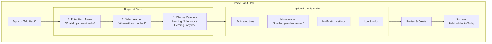

### Create Habit: Name Input

```mermaid
flowchart LR
    subgraph NameScreen["Name Input Screen"]
        Input["Text input<br/>'Take morning medication'"]
        Examples["Suggestions<br/>Based on common habits"]
        Next["Continue →"]
    end
```

| UI Element | Behavior |
|------------|----------|
| Text input | Auto-focus, 1-100 characters |
| Character count | Subtle indicator |
| Suggestions | Tap to fill, categorized |
| Continue | Enabled when name valid |

### Create Habit: Anchor Selection

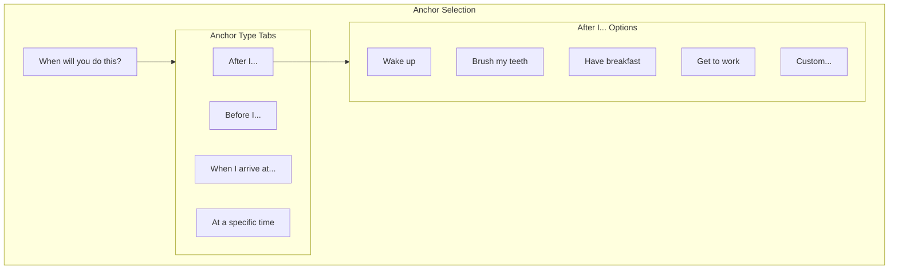

| Anchor Type | Input Method | Examples |
|-------------|--------------|----------|
| After behavior | Preset list + custom | "After I brush my teeth" |
| Before behavior | Preset list + custom | "Before I start work" |
| At location | Location picker | "When I arrive at gym" |
| At time | Time picker | "At 7:00 AM" |

### Create Habit: Category

```mermaid
flowchart LR
    subgraph CategoryScreen["Category Selection"]
        Morning["🌅 Morning<br/>Before noon"]
        Afternoon["☀️ Afternoon<br/>12 PM - 6 PM"]
        Evening["🌙 Evening<br/>After 6 PM"]
        Anytime["⏰ Anytime<br/>No specific time"]
    end
```

---

## Flow 3: Today Screen

```mermaid
flowchart TB
    subgraph TodayScreen["Today Screen"]
        Header["Header<br/>Date + Progress Ring"]
        
        subgraph HabitGroups["Habit Groups"]
            Morning["🌅 Morning Habits"]
            Afternoon["☀️ Afternoon Habits"]
            Evening["🌙 Evening Habits"]
            Anytime["⏰ Anytime"]
        end
        
        subgraph HabitCard["Habit Card"]
            CardName["Habit Name"]
            CardAnchor["Anchor text (subtle)"]
            CardAction["Completion Button"]
        end
        
        FAB["+ Add Habit"]
    end
    
    Header --> HabitGroups
    Morning --> HabitCard
```

### Today Screen States

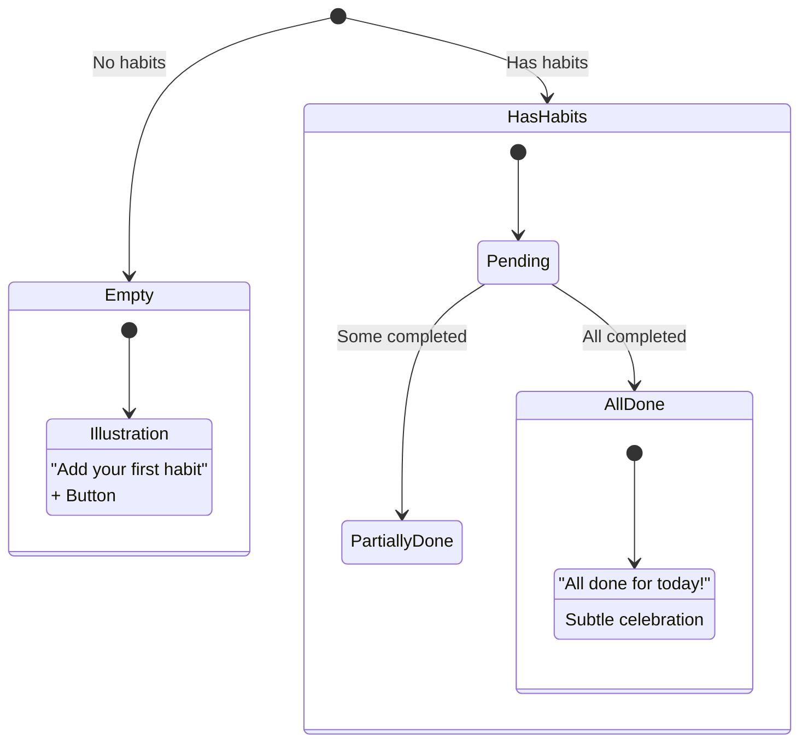

### Habit Card Interaction

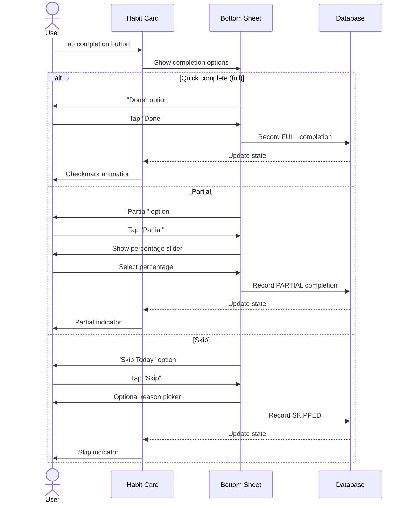

---

## Flow 4: Complete Habit

### Quick Complete (Single Tap)

```mermaid
flowchart LR
    subgraph QuickComplete["Quick Complete"]
        Tap["Tap ✓ button"]
        Haptic["Haptic feedback"]
        Animation["Checkmark animation"]
        Update["Card updates"]
    end
    
    Tap --> Haptic --> Animation --> Update
```

### Full Completion Sheet

```mermaid
flowchart TB
    subgraph CompletionSheet["Completion Bottom Sheet"]
        HabitInfo["Habit name + anchor"]
        
        subgraph Options["Completion Options"]
            Done["✓ Done<br/>Fully completed"]
            Partial["◐ Partial<br/>Did some of it"]
            Skip["⊘ Skip Today<br/>Not doing it"]
        end
        
        subgraph OptionalTracking["Optional (if enabled)"]
            Energy["Energy Level<br/>1-5 selector"]
            Note["Add Note"]
        end
    end
```

---

## Flow 5: Run Routine

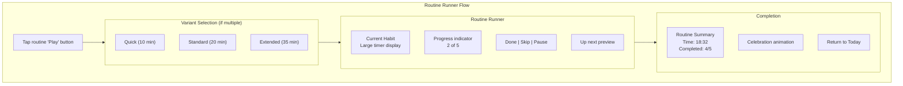

### Routine Runner Screen

```mermaid
flowchart TB
    subgraph RunnerScreen["Routine Runner Layout"]
        Header["Morning Routine<br/>Step 2 of 4"]
        
        subgraph Timer["Timer Display"]
            HabitName["Take medication"]
            TimerRing["Large countdown ring<br/>2:45"]
        end
        
        subgraph Actions["Action Buttons"]
            Done["✓ Done"]
            Skip["Skip →"]
            More["•••"]
        end
        
        Preview["Up next: Drink water (1 min)"]
    end
```

---

## Flow 6: Recovery (Lapse)

```mermaid
flowchart TB
    subgraph LapseFlow["Lapse Recovery Flow"]
        Detect["System detects 3+ missed days"]
        Notify["Gentle notification<br/>'Habit is waiting when you're ready'"]
        
        subgraph UserEngages["User Taps Notification"]
            Welcome["Welcome back!<br/>Let's figure this out."]
            
            subgraph Blocker["What got in the way? (optional)"]
                B1["Too tired"]
                B2["No time"]
                B3["Forgot"]
                B4["Needed break"]
                B5["Skip this"]
            end
            
            subgraph Actions["What would you like to do?"]
                Resume["Resume Tracking<br/>Pick up where you left off"]
                Simplify["Try Smaller<br/>Use micro version"]
                Pause["Take a Break<br/>Pause this habit"]
                Archive["Archive<br/>Remove for now"]
            end
        end
        
        Detect --> Notify --> Welcome --> Blocker --> Actions
    end
```

### Recovery Session UI

| Screen | Purpose | Messaging |
|--------|---------|-----------|
| Welcome | Warm return | "Welcome back! Let's figure this out together." |
| Blocker | Optional data | "What got in the way? (This helps us help you)" |
| Actions | Choose path | Clear options, no judgment |
| Confirm | Reinforce choice | "Great choice. Your habit is ready." |

---

## Flow 7: Fresh Start (Relapse)

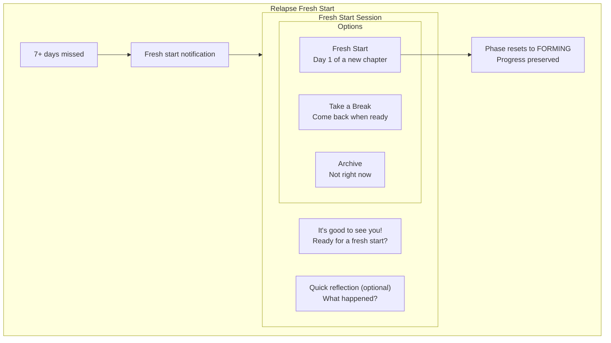

---

## Flow 8: Settings & Sync

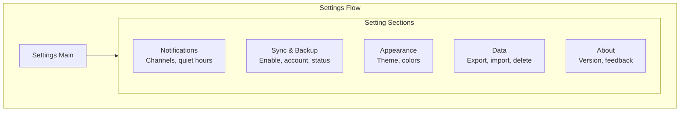

### Sync Setup Flow

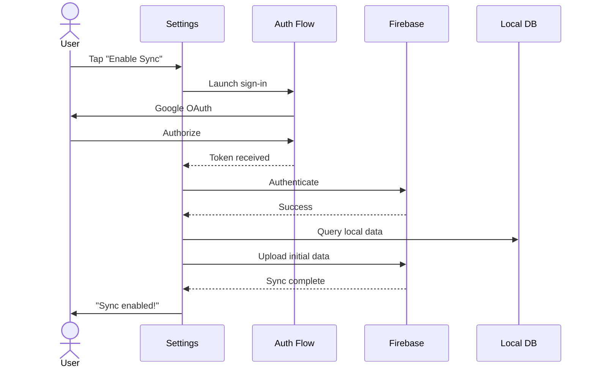

---

## Flow 9: WearOS Interactions

```mermaid
flowchart TB
    subgraph WearFlows["WearOS Flows"]
        subgraph Tile["Habit Tile"]
            TileView["Today's habits list"]
            TileTap["Tap habit → Complete"]
        end
        
        subgraph Complication["Complication"]
            CompView["Remaining count: 3"]
            CompTap["Tap → Open app"]
        end
        
        subgraph App["Watch App"]
            AppList["Habit list view"]
            AppDetail["Habit detail + complete"]
            AppRoutine["Routine runner"]
        end
    end
```

### Watch Complete Flow

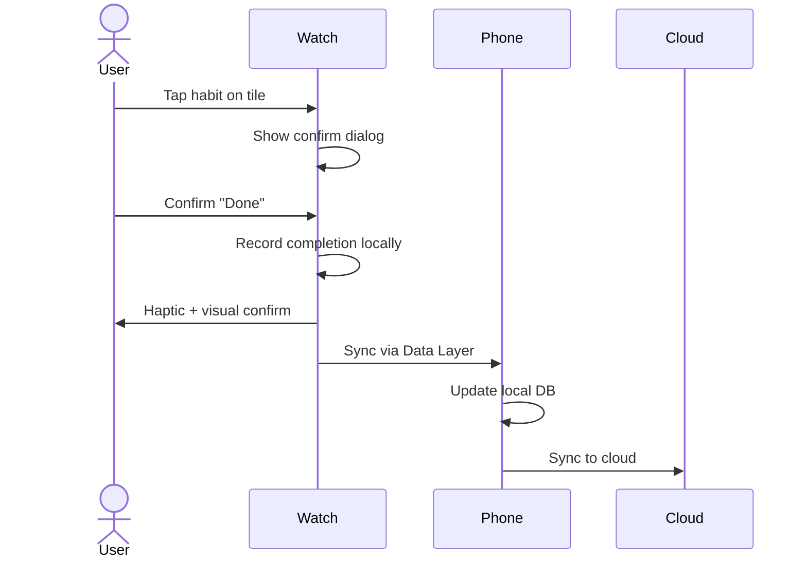

---

## Error States & Empty States

### Error Handling Flows

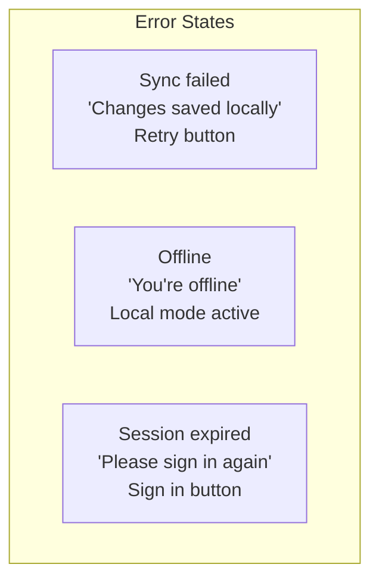

### Empty States

| Screen | Empty State | CTA |
|--------|-------------|-----|
| Today (no habits) | Illustration + "Add your first habit" | Add Habit button |
| Today (all done) | "All done for today! 🎉" | None needed |
| Routines (none) | "Group habits into routines" | Create Routine |
| History (no data) | "Your history will appear here" | None |

---

## Interaction Specifications

### Tap Targets

| Element | Minimum Size | Recommended Size |
|---------|--------------|------------------|
| Primary buttons | 48dp | 56dp |
| Completion button | 48dp | 64dp |
| List items | 48dp height | 72dp height |
| Icon buttons | 48dp | 48dp |

### Animations

| Action | Animation | Duration |
|--------|-----------|----------|
| Habit complete | Checkmark draw + scale | 300ms |
| Card expand | Height + fade | 200ms |
| Screen transition | Shared element | 300ms |
| Progress update | Ring fill | 400ms |

### Haptic Feedback

| Action | Haptic Type |
|--------|-------------|
| Habit complete | Success (tick) |
| Button tap | Light click |
| Error | Error pattern |
| Routine step done | Medium click |

---

## Accessibility

### Screen Reader Support

| Element | Content Description |
|---------|---------------------|
| Completion button | "Complete [habit name], button" |
| Progress ring | "[X] of [Y] habits completed" |
| Habit card | "[name], [status], [anchor]" |

### Motion Reduction

| Animation | Reduced Motion Alternative |
|-----------|---------------------------|
| Celebration | Static checkmark |
| Progress ring | Instant fill |
| Transitions | Fade only |
