# Notification System Design

## Overview

The notification system is critical for ADHD users—it externalizes executive function by providing timely, non-judgmental reminders. This document defines the notification strategy, channels, content guidelines, and technical implementation.

---

## Notification Philosophy

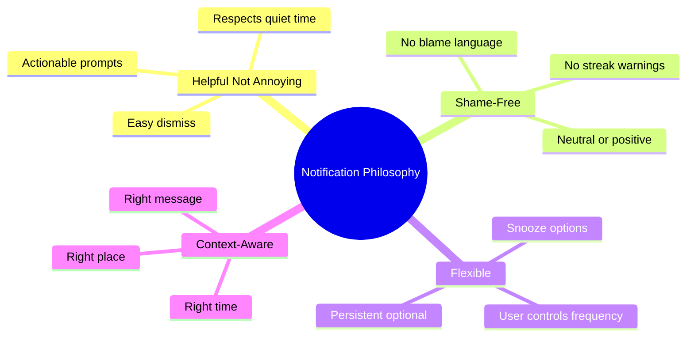

### Guiding Principles

| Principle | Implementation |
|-----------|----------------|
| Respect attention | Minimal notifications, high signal |
| No guilt trips | Never mention missed days in notifications |
| Easy action | Complete from notification when possible |
| User control | All notification types can be disabled |
| Progressive | Start gentle, only escalate if persistent enabled |

---

## Notification Channels

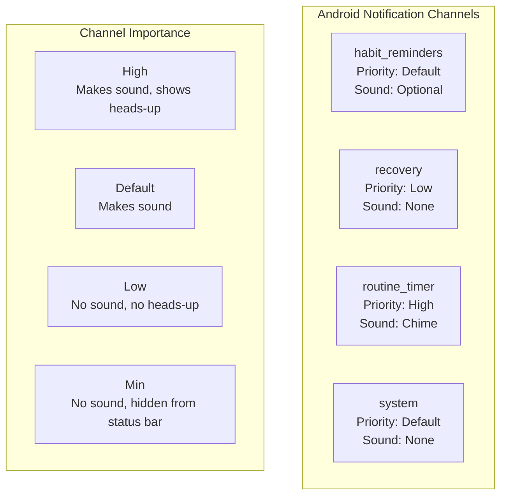

### Channel Definitions

| Channel ID | Name | Importance | Sound | Vibrate | Description |
|------------|------|------------|-------|---------|-------------|
| `habit_reminders` | Habit Reminders | Default | Optional | Yes | Daily habit reminders |
| `recovery` | Recovery | Low | No | No | Lapse/fresh start prompts |
| `routine_timer` | Routine Timer | High | Chime | Yes | Active routine notifications |
| `system` | System | Default | No | No | Sync status, errors |

---

## Notification Types

### Type 1: Habit Reminder

Triggered by scheduled reminder time for a habit.

```mermaid
flowchart LR
    subgraph Reminder["Habit Reminder Notification"]
        Icon["📋"]
        Title["Take medication"]
        Body["After you brush your teeth"]
        
        subgraph Actions["Actions"]
            Done["✓ Done"]
            Snooze["⏰ Snooze"]
            Skip["Skip"]
        end
    end
```

| Element | Content |
|---------|---------|
| Icon | App icon or habit icon |
| Title | Habit name |
| Body | Anchor behavior (context) |
| Actions | Done, Snooze (10 min), Skip |
| Tap action | Open habit detail |

**Timing Options**:
- At anchor time (if AT_TIME)
- At configured reminder time
- At category default time (Morning: 8 AM, etc.)

### Type 2: Persistent Reminder

For habits marked as persistent—re-notifies until acknowledged.

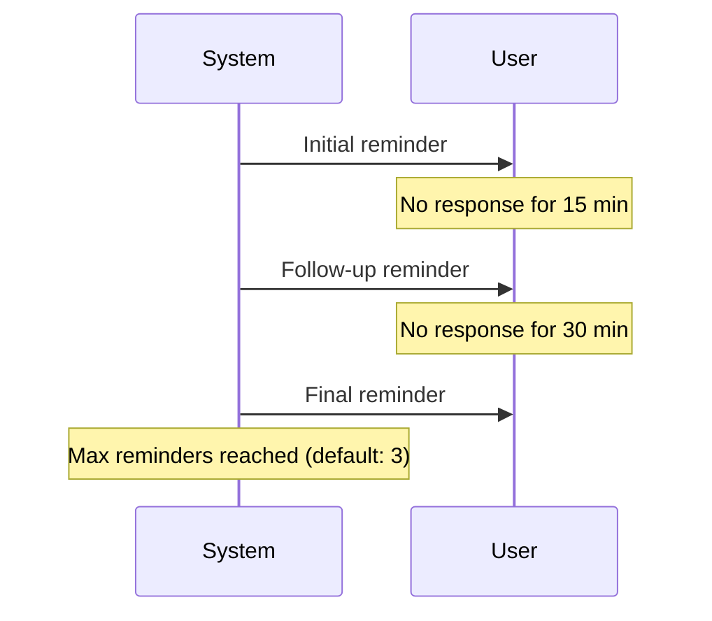

| Follow-up | Delay | Message Variation |
|-----------|-------|-------------------|
| 1st | 15 minutes | Same as initial |
| 2nd | 30 minutes | "Still waiting when you're ready" |
| 3rd | 60 minutes | "Last reminder for today" |

**Implementation**:
- AlarmManager for precise timing
- Cancelled when habit completed or explicitly dismissed
- Max reminders configurable per habit

### Type 3: Lapse Prompt (Day 2)

Soft check-in after 2 missed days.

```mermaid
flowchart LR
    subgraph LapseDay2["Day 2 Notification"]
        Icon["💭"]
        Title["Take medication"]
        Body["Just checking in. No pressure."]
        
        subgraph Actions["Actions"]
            Open["Open"]
            Dismiss["Dismiss"]
        end
    end
```

| Element | Content |
|---------|---------|
| Priority | Low |
| Sound | None |
| Title | Habit name |
| Body | "Just checking in. No pressure." |
| Tap | Opens habit detail |

### Type 4: Recovery Prompt (Day 3+)

Gentle prompt when lapse threshold reached.

```mermaid
flowchart LR
    subgraph RecoveryPrompt["Day 3+ Notification"]
        Icon["🌱"]
        Title["Take medication"]
        Body["Ready when you are. Tap to check in."]
        
        subgraph Actions["Actions"]
            CheckIn["Check In"]
            Later["Later"]
        end
    end
```

| Element | Content |
|---------|---------|
| Priority | Low |
| Sound | None |
| Title | Habit name |
| Body | "Ready when you are. Tap to check in." |
| Tap | Opens recovery session |

### Type 5: Fresh Start (Day 7+ / Monday / Month)

Deeper recovery prompt or fresh start opportunity.

```mermaid
flowchart LR
    subgraph FreshStart["Fresh Start Notification"]
        Icon["✨"]
        Title["Fresh start?"]
        Body["New week, clean slate. Any habits ready for a comeback?"]
        
        subgraph Actions["Actions"]
            ViewHabits["View Habits"]
            NotNow["Not Now"]
        end
    end
```

**Variants**:

| Trigger | Title | Body |
|---------|-------|------|
| Day 7 (single habit) | "{Habit name}" | "It's been a while. Ready for a fresh start?" |
| Monday (multiple) | "New week" | "Clean slate. Any habits ready for a comeback?" |
| Month start | "New month" | "Perfect time for a fresh start." |

### Type 6: Routine Timer

Active notification during routine execution.

```mermaid
flowchart LR
    subgraph RoutineTimer["Routine Timer Notification"]
        Icon["⏱️"]
        Title["Morning Routine - Step 2/4"]
        Body["Take medication • 2:45 remaining"]
        Progress["████████░░ 65%"]
        
        subgraph Actions["Actions"]
            Done["✓ Done"]
            Skip["Skip"]
            Pause["⏸"]
        end
    end
```

| Element | Content |
|---------|---------|
| Priority | High (ongoing) |
| Style | Media style with progress |
| Ongoing | Yes (not dismissible) |
| Updates | Every second (timer) |
| Actions | Done, Skip, Pause |

### Type 7: Sync Status

Background sync status notifications.

| Scenario | Title | Body | Priority |
|----------|-------|------|----------|
| Sync error | "Sync paused" | "Changes saved locally. Tap to retry." | Default |
| Auth expired | "Sign in needed" | "Tap to reconnect sync." | Default |
| First sync complete | "Sync enabled" | "Your data is backed up." | Low |

---

## Message Guidelines

### Approved Phrases

```mermaid
mindmap
  root((Approved Messaging))
    Reminders
      "Time for: [habit]"
      "[Habit] is ready"
      "After [anchor]: [habit]"
    Check-ins
      "Just checking in"
      "No pressure"
      "When you're ready"
    Recovery
      "Welcome back"
      "Ready for a fresh start?"
      "Let's figure this out"
    Encouragement
      "You've got this"
      "Great choice"
      "Progress, not perfection"
```

### Forbidden Phrases

| ❌ Never Use | Why | ✅ Use Instead |
|-------------|-----|----------------|
| "Don't forget!" | Creates anxiety | "Time for:" |
| "You missed X days" | Shame trigger | (Don't mention) |
| "Your streak is at risk" | Streak = shame | (No streaks) |
| "You haven't done..." | Accusatory | "Ready when you are" |
| "Warning:" | Fear-based | (Neutral framing) |
| "Failed to..." | Failure language | "Paused" or "Waiting" |

---

## Notification Scheduling

### Schedule Architecture

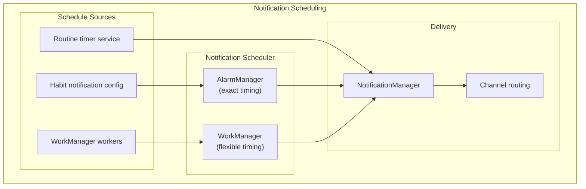

### Timing Strategy

| Notification Type | Scheduling Method | Precision |
|-------------------|-------------------|-----------|
| Habit reminders | AlarmManager | Exact |
| Persistent follow-ups | AlarmManager | Exact |
| Lapse prompts | WorkManager | Flexible (± 15 min) |
| Fresh start | WorkManager | Flexible (6-8 AM window) |
| Routine timer | Foreground service | Real-time |
| Sync status | Immediate | Instant |

### Quiet Hours

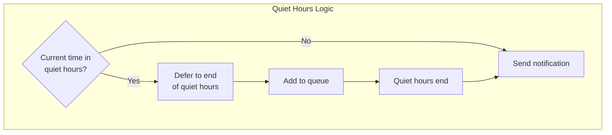

**Default Quiet Hours**: 10 PM - 7 AM (user configurable)

**Exceptions**:
- Routine timer (always allowed—user initiated)
- Critical sync errors (rare)

---

## Action Handling

### Notification Actions

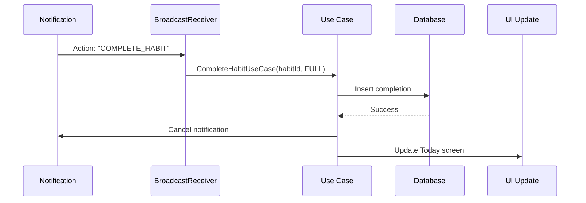

### Action Intents

| Action | Intent Extra | Handler |
|--------|--------------|---------|
| COMPLETE_HABIT | habitId | CompleteHabitReceiver |
| SKIP_HABIT | habitId | SkipHabitReceiver |
| SNOOZE_HABIT | habitId, minutes | SnoozeReceiver |
| OPEN_RECOVERY | habitId | Opens RecoveryActivity |
| ROUTINE_DONE | executionId | RoutineReceiver |
| ROUTINE_SKIP | executionId | RoutineReceiver |
| ROUTINE_PAUSE | executionId | RoutineReceiver |

---

## User Preferences

### Notification Settings

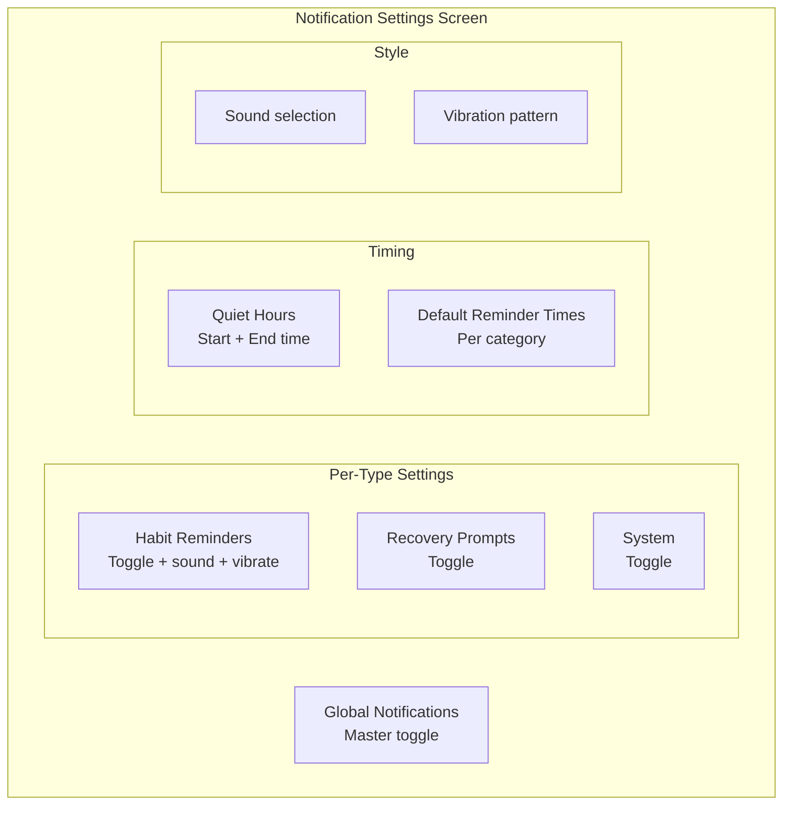

### Default Times by Category

| Category | Default Reminder Time |
|----------|----------------------|
| Morning | 7:00 AM |
| Afternoon | 12:30 PM |
| Evening | 7:00 PM |
| Anytime | No default (user sets) |

---

## WearOS Notifications

### Watch Notification Behavior

| Phone Notification | Watch Behavior |
|-------------------|----------------|
| Habit reminder | Bridged with actions |
| Recovery prompt | Bridged (open on phone) |
| Routine timer | Bridged (control on watch) |
| Sync status | Not bridged |

### Watch-Specific Actions

```mermaid
flowchart LR
    subgraph WatchNotif["Watch Notification"]
        Title["Take medication"]
        Actions["✓ Done | Snooze | Phone"]
    end
```

---

## Technical Implementation

### Notification Builder

```kotlin
// Pseudocode structure
fun buildHabitReminderNotification(habit: Habit): Notification {
    return NotificationCompat.Builder(context, CHANNEL_REMINDERS)
        .setSmallIcon(R.drawable.ic_notification)
        .setContentTitle(habit.name)
        .setContentText(habit.anchorBehavior)
        .setPriority(NotificationCompat.PRIORITY_DEFAULT)
        .setCategory(NotificationCompat.CATEGORY_REMINDER)
        .addAction(buildCompleteAction(habit.id))
        .addAction(buildSnoozeAction(habit.id))
        .addAction(buildSkipAction(habit.id))
        .setContentIntent(buildOpenHabitIntent(habit.id))
        .setAutoCancel(true)
        .build()
}
```

### Channel Creation

```kotlin
// Pseudocode
fun createNotificationChannels() {
    val remindersChannel = NotificationChannel(
        CHANNEL_REMINDERS,
        "Habit Reminders",
        NotificationManager.IMPORTANCE_DEFAULT
    ).apply {
        description = "Daily habit reminders"
        enableVibration(true)
    }
    
    val recoveryChannel = NotificationChannel(
        CHANNEL_RECOVERY,
        "Recovery",
        NotificationManager.IMPORTANCE_LOW
    ).apply {
        description = "Lapse and fresh start prompts"
        enableVibration(false)
        setSound(null, null)
    }
    
    // ... create other channels
    
    notificationManager.createNotificationChannels(listOf(
        remindersChannel,
        recoveryChannel,
        routineChannel,
        systemChannel
    ))
}
```

---

## Notification IDs

| Type | ID Strategy | Example |
|------|-------------|---------|
| Habit reminder | Hash of habitId | habitId.hashCode() |
| Persistent follow-up | habitId hash + offset | habitId.hashCode() + 1000 |
| Recovery prompt | habitId hash + offset | habitId.hashCode() + 2000 |
| Routine timer | Fixed ID | 9001 |
| Sync status | Fixed ID | 9002 |

---

## Metrics & Debugging

### Tracked Metrics

| Metric | Purpose |
|--------|---------|
| Notification delivered | Delivery confirmation |
| Action taken | Which action used |
| Time to action | Response latency |
| Dismiss rate | User engagement |
| Snooze frequency | Timing optimization |

### Debug Features

- Notification log in settings (dev build)
- Test notification buttons
- Channel state inspector
