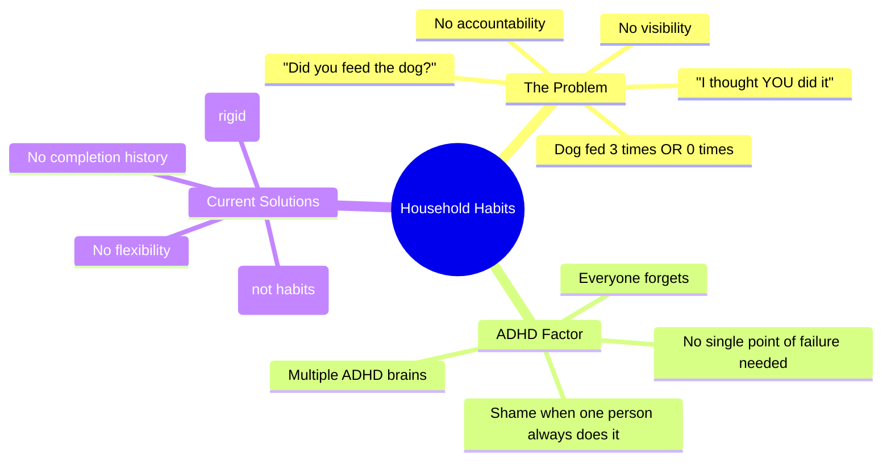
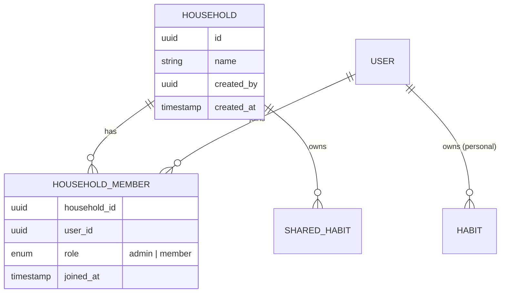
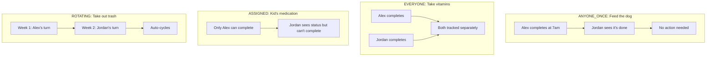
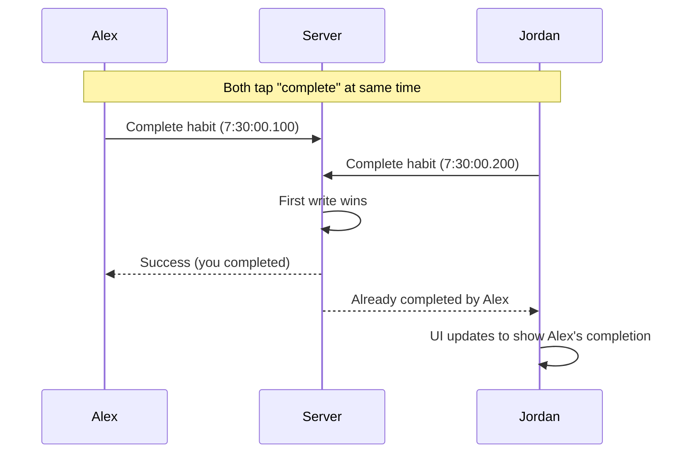
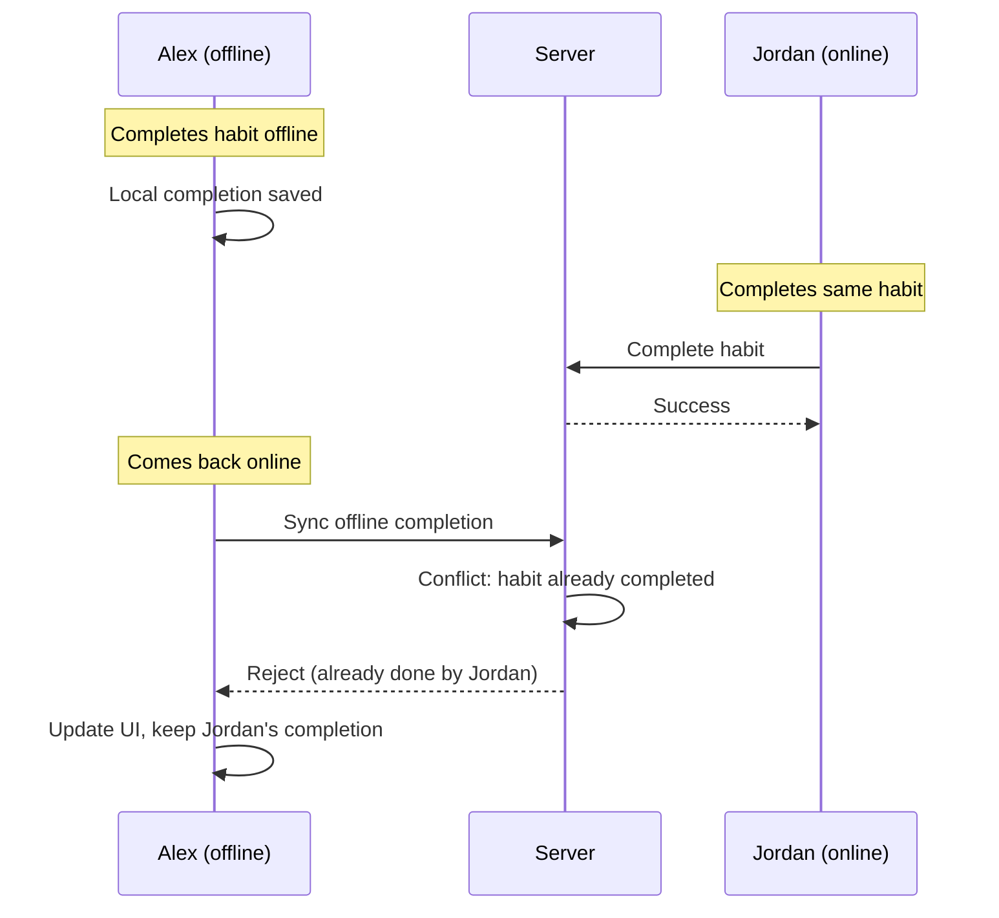

# Shared Habits (v1.1)

## Overview

Shared habits enable household members to collaborate on recurring responsibilities. Unlike task-sharing apps (Todoist, Apple Reminders), Kairos treats shared items as **habits**—they recur, track completion history, and show who did what.

> **Version**: This feature is planned for v1.1. The schema is designed in v1.0 to avoid migrations.

---

## Problem Statement



### Why Habits, Not Tasks?

| Shared Task (Todoist) | Shared Habit (Kairos) |
|-----------------------|-----------------------|
| "Take out trash" — one time | "Take out trash" — every week |
| Assigned to one person | Anyone can complete |
| Done = disappears | Done today = back tomorrow |
| No history | Full completion history |
| Creates resentment | Creates visibility |

---

## Goals

### Primary Goals

| Goal | Success Criteria |
|------|------------------|
| Household habits work offline | Full offline parity |
| Completion attribution clear | Always shows who did it |
| No forced assignments | Flexible completion modes |
| Privacy maintained | Personal habits stay private |

### Secondary Goals

| Goal | Success Criteria |
|------|------------------|
| Fair distribution visible | Stats show contribution |
| Easy household setup | < 2 minutes to create household |
| Invite flow works | Email invite + accept |

---

## Core Concepts

### Household

A group of users sharing a Kairos server who want to collaborate on habits.



### Completion Modes

How a shared habit gets marked "done" for the day.

| Mode | Behavior | Use Case |
|------|----------|----------|
| `ANYONE_ONCE` | First person to complete → done for everyone | Feed the dog |
| `EVERYONE` | Each member completes individually | Take daily vitamins |
| `ASSIGNED` | Only assigned member(s) can complete | Kid's medication (parent responsible) |
| `ROTATING` | Auto-assigns, cycles through members | Take out trash (fair distribution) |



---

## User Stories

### US-1: Create Household

**As** a user with a self-hosted server  
**I want** to create a household  
**So that** I can share habits with my family

**Acceptance Criteria**:
- Can create household with name
- Creator becomes admin
- Household appears in settings

### US-2: Invite Member

**As** a household admin  
**I want** to invite someone to my household  
**So that** we can share habits

**Acceptance Criteria**:
- Can send invite via email or share code
- Invitee must have account on same server
- Invitee can accept/decline
- Admin can revoke pending invites

### US-3: Create Shared Habit

**As** a household member  
**I want** to create a habit for the household  
**So that** anyone can complete it

**Acceptance Criteria**:
- Can select "Shared with household" when creating
- Must choose completion mode
- Habit appears in everyone's Today view

### US-4: Complete Shared Habit (ANYONE_ONCE)

**As** a household member  
**I want** to complete a shared habit  
**So that** everyone knows it's done

**Acceptance Criteria**:
- Tap to complete (same as personal)
- Shows "Done by [name] at [time]" for others
- Others cannot re-complete today

### US-5: View Completion Attribution

**As** a household member  
**I want** to see who completed shared habits  
**So that** I have visibility into household contributions

**Acceptance Criteria**:
- Today view shows who completed
- History shows completion attribution
- Weekly stats show distribution

---

## Data Model

### Extended Habit Schema

```sql
-- habits table additions
ALTER TABLE habits ADD COLUMN household_id UUID REFERENCES households(id);
ALTER TABLE habits ADD COLUMN completion_mode TEXT;  -- 'ANYONE_ONCE', 'EVERYONE', 'ASSIGNED', 'ROTATING'
ALTER TABLE habits ADD COLUMN assigned_to JSONB;     -- Array of user_ids for ASSIGNED mode
ALTER TABLE habits ADD COLUMN rotation_config JSONB; -- Config for ROTATING mode

-- Constraint: habit belongs to user XOR household
ALTER TABLE habits ADD CONSTRAINT habit_ownership 
    CHECK (
        (user_id IS NOT NULL AND household_id IS NULL) OR
        (user_id IS NULL AND household_id IS NOT NULL)
    );
```

### Extended Completion Schema

```sql
-- completions table additions
ALTER TABLE completions ADD COLUMN completed_by UUID REFERENCES users(id);

-- For personal habits: completed_by = habit owner (implicit, can be NULL)
-- For shared habits: completed_by = user who completed (required)
```

### Household Tables

```sql
CREATE TABLE households (
    id UUID PRIMARY KEY DEFAULT gen_random_uuid(),
    name TEXT NOT NULL,
    created_by UUID NOT NULL REFERENCES users(id),
    created_at TIMESTAMP NOT NULL DEFAULT NOW(),
    updated_at TIMESTAMP NOT NULL DEFAULT NOW(),
    sync_status TEXT DEFAULT 'SYNCED',
    version BIGINT DEFAULT 1
);

CREATE TABLE household_members (
    id UUID PRIMARY KEY DEFAULT gen_random_uuid(),
    household_id UUID NOT NULL REFERENCES households(id) ON DELETE CASCADE,
    user_id UUID NOT NULL REFERENCES users(id) ON DELETE CASCADE,
    role TEXT NOT NULL DEFAULT 'member',  -- 'admin' | 'member'
    joined_at TIMESTAMP NOT NULL DEFAULT NOW(),
    sync_status TEXT DEFAULT 'SYNCED',
    version BIGINT DEFAULT 1,
    
    UNIQUE (household_id, user_id)
);

CREATE TABLE household_invites (
    id UUID PRIMARY KEY DEFAULT gen_random_uuid(),
    household_id UUID NOT NULL REFERENCES households(id) ON DELETE CASCADE,
    email TEXT NOT NULL,
    invited_by UUID NOT NULL REFERENCES users(id),
    code TEXT NOT NULL UNIQUE,  -- For share link
    created_at TIMESTAMP NOT NULL DEFAULT NOW(),
    expires_at TIMESTAMP NOT NULL,
    accepted_at TIMESTAMP,
    
    UNIQUE (household_id, email)
);
```

### Rotation Configuration

```json
{
  "rotation_config": {
    "members": ["user-1", "user-2", "user-3"],
    "interval": "WEEKLY",
    "current_index": 0,
    "last_rotated_at": "2024-01-15T00:00:00Z"
  }
}
```

---

## Sync Rules

### PowerSync Bucket Definitions

```yaml
bucket_definitions:
  # Personal data (existing)
  user_data:
    parameters:
      - name: user_id
        type: string
    data:
      - table: habits
        filter: "user_id = :user_id"
      # ... other personal tables

  # Household data (v1.1)
  household_data:
    parameters:
      - name: user_id
        type: string
    data:
      - table: households
        filter: "id IN (SELECT household_id FROM household_members WHERE user_id = :user_id)"
      
      - table: household_members
        filter: "household_id IN (SELECT household_id FROM household_members WHERE user_id = :user_id)"
      
      - table: habits
        filter: "household_id IN (SELECT household_id FROM household_members WHERE user_id = :user_id)"
      
      - table: completions
        filter: "habit_id IN (
          SELECT id FROM habits 
          WHERE household_id IN (SELECT household_id FROM household_members WHERE user_id = :user_id)
        )"
```

Each household member syncs:
- All households they belong to
- All members of those households (for names/avatars)
- All shared habits in those households
- All completions for shared habits

---

## UI Design

### Today Screen (with Shared Habits)

```
┌─────────────────────────────────────┐
│  Today                    5/8 done  │
├─────────────────────────────────────┤
│                                     │
│  MY HABITS                          │
│  ────────────────────────────────── │
│  ✓ Take medication                  │
│  ○ Morning stretch                  │
│  ✓ Journal                          │
│                                     │
│  HOUSEHOLD                          │
│  ────────────────────────────────── │
│  ✓ Feed dog        Alex · 7:30 AM  │
│  ○ Run dishwasher                   │
│  ○ Check mail                       │
│  ✓ Water plants   Jordan · 6:15 AM │
│  ○ Take out trash   (Your turn)    │
│                                     │
└─────────────────────────────────────┘
```

### Shared Habit Card States

| State | Display |
|-------|---------|
| Pending | Normal card, no attribution |
| Completed by you | "✓ Done" |
| Completed by other | "✓ [Name] · [time]" |
| Your turn (ROTATING) | "(Your turn)" badge |
| Assigned to you | Normal (you can complete) |
| Assigned to other | Greyed out, shows assignee |

### Completion Attribution Detail

```
┌─────────────────────────────────────┐
│  Feed the Dog                       │
│  ────────────────────────────────── │
│  Mode: Anyone can complete          │
│                                     │
│  Today                              │
│  ✓ Alex · 7:30 AM                  │
│                                     │
│  This Week                          │
│  ✓ Mon · Alex                      │
│  ✓ Tue · Jordan                    │
│  ✓ Wed · Alex                      │
│  ✓ Thu · Alex                      │
│  ○ Fri · (pending)                 │
│                                     │
│  Stats                              │
│  Alex: 3 times                      │
│  Jordan: 1 time                     │
│                                     │
│  [Edit]              [View History] │
└─────────────────────────────────────┘
```

### Household Settings

```
┌─────────────────────────────────────┐
│  ← Household                        │
├─────────────────────────────────────┤
│                                     │
│  The Johnson Home                   │
│                                     │
│  MEMBERS                            │
│  ────────────────────────────────── │
│  👤 Alex (you)              Admin   │
│  👤 Jordan                  Member  │
│  👤 Sam                     Member  │
│                                     │
│  [+ Invite Member]                  │
│                                     │
│  SHARED HABITS                      │
│  ────────────────────────────────── │
│  5 active habits                    │
│  [View All]                         │
│                                     │
│  ────────────────────────────────── │
│  [Leave Household]                  │
│                                     │
└─────────────────────────────────────┘
```

### Create Shared Habit

```
┌─────────────────────────────────────┐
│  ← New Habit                        │
├─────────────────────────────────────┤
│                                     │
│  Feed the dog                       │
│                                     │
│  OWNERSHIP                          │
│  ────────────────────────────────── │
│  ○ Just me (personal)               │
│  ● Shared with household            │
│                                     │
│  COMPLETION MODE                    │
│  ────────────────────────────────── │
│  ● Anyone can complete              │
│    First person to do it            │
│                                     │
│  ○ Everyone completes               │
│    Each person does it daily        │
│                                     │
│  ○ Assigned members                 │
│    Only specific people             │
│                                     │
│  ○ Rotating                         │
│    Takes turns automatically        │
│                                     │
│  [Continue →]                       │
│                                     │
└─────────────────────────────────────┘
```

---

## Functional Requirements

### FR-1: Household Management

| ID | Requirement | Priority |
|----|-------------|----------|
| FR-1.1 | Create household with name | P0 |
| FR-1.2 | Creator becomes admin | P0 |
| FR-1.3 | Rename household (admin) | P1 |
| FR-1.4 | Delete household (admin, requires confirmation) | P1 |
| FR-1.5 | Leave household (member) | P0 |
| FR-1.6 | User can belong to one household | P0 |

### FR-2: Membership

| ID | Requirement | Priority |
|----|-------------|----------|
| FR-2.1 | Invite by email | P0 |
| FR-2.2 | Invite by share code | P1 |
| FR-2.3 | Accept/decline invite | P0 |
| FR-2.4 | Revoke pending invite (admin) | P1 |
| FR-2.5 | Remove member (admin) | P0 |
| FR-2.6 | Transfer admin role | P1 |
| FR-2.7 | View all members | P0 |

### FR-3: Shared Habits

| ID | Requirement | Priority |
|----|-------------|----------|
| FR-3.1 | Create habit with household ownership | P0 |
| FR-3.2 | Select completion mode | P0 |
| FR-3.3 | Shared habits appear in all members' Today | P0 |
| FR-3.4 | Edit shared habit (any member) | P0 |
| FR-3.5 | Archive shared habit (any member) | P0 |
| FR-3.6 | ANYONE_ONCE: first completion wins | P0 |
| FR-3.7 | EVERYONE: track per-member completion | P0 |
| FR-3.8 | ASSIGNED: restrict completion to assignees | P1 |
| FR-3.9 | ROTATING: auto-assign on schedule | P2 |

### FR-4: Attribution

| ID | Requirement | Priority |
|----|-------------|----------|
| FR-4.1 | Completions show who completed | P0 |
| FR-4.2 | Today view shows completer name | P0 |
| FR-4.3 | History shows completion attribution | P0 |
| FR-4.4 | Weekly stats show distribution | P1 |

---

## Non-Functional Requirements

### Performance

| ID | Requirement | Target |
|----|-------------|--------|
| NFR-P1 | Shared habit sync latency | < 5 seconds |
| NFR-P2 | Household member count | ≤ 10 members |
| NFR-P3 | Shared habits per household | ≤ 50 |

### Privacy

| ID | Requirement |
|----|-------------|
| NFR-PR1 | Personal habits never visible to household members |
| NFR-PR2 | Completion attribution only for shared habits |
| NFR-PR3 | Member can only see households they belong to |

---

## Edge Cases

### Concurrent Completion (ANYONE_ONCE)



### Member Leaves Household

- Member's personal habits unchanged
- Member no longer sees shared habits
- Member's historical completions preserved
- Reassign if member was in ROTATING queue

### Last Admin Leaves

- Must transfer admin first
- Or delete household
- Cannot leave as sole admin

### Offline Conflict



Resolution: For ANYONE_ONCE, server timestamp wins. Offline completion rejected if someone else completed first.

---

## Future Considerations

### v1.2+

| Feature | Description |
|---------|-------------|
| Multiple households | User can belong to multiple |
| Sub-groups | "Kids' chores" within household |
| Completion comments | "Fed extra, was hungry" |
| Photo verification | Attach photo to completion |
| Recurring assignment | "Alex always does weekends" |
| Notifications to others | "Alex completed Feed Dog" push |

---

## Implementation Notes

### Migration Strategy

1. **v1.0**: Create tables, add columns (all nullable/unused)
2. **v1.1**: Enable household UI, start using columns
3. No schema migration needed between versions

### Feature Flag

```kotlin
object FeatureFlags {
    val SHARED_HABITS_ENABLED = BuildConfig.VERSION_CODE >= 110
}
```

### Testing

| Scenario | Test |
|----------|------|
| Create household | Unit + Integration |
| Invite flow | E2E |
| Concurrent completion | Load test |
| Offline + sync | Integration |
| Member removal | Unit |
